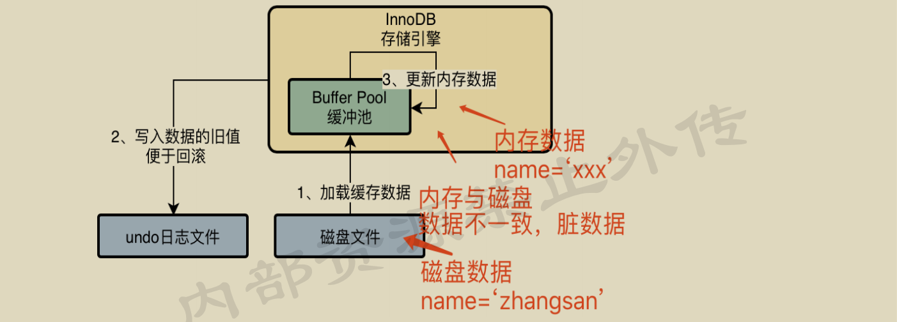
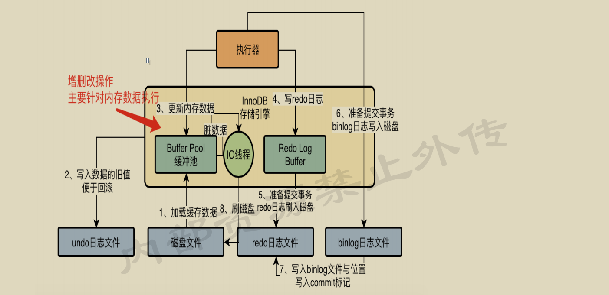
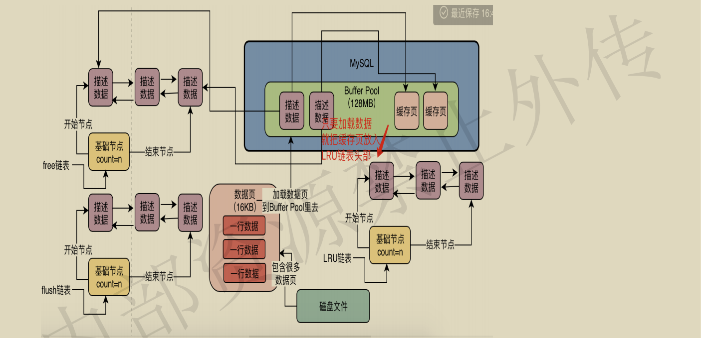
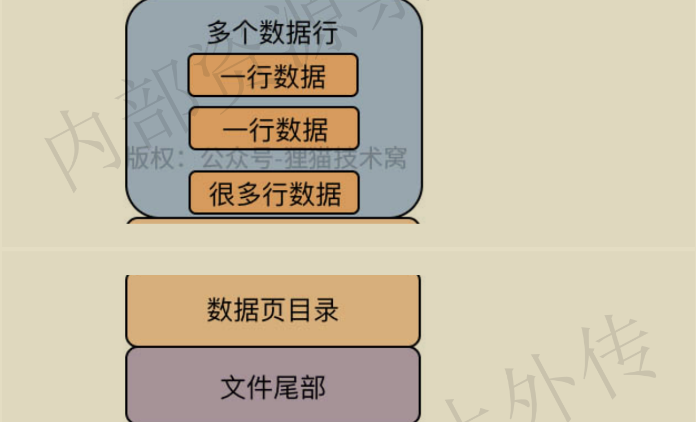
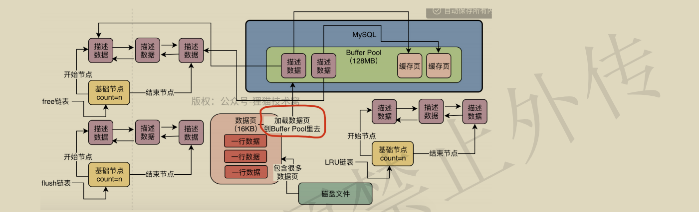
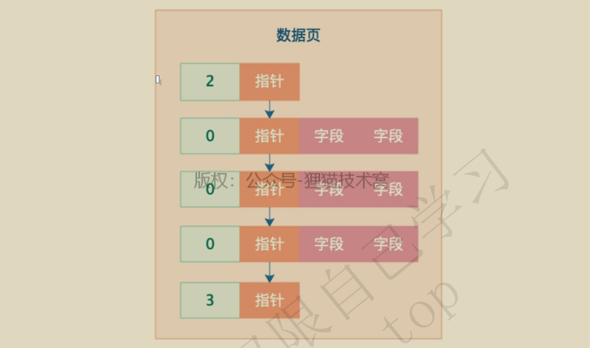
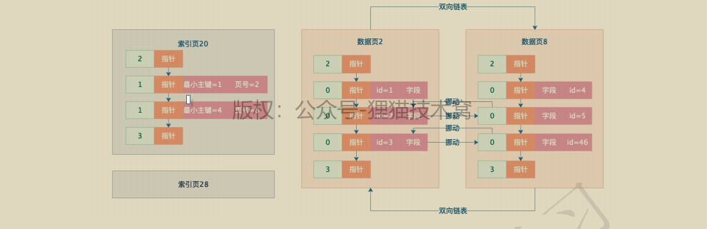
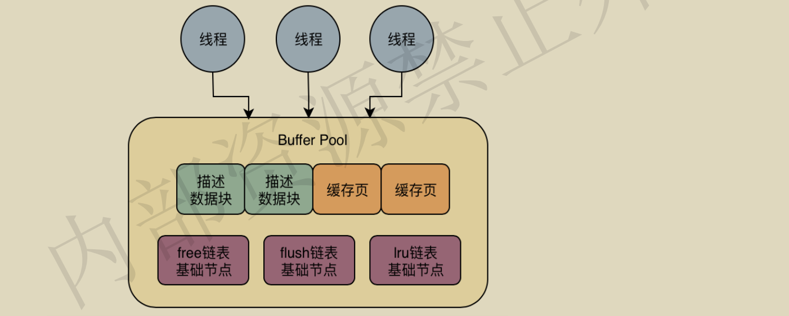
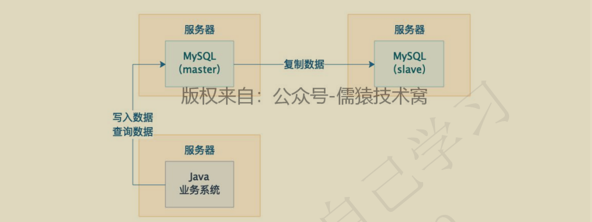

[TOC]


# MYSQL笔记

## MYSQL架构设计

### MySQL驱动

大家都知道，我们如果要在Java系统中去访问一个MySQL数据库，必须得在系统的依赖中加入一个MySQL驱动，有了这个MySQL驱动

才能跟MySQL数据库建立连接，然后执行各种各样的SQL语句。MySQL驱动到底是个什么东西？

大家都知道，如果我们要访问数据库，必须得跟数据库建立一个网络连接，那么这个连接由谁来建立呢？其实答案就是这个MySQL驱动，他会在底层跟数据库建立网络连接，有网络连接，接着才能去发送请求给数据库服务器！我们看下图


然后当我们跟数据库之间有了网络连接之后，我们的Java代码才能基于这个连接去执行各种各样的增删改查SQL语句


所以对于Java语言开发的系统，MySQL会提供Java版本的MySQL驱动，对于PHP、Perl、.NET、Python、Ruby等各种常见的编程语言，MySQL都会提供对应语言的MySQL驱动，让各种语言编写的系统通过MySQL驱动去访问数据库。

### 数据库连接池

假设我们用Java开发了一个Web系统，是部署在Tomcat中的，那么Tomcat本身肯定是有多个线程来并发的处理同时接收到的多个请求的，如果Tomcat中的多个线程并发处理多个请求的时候，都要去抢夺一个连接去访问数据库的话，那效率肯定是很低下的。


如果Tomcat中的每个线程在每次访问数据库的时候，都基于MySQL驱动去创建一个数据库连接，然后执行SQL语句，然后执行完之后再销毁这个数据库连接。这也是非常不好的，因为每次建立一个数据库连接都很耗时，好不容易建立好了连接，执行完了SQL语句，你还把数据库连接给销毁了，下一次再重新建立数据库连接，那肯定是效率很低下的


所以一般我们必须要使用一个数据库连接池，也就是说在一个池子里维持多个数据库连接，让多个线程使用里面的不同的数据库连接去执行SQL语句，然后执行完SQL语句之后，不要销毁这个数据库连接，而是把连接放回池子里，后续还可以继续使用。基于这样的一个数据库连接池的机制，就可以解决多个线程并发的使用多个数据库连接去执行SQL语句的问题，而且还避免了数据库连接使用完之后就销毁的问题。


常见的数据库连接池有DBCP，C3P0，Druid，等等。系统与数据库的交互本质都是一样的，都是基于数据库连接池去与数据库进行交互。

### MySQL数据库的连接池

很多系统要与MySQL数据库建立很多个连接，那么MySQL也必然要维护与系统之间的多个连接，所以**MySQL架构体系中的第一个环节，就是连接池**。实际上MySQL中的连接池就是维护了与系统之间的多个数据库连接。除此之外，你的系统每次跟MySQL建立连接的时候，还会根据你传递过来的账号和密码，进行账号密码的验证，库表权限的验证。


### MySQL架构设计

#### 网络连接必须让线程来处理

一个不变的原则：网络连接必须让线程来处理。假设我们的数据库服务器的连接池中的某个连接接收到了网络请求，假设就是一条SQL语句，那么大家先思考一个问题，谁负责从这个连接中去监听网络请求？谁负责从网络连接里把请求数据读取出来？那就是网络连接必须得分配给一个线程去进行处理，由一个线程来监听请求以及读取请求数据，比如从网络连接中读取和解析出来一条我们的系统发送过去的SQL语句，如下图所示：


#### SQL接口组件

负责处理接收到的SQL语句

当MySQL内部的工作线程从一个网络连接中读取出来一个SQL语句之后，就会转交给SQL接口去执行

所以MySQL内部首先提供了一个组件，就是SQL接口（SQL Interface），他是一套执行SQL语句的接口，专门用于执行发送给MySQL的增删改查的SQL语句


#### 查询解析器

select id,name,age from users where id=1

这个SQL语句，我们用人脑是直接就可以处理一下，只要懂SQL语法的人，立马大家就知道他是什么意思，但是MySQL自己本身也是一个系统，是一个数据库管理系统，他没法直接理解这些SQL语句！所以此时有一个关键的组件要出场了，那就是**查询解析器**。可以让MySQL能看懂SQL语句

这个查询解析器（Parser）就是负责对SQL语句进行解析的，比如对上面那个SQL语句进行一下拆解，拆解成以下几个部分：

- 我们现在要从“users”表里查询数据
- 查询“id”字段的值等于1的那行数据
- 对查出来的那行数据要提取里面的“id,name,age”三个字段。

所谓的SQL解析，就是按照既定的SQL语法，对我们按照SQL语法规则编写的SQL语句进行解析，然后理解这个SQL语句要干什么事情，如下图所示：


#### 查询优化器

当我们通过解析器理解了SQL语句要干什么之后，接着会找查询优化器（Optimizer）来选择一个最优的查询路径。

他会针对你编写的几十行、几百行甚至上千行的复杂SQL语句生成查询路径树，然后从里面选择一条最优的查询路径出来。相当于他会告诉你，你应该按照一个什么样的步骤和顺序，去执行哪些操作，然后一步一步的把SQL语句就给完成了。


#### 调用存储引擎接口

**真正执行SQL语句**。最后一步，就是把查询优化器选择的最优查询路径，也就是你到底应该按照一个什么样的顺序和步骤去执行这个SQL语句的计划，把这个计划交给底层的存储引擎去真正的执行。这个存储引擎是MySQL的架构设计中很有特色的一个环节。真正在执行SQL语句的时候，要不然是更新数据，要不然是查询数据。所以对数据库而言，我们的数据要不然是放在内存里，要不然是放在磁盘文件里

所以我们来思考一下，假设我们的数据有的存放在内存里，有的存放在磁盘文件里，如下图所示。


那么现在问题来了，我们已经知道一个SQL语句要如何执行了，但是我们现在怎么知道哪些数据在内存里？哪些数据在磁盘里？我们执行的时候是更新内存的数据？还是更新磁盘的数据？我们如果更新磁盘的数据，是先查询哪个磁盘文件，再更新哪个磁盘文件？所以这个时候就需要存储引擎了，存储引擎其实就是执行SQL语句的，他会按照一定的步骤去查询内存缓存数据，更新磁盘数据，查询磁盘数据，等等，执行诸如此类的一系列的操作，如下图所示。


MySQL的架构设计中，SQL接口、SQL解析器、查询优化器其实都是通用的，他就是一套组件而已。但是存储引擎的话，他是支持各种各样的存储引擎的，比如我们常见的InnoDB、MyISAM、Memory等等，我们是可以选择使用哪种存储引擎来负责具体的SQL语句执行的。在MySQL5.7之后都是使用InnoDB存储引擎的

#### **执行器**

这个执行器会根据优化器选择的执行方案，去调用存储引擎的接口按照一定的顺序和步骤，就把SQL语句的逻辑给执行了。

举个例子，比如执行器可能会先调用存储引擎的一个接口，去获取“users”表中的第一行数据，然后判断一下这个数据的“id”字段的值是否等于我们期望的一个值，如果不是的话，那就继续调用存储引擎的接口，去获取“users”表的下一行数据。

**执行器就会去根据我们的优化器生成的一套执行计划，然后不停的调用存储引擎的各种接口去完成SQL****语句的执行计划**，大致就是不停的更新或者提取一些数据出来


## InnoDB存储引擎的架构设计

### 更新语句在MySQL中的执行过程

```mysql
update users set name='xxx' where id=10
```

首先肯定是我们的系统通过一个数据库连接发送到了MySQL上，然后肯定会经过SQL接口、解析器、优化器、执行器几个环节，解析SQL语句，生成执行计划，接着去由执行器负责这个计划的执行，调用InnoDB存储引擎的接口去执行。


#### 缓冲池（Buffer Pool）

InnoDB存储引擎中有一个**非常重要的放在内存里的组件**，就是缓冲池（Buffer Pool），这里面会缓存很多的数据，以便于以后在查询的时候，万一你要是内存缓冲池里有数据，就可以不用去查磁盘了。


引擎要执行更新语句的时候 ，比如对“id=10”这一行数据，他其实会先将“id=10”这一行数据看看是否在缓冲池里，如果不在的话，那么会直接从磁盘里加载到缓冲池里来，而且接着还会对这行记录加独占锁。因为我们想一下，在我们更新“id=10”这一行数据的时候，肯定是不允许别人同时更新的，所以必须要对这行记录加独占锁。


#### undo日志文件

假设“id=10”这行数据的name原来是“zhangsan”，现在我们要更新为“xxx”，那么此时我们得先把要更新的原来的值“zhangsan”和“id=10”这些信息，写入到undo日志文件中去。所以为了考虑到未来可能要回滚数据的需要，这里会把你更新前的值写入undo日志文件，我们看下图。


#### 更新buffer pool中的缓存数据

当我们把要更新的那行记录从磁盘文件加载到缓冲池，同时对他加锁之后，而且还把更新前的旧值写入undo日志文件之后，我们就可以正式开始更新这行记录了，更新的时候，先是会更新缓冲池中的记录，此时这个数据就是脏数据了。

这里所谓的更新内存缓冲池里的数据，意思就是把内存里的“id=10”这行数据的name字段修改为“xxx”，那么为什么说此时这行数据就是脏数据了呢？因为这个时候磁盘上“id=10”这行数据的name字段还是“zhangsan”，但是内存里这行数据已经被修改了，所以就会叫他是脏数据。



#### Redo Log Buffer

接着我们来思考一个问题，按照上图的说明，现在已经把内存里的数据进行了修改，但是磁盘上的数据还没修改那么此时万一MySQL所在的机器宕机了，必然会导致内存里修改过的数据丢失，这可怎么办呢？

这个时候，就必须要把对内存所做的修改写入到一个**Redo Log Buffer**里去，这也是内存里的一个缓冲区，是用来存放redo日志的。所谓的redo日志，就是记录下来你对数据做了什么修改，比如对“id=10这行记录修改了name字段的值为xxx”，这就是一个日志


这个redo日志其实是用来在MySQL突然宕机的时候，用来恢复你更新过的数据的

##### 如果还没提交事务，MySQL宕机了怎么办？

到目前为止，其实还没有提交事务，那么此时如果MySQL崩溃，必然导致内存里Buffer Pool中的修改过的数据都丢失，同时你写入Redo Log Buffer中的redo日志也会丢失


此时数据丢失其实是不要紧的，因为你一条更新语句，没提交事务，就代表他没执行成功，此时MySQL宕机虽然导致内存里的数据都丢失了，但是你会发现，磁盘上的数据依然还停留在原样子。也就是说，“id=1”的那行数据的name字段的值还是老的值，“zhangsan”，所以此时你的这个事务就是执行失败了，没能成功完成更新，你会收到一个数据库的异常。然后当mysql重启之后，你会发现你的数据并没有任何变化。所以此时如果mysql宕机，不会有任何的问题。

#### 提交事务的时候将redo日志写入磁盘中

接着我们想要提交一个事务了，此时就会根据一定的策略把redo日志从redo log buffer里刷入到磁盘文件里去。此时这个策略是通过**innodb_flush_log_at_trx_commit**来配置的，他有几个选项。

当这个参数的值为0的时候，那么你提交事务的时候，不会把redo log buffer里的数据刷入磁盘文件的，此时可能你都提交事务了，结果mysql宕机了，然后此时内存里的数据全部丢失。相当于你提交事务成功了，但是由于MySQL突然宕机，导致内存中的数据和redo日志都丢失了，我们看下图：


当这个参数的值为1的时候，你提交事务的时候，就必须把redo log从内存刷入到磁盘文件里去，只要事务提交成功，那么redo log就必然在磁盘里了，我们看下图：


只要提交事务成功之后，redo日志一定在磁盘文件里，此时你肯定会有一条redo日志说了，“我此时对哪个数据做了一个什么修改，比如name字段修改为xx了”。然后哪怕此时buffer pool中更新过的数据还没刷新到磁盘里去，此时内存里的数据是已经更新过的“name=xxx”，然后磁盘上的数据还是没更新过的“name=zhangsan”。提交事务之后，可能处于的一个状态。


此时如果说提交事务后处于上图的状态，然后mysql系统突然崩溃了，此时会如何？会丢失数据吗？肯定不会啊，因为虽然内存里的修改成name=xxx的数据会丢失，但是redo日志里已经说了，对某某数据做了修改name=xxx。所以此时mysql重启之后，他可以根据redo日志去恢复之前做过的修改，我们看下图。


最后来看看，如果innodb_flush_log_at_trx_commit参数的值是2呢。意思就是，提交事务的时候，把redo日志写入磁盘文件对应的os cache缓存里去，而不是直接进入磁盘文件，可能1秒后才会把os cache里的数据写入到磁盘文件里去。这种模式下，你提交事务之后，redo log可能仅仅停留在os cache内存缓存里，没实际进入磁盘文件，万一此时你要是机器宕机了，那么os cache里的redo log就会丢失，同样会让你感觉提交事务了，结果数据丢了，看下图。


##### **redo日志刷盘策略的选择建议**

通常建议是设置为1。也就是说，提交事务的时候，redo日志必须是刷入磁盘文件里的。这样可以严格的保证提交事务之后，数据是绝对不会丢失的，因为有redo日志在磁盘文件里可以恢复你做的所有修改。如果要是选择0的话，可能你提交事务之后，mysql宕机，那么此时redo日志没有刷盘，导致内存里的redo日志丢失，你提交的事务更新的数据就丢失了；如果要是选择2的话，如果机器宕机，虽然之前提交事务的时候，redo日志进入os cache了，但是还没进入磁盘文件，此时机器宕机还是会导致os cache里的redo日志丢失。所以对于数据库这样严格的系统而言，一般建议redo日志刷盘策略设置为1，保证事务提交之后，数据绝对不能丢失。

#### MySQL binlog

之前说的redo log，他是一种偏向物理性质的重做日志。因为他里面记录的是类似这样的东西，“对哪个数据页中的什么记录，做了个什么修改”。而且redo log本身是属于InnoDB存储引擎特有的一个东西。

而binlog叫做归档日志，他里面记录的是偏向于逻辑性的日志，类似于“对users表中的id=10的一行数据做了更新操作，更新以后的值是什么” binlog不是InnoDB存储引擎特有的日志文件，是属于mysql server自己的日志文件。

##### 提交事务的时候，同时会写入binlog

在我们提交事务的时候，会把redo log日志写入磁盘文件中去。然后其实在提交事务的时候，我们同时还会把这次更新对应的binlog日志写入到磁盘文件中去，如下图所示。


大家可以在这个图里看到一些变动，就是我把跟InnoDB存储引擎进行交互的组件加入了之前提过的执行器这个组件，他会负责跟InnoDB进行交互，包括从磁盘里加载数据到Buffer Pool中进行缓存，包括写入undo日志，包括更新Buffer Pool里的数据，以及写入redo log buffer，redo log刷入磁盘，写binlog，等等。

$\textcolor{Red}{实际上，执行器是非常核心的一个组件，负责跟存储引擎配合完成一个SQL语句在磁盘与内存层面的全部数据更新操作。} $

而且我们在上图可以看到，我把一次更新语句的执行，拆分为了两个阶段，上图中的1、2、3、4几个步骤，其实本质是你执行这个更新语句的时候干的事。然后上图中的5和6两个步骤，是从你提交事务开始的，属于提交事务的阶段了。

#### binlog日志的刷盘策略分析

对于binlog日志，其实也有不同的刷盘策略，有一个$\textcolor{red}{sync_binlog}$参数可以控制binlog的刷盘策略，他的默认值是0，此时你把binlog写入磁盘的时候，其实不是直接进入磁盘文件，而是进入os cache内存缓存。所以跟之前分析的一样，如果此时机器宕机，那么你在os cache里的binlog日志是会丢失的，我们看下图的示意


如果要是把**sync_binlog**参数设置为1的话，那么此时会强制在提交事务的时候，把binlog直接写入到磁盘文件里去，那么这样提交事务之后，哪怕机器宕机，磁盘上的binlog是不会丢失的，如下图所示


#### 基于binlog和redo log完成事务的提交

当我们把binlog写入磁盘文件之后，接着就会完成最终的事务提交，此时会把本次更新对应的binlog文件名称和这次更新的binlog日志在文件里的位置，都写入到redo log日志文件里去，同时在redo log日志文件里写入一个commit标记。在完成这个事情之后，才算最终完成了事务的提交，我们看下图的示意。


##### 在redo日志中写入commit标记的意义是什么？

他其实是用来保持redo log日志与binlog日志一致的。

假设我们在提交事务的时候，一共有上图中的5、6、7三个步骤，必须是三个步骤都执行完毕，才算是提交了事务。那么在我们刚完成步骤5的时候，也就是redo log刚刷入磁盘文件的时候，mysql宕机了，此时怎么办？这个时候因为没有最终的事务commit标记在redo日志里，所以此次事务可以判定为不成功。不会说redo日志文件里有这次更新的日志，但是binlog日志文件里没有这次更新的日志，不会出现数据不一致的问题。

如果要是完成步骤6的时候，也就是binlog写入磁盘了，此时mysql宕机了，怎么办？同理，因为没有redo log中的最终commit标记，因此此时事务提交也是失败的

必须是在redo log中写入最终的事务commit标记了，然后此时事务提交成功，而且redo log里有本次更新对应的日志，binlog里也有本次更新对应的日志 ，redo log和binlog完全是一致的。

#### 后台IO线程随机将内存更新后的脏数据刷回磁盘

现在我们假设已经提交事务了，此时一次更新“update users set name='xxx' where id=10”，他已经把内存里的buffer pool中的缓存数据更新了，同时磁盘里有redo日志和binlog日志，都记录了把我们指定的“id=10”这行数据修改了“name='xxx'”。

但是这个时候磁盘上的数据文件里的“id=10”这行数据的name字段还是等于zhangsan这个旧的值。所以MySQL有一个后台的IO线程，会在之后某个时间里，随机的把内存buffer pool中的修改后的脏数据给刷回到磁盘上的数据文件里去，我们看下图：


当上图中的IO线程把buffer pool里的修改后的脏数据刷回磁盘的之后，磁盘上的数据才会跟内存里一样，都是name=xxx这个修改以后的值了！

在你IO线程把脏数据刷回磁盘之前，哪怕mysql宕机崩溃也没关系，因为重启之后，会根据redo日志恢复之前提交事务做过的修改到内存里去，就是id=10的数据的name修改为了xxx，然后等适当时机，IO线程自然还是会把这个修改后的数据刷到磁盘上的数据文件里去的

#### 基于更新数据的流程，总结InnoDB存储引擎的架构原理

**InnoDB存储引擎主要就是包含了一些buffer pool、redo logbuffer等内存里的缓存数据，同时还包含了一些undo日志文件，redo日志文件等东西，同时mysql server自己还有binlog日志文件。在你执行更新的时候，每条SQL语句，都会对应修改buffer pool里的缓存数据、写undo日志、写redo log buffer几个步骤；但是当你提交事务的时候，一定会把redo log刷入磁盘，binlog刷入磁盘，完成redo log中的事务commit标记；最后后台的IO线程会随机的把buffer pool里的脏数据刷入磁盘里去。**

#### 思考题

- 为什么MySQL在更新数据的时候，要大费周章的搞这么多事情，包括buffer pool、redo log、undo log、binlog、事务提交、脏数据。引入了一大堆的概念，有复杂的流程和步骤。

  防止系统崩溃，数据丢失

- 为什么他反而最关键的修改磁盘里的数据，要通过IO线程不定时的去执行？

- 为什么他不干脆直接就每次执行SQL语句，直接就更新磁盘里的数据得了？

  不可能直接更新磁盘上的数据的，因为如果你对磁盘进行随机读写操作，那速度是相当的慢，随便一个大磁盘文件的随机读写操作，可能都要几百毫秒。如果要是那么搞的话，可能你的数据库每秒也就只能处理几百个请求了！

### Buffer Pool原理

其实他是一个非常关键的组件，因为我们通过之前的讲解都知道一点，那就是数据库中的数据实际上最终都是要存放在磁盘文件上的。但是我们在对数据库执行增删改操作的时候，不可能直接更新磁盘上的数据的，因为如果你对磁盘进行随机读写操作，那速度

是相当的慢，随便一个大磁盘文件的随机读写操作，可能都要几百毫秒。如果要是那么搞的话，可能你的数据库每秒也就只能处理几百个请求了！在对数据库执行增删改操作的时候，实际上主要都是针对内存里的Buffer Pool中的数据进行的，也就是你实际上主要是对数据库的内存里的数据结构进行了增删改，如下图所示。



你在数据库的内存里执行了一堆增删改的操作，内存数据是更新了，但是这个时候如果数据库突然崩溃了，那么内存里更新好的数据不是都没了吗？MySQL就怕这个问题，所以引入了一个redo log机制，你在对内存里的数据进行增删改的时候，他同时会把增删改对应的日志写入redo log中，如下图。


万一你的数据库突然崩溃了，没关系，只要从redo log日志文件里读取出来你之前做过哪些增删改操作，瞬间就可以重新把这些增删改操作在你的内存里执行一遍，这就可以恢复出来你之前做过哪些增删改操作了。当然对于数据更新的过程，他是有一套严密的步骤的，还涉及到undo log、binlog、提交事务、buffer pool脏数据刷回磁盘，等等。

**所以这里我们简单对Buffer Pool这个东西做一下总结，他其实是数据库中我们第一个必须要搞清楚的核心组件，因为增删改操作首先就是针对这个内存中的Buffer Pool里的数据执行的，同时配合了后续的redo log、刷磁盘等机制和操作。所以Buffer Pool就是数据库的一个内存组件，里面缓存了磁盘上的真实数据，然后我们的Java系统对数据库执行的增删改操作，其实主要就是对这个内存数据结构中的缓存数据执行的。**

#### Buffer Pool内存数据结构

因为Buffer Pool本质其实就是数据库的一个内存组件，你可以理解为他就是一片内存数据结构，所以这个内存数据结构肯定是有一定的大小的，不可能是无限大的。

这个Buffer Pool默认情况下是128MB，实际生产环境下完全可以对Buffer Pool进行调整。比如我们的数据库如果是16核32G的机器，那么你就可以给Buffer Pool分配个2GB的内存，使用下面的配置就可以了。

[server]

innodb_buffer_pool_size = 2147483648


#### 数据页：MySQL中抽象出来的数据单位

数据库的核心数据模型就是表+字段+行的概念，也就是说我们都知道数据库里有一个一个的表，一个表有很多字段，然后一个表里有很多行数据，每行数据都有自己的字段值。实际上MySQL对数据抽象出来了一个数据页的概念，他是把很多行数据放在了一个数据页里，也就是说我们的磁盘文件中就是会有很多的数据页，每一页数据里放了很多行数据，如下图所示。

 

所以实际上假设我们要更新一行数据，此时数据库会找到这行数据所在的数据页，然后从磁盘文件里把这行数据所在的数据页直接给加载到Buffer Pool里去，也就是说，Buffer Pool中存放的是一个一个的数据页，如下图。


#### **磁盘上的数据页和Buffer Pool中的缓存页是如何对应起来的**

实际上默认情况下，磁盘中存放的数据页的大小是16KB，也就是说，一页数据包含了16KB的内容。而Buffer Pool中存放的一个一个的数据页，我们通常叫做缓存页，因为毕竟Buffer Pool是一个缓冲池，里面的数据都是从磁盘缓存到内存去的。而Buffer Pool中默认情况下，一个缓存页的大小和磁盘上的一个数据页的大小是一一对应起来的，都是16KB。所以我们看下图，我给图中的Buffer Pool标注出来了他的内存大小，假设他是128MB吧，然后数据页的大小是16KB。


#### 缓存页对应的描述信息

对于每个缓存页，他实际上都会有一个描述信息，也可以叫做是控制数据，或者缓存页的元数据，都是可以的。这个描述信息大体可以认为是用来描述这个缓存页的。比如包含如下的一些东西：这个数据页所属的表空间、数据页的编号、这个缓存页在Buffer Pool中的地址以及别的一些杂七杂八的东西。每个缓存页都会对应一个描述信息，这个描述信息本身也是一块数据，在Buffer Pool中，每个缓存页的描述数据放在最前面，然后各个缓存页放在后面。所以此时我们看下面的图，Buffer Pool实际看起来大概长这个样子。


**Buffer Pool中的描述数据大概相当于缓存页大小的5%左右，也就是每个描述数据大概是800个字节左右的大小，然后假设你设置的buffer pool大小是128MB，实际上Buffer Pool真正的最终大小会超出一些，可能有个130多MB的样子，因为他里面还要存放每个缓存页的描述数据。**

#### 内存碎片的问题

对于Buffer Pool而言，他里面会存放很多的缓存页以及对应的描述数据，那么假设Buffer Pool里的内存都用尽了，已经没有足够的剩余内存来存放缓存页和描述数据了，此时Buffer Pool里就一点内存都没有了吗？还是说BufferPool里会残留一些内存碎片呢？如果你觉得Buffer Pool里会有内存碎片的话，那么你觉得应该怎么做才能尽可能减少Buffer Pool里的内存碎片呢？

当然有内存碎片。因为Buffer Pool大小是你自己定的，很可能Buffer Pool划分完全部的缓存页和描述数据块之后，还剩一点点的内存，这一点点的内存放不下任何一个缓存页了，所以这点内存就只能放着不能用，这就是内存碎片。

怎么减少内存碎片？

数据库在Buffer Pool中划分缓存页的时候，会**让所有的缓存页和描述数据块都紧密的挨在一起，这样尽可能减少内存浪费**，就可以尽可能的减少内存碎片的产生了。如果你的Buffer Pool里的缓存页是东一块西一块，那么必然导致缓存页的内存之间有很多内存空隙，这就会有大量的内存碎片了。

#### 数据库启动的时候，是如何初始化Buffer Pool的

其实这个也很简单，数据库只要一启动，就会按照你设置的Buffer Pool大小，稍微再加大一点，去找操作系统申请一块内存区域，作为Buffer Pool的内存区域。然后当内存区域申请完毕之后，数据库就会按照默认的缓存页的16KB的大小以及对应的800个字节左右的描述数据的大小，在Buffer Pool中划分出来一个一个的缓存页和一个一个的他们对应的描述数据。然后当数据库把Buffer Pool划分完毕之后，看起来就是之前我们看到的那张图了，如下图所示。


只不过这个时候，Buffer Pool中的一个一个的缓存页都是空的，里面什么都没有，要等数据库运行起来之后，当我们要对数据执行增删改查的操作的时候，才会把数据对应的页从磁盘文件里读取出来，放入Buffer Pool中的缓存页中。

#### 怎么知道哪些缓存页是空闲的呢？

当你的数据库运行起来之后，你肯定会不停的执行增删改查的操作，此时就需要不停的从磁盘上读取一个一个的数据页放入Buffer Pool中的对应的缓存页里去，把数据缓存起来，那么以后就可以对这个数据在内存里执行增删改查了。但是此时在从磁盘上读取数据页放入Buffer Pool中的缓存页的时候，必然涉及到一个问题，那就是哪些缓存页是空闲的？因为默认情况下磁盘上的数据页和缓存页是一 一对应起来的，都是16KB，一个数据页对应一个缓存页。所以我们必须要知道Buffer Pool中哪些缓存页是空闲的状态。

所以数据库会为Buffer Pool设计一个**free链表**，他是一个双向链表数据结构，这个free链表里，每个节点就是一个空闲的缓存页的描述数据块的地址，也就是说，只要你一个缓存页是空闲的，那么他的描述数据块就会被放入这个free链表中。刚开始数据库启动的时候，可能所有的缓存页都是空闲的，因为此时可能是一个空的数据库，一条数据都没有，所以此时所有缓存页的描述数据块，都会被放入这个free链表中。


大家可以看到上面出现了一个free链表，这个free链表里面就是各个缓存页的描述数据块，只要缓存页是空闲的，那么他们对应的描述数据块就会加入到这个free链表中，每个节点都会双向链接自己的前后节点，组成一个双向链表。除此之外，这个free链表有一个基础节点，他会引用链表的头节点和尾节点，里面还存储了链表中有多少个描述数据块的节点，也就是有多少个空闲的缓存页。

#### free链表占用多少内存空间

这个free链表，他本身其实就是由Buffer Pool里的描述数据块组成的，你可以认为是每个描述数据块里都有两个指针，一个是free_pre，一个是free_next，分别指向自己的上一个free链表的节点，以及下一个free链表的节点。通过Buffer Pool中的描述数据块的free_pre和free_next两个指针，就可以把所有的描述数据块串成一个free链表。对于free链表而言，只有一个基础节点是不属于Buffer Pool的，他是40字节大小的一个节点，里面就存放了free链表的头节点的地址，尾节点的地址，还有free链表里当前有多少个节点。

#### 如何将磁盘上的页读取到Buffer Pool的缓存页中去？

其实有了free链表之后，这个问题就很简单了。

首先，我们需要从free链表里获取一个描述数据块，然后就可以对应的获取到这个描述数据块对应的空闲缓存页，我们看下图所示。


接着我们就可以把磁盘上的数据页读取到对应的缓存页里去，同时把相关的一些描述数据写入缓存页的描述数据块里去，比如这个数据页所属的表空间之类的信息，最后把那个描述数据块从free链表里去除就可以了，如下图所示。


#### 怎么知道数据页有没有被缓存？

我们在执行增删改查的时候，肯定是先看看这个数据页有没有被缓存，如果没被缓存就走上面的逻辑，从free链表中找到一个空闲的缓存页，从磁盘上读取数据页写入缓存页，写入描述数据，从free链表中移除这个描述数据块。但是如果数据页已经被缓存了，那么就会直接使用了。

所以其实**数据库还会有一个哈希表数据结构，他会用表空间号+数据页号，作为一个key，然后缓存页的地址作为value。**

当你要使用一个数据页的时候，通过“表空间号+数据页号”作为key去这个哈希表里查一下，如果没有就读取数据页，如果已经有了，就说明数据页已经被缓存了。

也就是说，每次你读取一个数据页到缓存之后，都会在这个哈希表中写入一个key-value对，key就是表空间号+数据页号，alue就是缓存页的地址，那么下次如果你再使用这个数据页，就可以从哈希表里直接读取出来他已经被放入一个缓存页了


#### 思考题

说我们写SQL的时候，只知道表+行的概念，但是在MySQL内部操作的时候，是表空间+数据页的概念。这两者之间的区别是什么？他们之间的联系是什么？

**个是逻辑概念，一个是物理概念**

表、列和行，都是逻辑概念，我们只知道数据库里有一个表，表里有几个字段，有多少行，但是这些表里的数据，在数据库的磁盘上如何存储的，你知道吗？我们是不关注的，所以他们都是逻辑上的概念。

表空间、数据页，这些东西，都是物理上的概念，实际上在物理层面，你的表里的数据都放在一个表空间中，表空间是由一堆磁盘上的数据文件组成的，这些数据文件里都存放了你表里的数据，这些数据是由一个一个的数据页组织起来的，这些都是物理层面的概念，这就是他们之间的区别。

#### 脏数据页到底为什么会脏

一旦你更新的数据页都会在Buffer Pool的缓存页中，那么缓存页里的数据和磁盘上的数据页里的数据就不一致了。这个时候，我们就说缓存页是脏数据，脏页。

内存里更新的脏页的数据，都是要被刷新回磁盘文件


#### 哪些缓存页是脏页呢？

不可能所有的缓存页都刷回磁盘的，因为有的缓存页可能是因为查询的时候被读取到Buffer Pool里去的，可能根本没修改过！

所以数据库在这里引入了另外一个跟free链表类似的**flush链表**，这个flush链表本质也是通过缓存页的描述数据块中的两个指针，让被修改过的缓存页的描述数据块，组成一个双向链表。凡是被修改过的缓存页，都会把他的描述数据块加入到flush链表中去，flush的意思就是这些都是脏页，后续都是要flush刷新到磁盘上去的。所以flush链表的结构如下图所示，跟free链表几乎是一样的。


#### 当Buffer Pool中的缓存页不足时，如何基于LRU算法淘汰部分缓存？

##### 如果Buffer Pool中的缓存页不够了怎么办？

当你要执行CRUD操作的时候，无论是查询数据，还是修改数据，实际上都会把磁盘上的数据页加载到缓存页里来。那么在加载数据到缓存页的时候，必然是要加载到空闲的缓存页里去的，所以必须要从free链表中找一个空闲的缓存页，然后把磁盘上的数据页加载到那个空闲的缓存页里去，我们看下图的红色箭头的示意。


随着你不停的把磁盘上的数据页加载到空闲的缓存页里去，free链表中的空闲缓存页会越来越少。因为只要你把一个数据页加载到一个空闲缓存页里去，free链表中就会减少一个空闲缓存页。所以，当你不停的把磁盘上的数据页加载到空闲缓存页里去，free链表中不停的移除空闲缓存页，迟早有那么一瞬间，你会发现free链表中已经没有空闲缓存页了


如果所有的缓存页都被塞了数据了，此时无法从磁盘上加载新的数据页到缓存页里去了，那么此时你只有一个办法，就是淘汰掉一些缓存页。

##### 如果要淘汰掉一些缓存数据，淘汰谁？

淘汰缓存页：顾名思义，你必须把一个缓存页里被修改过的数据，给他刷到磁盘上的数据页里去，然后这个缓存页就可以清空了，让他重新变成一个空闲的缓存页。接着你再把磁盘上你需要的新的数据页加载到这个腾出来的空闲缓存页中去，


那么下一个问题来了，如果要把一个缓存页里的数据刷入磁盘，腾出来一个空闲缓存页，那么应该把哪个缓存页的数据给刷入磁盘呢？

##### 缓存命中率概念的引入

假设现在有两个缓存页，一个缓存页的数据，经常会被修改和查询，比如在100次请求中，有30次都是在查询和修改这个缓存页里的数据。那么此时我们可以说这种情况下，缓存命中率很高。

另外一个缓存页里的数据，就是刚从磁盘加载到缓存页之后，被修改和查询过1次，之后100次请求中没有一次是修改和查询这个缓存页的数据的，那么此时我们就说缓存命中率有点低，因为大部分请求可能还需要走磁盘查询数据，他们要操作的数据不在缓存中。

所以要把第二个缓存页的数据刷入到磁盘去。

##### 引入LRU链表来判断哪些缓存页是不常用的

此时就要引入一个新的LRU链表了，这个所谓的LRU就是Least Recently Used，最近最少使用的意思。通过这个LRU链表，我们可以知道哪些缓存页是最近最少被使用的，那么当你缓存页需要腾出来一个刷入磁盘的时候，不就可以选择那个LRU链表中最近最少被使用的缓存页了么？

这个LRU链表大致是怎么个工作原理呢？

假设我们从磁盘加载一个数据页到缓存页的时候，就把这个缓存页的描述数据块放到LRU链表头部去，那么只要有数据的缓存页，他都会在LRU里了，而且最近被加载数据的缓存页，都会放到LRU链表的头部去。



然后假设某个缓存页的描述数据块本来在LRU链表的尾部，后续你只要查询或者修改了这个缓存页的数据，也要把这个缓存页挪动到LRU链表的头部去，也就是说最近被访问过的缓存页，一定在LRU链表的头部，如下图。


那么这样的话，当你的缓存页没有一个空闲的时候，你是不是要找出来那个最近最少被访问的缓存页去刷入磁盘？此时你就直接在LRU链表的尾部找到一个缓存页，他一定是最近最少被访问的那个缓存页！然后你就把LRU链表尾部的那个缓存页刷入磁盘中，然后把你需要的磁盘数据页加载到腾出来的空闲缓存页中就可以了

##### 预读带来的一个巨大问题

但是这样的一个LRU机制在实际运行过程中，是会存在巨大的隐患的。首先会带来隐患的就是MySQL的预读机制，这个所谓预读机制，说的就是当你从磁盘上加载一个数据页的时候，他可能会连带着把这个数据页相邻的其他数据页，也加载到缓存里去！举个例子，假设现在有两个空闲缓存页，然后在加载一个数据页的时候，连带着把他的一个相邻的数据页也加载到缓存里去了，正好每个数据页放入一个空闲缓存页！但是接下来呢，实际上只有一个缓存页是被访问了，另外一个通过预读机制加载的缓存页，其实并没有人访问，此时这两个缓存页可都在LRU链表的前面，如下图：


前两个缓存页都是刚加载进来的，但是此时第二个缓存页是通过预读机制捎带着加载进来的，他也放到了链表的前面，但是他实际没人访问他。除了第二个缓存页之外，第一个缓存页，以及尾巴上两个缓存页，都是一直有人访问的那种缓存页，只不过上图代表的是刚刚把头部两个缓存页加载进来的时候的一个LRU链表当时的情况。这个时候，假如没有空闲缓存页了，那么此时要加载新的数据页了，是不是就要从LRU链表的尾部把所谓的“最近最少使用的一个缓存页”给拿出来，刷入磁盘，然后腾出来一个空闲缓存页了？这个时候，如果你把上图中LRU尾部的那个缓存页刷入磁盘然后清空，你觉得合理吗？他可是之前一直频繁被人访问的啊！只不过在这一个瞬间，被新加载进来的两个缓存页给占据了LRU链表前面的位置，尤其是第二个缓存页，居然还是通过预读机制加载进来的，根本就不会有人访问！那么这个时候，你要是把LRU链表尾部的缓存页给刷入磁盘，这是绝对不合理的，最合理的反而是把上图中LRU链表的第二个通过预读机制加载进来的缓存页给刷入磁盘和清空，毕竟他几乎是没什么人会访问的！

##### 哪些情况下会触发MySQL的预读机制？

**（1）**有一个参数是innodb_read_ahead_threshold，他的默认值是56，意思就是如果顺序的访问了一个区里的多个数据页，访问的数据页的数量超过了这个阈值，此时就会触发预读机制，把下一个相邻区中的所有数据页都加载到缓存里去

**（2）**如果Buffer Pool里缓存了一个区里的13个连续的数据页，而且这些数据页都是比较频繁会被访问的，此时就会直接触发预读机制，把这个区里的其他的数据页都加载到缓存里去。这个机制是通过参数innodb_random_read_ahead来控制的，他默认是OFF，也就是这个规则是关闭的

所以默认情况下，主要是第一个规则可能会触发预读机制，一下子把很多相邻区里的数据页加载到缓存里去，这些缓存页如果一下子都放在LRU链表的前面，而且他们其实并没什么人会访问的话，那就会如上图，导致本来就在缓存里的一些频繁被访问的缓存页在LRU链表的尾部。这样的话，一旦要把一些缓存页淘汰掉，刷入磁盘，腾出来空闲缓存页，就会如上所述，把LRU链表尾部一些频繁被访问的缓存页给刷入磁盘和清空掉了！这是完全不合理的，并不应该这样！

##### 另外一种可能导致频繁被访问的缓存页被淘汰的场景

讲另外一种可能导致频繁被访问的缓存页被淘汰的场景，那就是**全表扫描**这个所谓的全表扫描，意思就是类似如下的SQL语句：SELECT * FROM USERS此时他没加任何一个where条件，会导致他直接一下子把这个表里所有的数据页，都从磁盘加载到Buffer Pool里去。这个时候他可能会一下子就把这个表的所有数据页都一一装入各个缓存页里去！此时可能LRU链表中排在前面的一大串缓存页，都是全表扫描加载进来的缓存页！那么如果这次全表扫描过后，后续几乎没用到这个表里的数据呢？此时LRU链表的尾部，可能全部都是之前一直被频繁访问的那些缓存页！然后当你要淘汰掉一些缓存页腾出空间的时候，就会把LRU链表尾部一直被频繁访问的缓存页给淘汰掉了，而留下了之前全表扫描加载进来的大量的不经常访问的缓存页！

**总结**

如果你使用简单的LRU链表的机制，其实是漏洞百出的，因为很可能预读机制，或者全表扫描的机制，都会一下子把大量未来可能不怎么访问的数据页加载到缓存页里去，然后LRU链表的前面全部是这些未来可能不怎么会被访问的缓存页！而真正之前一直频繁被访问的缓存页可能此时都在LRU链表的尾部了！如果此时此刻，需要把一些缓存页刷入磁盘，腾出空间来加载新的数据页，那么此时就只能把LRU链表尾部那些一直频繁被访问的缓存页给刷入磁盘了！最后我们再看一下下面的图示


##### **思考题**

为什么MySQL要设计预读这个机制？为什么要把一些相邻的数据页也加载到缓存里去呢？这么做的意义在哪里？是为了应对什么样的一个场景？

道理很简单，说白了还不是为了提升性能么。假设你读取了数据页01到缓存页里去，那么好，接下来有可能会接着顺序读取数据页01相邻的数据页02到缓存页里去，这个时候，是不是可能在读取数据页02的时候要再次发起一次磁盘IO？所以为了优化性能，MySQL才设计了预读机制，也就是说如果在一个区内，你顺序读取了好多数据页了，比如数据页01~数据页56都被你依次顺序读取了，MySQL会判断，你可能接着会继续顺序读取后面的数据页。那么此时他就干脆提前把后续的一大堆数据页（比如数据页57~数据页72）都读取到Buffer Pool里去，那么后续你再读取数据页60的时候，是不是就可以直接从Buffer Pool里拿到数据了？当然理想是上述那样，很丰满，但是现实可能很骨感。你预读的一大堆数据页要是占据了LRU链表的前面部分，可能这些预读的数据页压根儿后续没人会使用，那你这个预读机制就是在捣乱了。

#### **基于冷热数据分离的思想设计LRU链表**

真正MySQL在设计LRU链表的时候，采取的实际上是冷热数据分离的思想。

之前一系列的问题，都是因为所有缓存页都混在一个LRU链表里，才导致的。所以真正的LRU链表，会被拆分为两个部分，一部分是热数据，一部分是冷数据，这个冷热数据的比例是由innodb_old_blocks_pct参数控制的，他默认是37，也就是说冷数据占比37%。


首先数据页第一次被加载到缓存的时候，这个时候缓存页会被放在LRU链表的冷数据区域的链表头部。


**第一次被加载了数据的缓存页，都会不停的移动到冷数据区域的链表头部**。

##### 冷数据区域的缓存页什么时候会放到热数据区域

那么你要知道，冷数据区域的缓存页肯定是会被使用的，那么冷数据区域的缓存页什么时候会放到热数据区域呢？只要对冷数据区域的缓存页进行了一次访问，就立马把这个缓存页放到热数据区域的头部？

其实这也是不合理的，如果你刚加载了一个数据页到那个缓存页，他是在冷数据区域的链表头部，然后立马（在1ms以内）就访问了一下这个缓存页，之后就再也不访问他了呢？难道这种情况你也要把那个缓存页放到热数据区域的头部吗？

所以MySQL设定了一个规则，他设计了一个innodb_old_blocks_time参数，默认值1000，也就是1000毫秒

也就是说，**必须是一个数据页被加载到缓存页之后，在1s之后，你访问这个缓存页，他才会被挪动到热数据区域的链表头部去**。因为假设你加载了一个数据页到缓存去，然后过了1s之后你还访问了这个缓存页，说明你后续很可能会经常要访问它，这个时间限制就是1s，因此只有1s后你访问了这个缓存页，他才会给你把缓存页放到热数据区域的链表头部去。


##### 对于预读以及全表扫描加载进来的一大堆缓存页会如何存放？

明显是放在LRU链表的冷数据区域的前面啊！

假设这个时候热数据区域已经有很多被频繁访问的缓存页了，你会发现热数据区域还是存放被频繁访问的缓存页的，**只要热数据区域有缓存页被访问，他还是会被移动到热数据区域的链表头部去**。所以此时你看下图，你会发现，预读机制和全表扫描加载进来的一大堆缓存页，此时都在冷数据区域里，跟热数据区域里的频繁访问的缓存页，是没关系的！


##### 预读机制和全表扫描机制加载进来的缓存页，什么时候能进热数据区域呢？

如果你仅仅是一个全表扫描的查询，此时你肯定是在1s内就把一大堆缓存页加载进来，然后就访问了这些缓存页一下，通常这些操作1s内就结束了。所以基于目前的一个机制，可以确定的是，这种情况下，那些缓存页是不会从冷数据区域转移到热数据区域的！除非你在冷数据区域里的缓存页，在1s之后还被人访问了，那么此时他们就会判定为未来可能会被频繁访问的缓存页，然后移动到热数据区域的链表头部去！

##### 如果此时缓存页不够了，需要淘汰一些缓存，会怎么样？

那就很简单了，直接就是可以找到LRU链表中的冷数据区域的尾部的缓存页，他们肯定是之前被加载进来的，而且加载进来1s过后都没人访问过，说明这个缓存页压根儿就没人愿意去访问他！他就是冷数据！所以此时就直接淘汰冷数据区域的尾部的缓存页，刷入磁盘，就可以了，我们看下图。


##### 总结

LRU链表的设计机制，刚加载数据的缓存页都是放冷数据区域的头部的，1s过后被访问了才会放热数据区域的头部，热数据区域的缓存页被访问了，就会自动放到头部去。这样的话，实际上冷数据区域放的都是加载进来的缓存页，最多在1s内被访问过，之后就再也没访问过的冷数据缓存页！而加载进来之后在1s过后还经常被访问的缓存页，都放在了热数据区域里，他们进行了冷热数据的隔离！这样的话，在淘汰缓存的时候，一定是优先淘汰冷数据区域几乎不怎么被访问的缓存页的！也希望大家好好吸收这种冷热数据隔离的思想，尽可能让热数据和冷数据分开，避免冷数据影响热数据的访问！

##### 基于这套冷热数据隔离的方案，LRU链表的冷数据区域放的都是什么样的数据？

大部分应该都是预读加载进来的缓存页，加载进来1s之后都没人访问的，然后包括全表扫描或者一些大的查询语句，加载一堆数据到缓存页，结果都是1s之内访问了一下，后续就不再访问这些表的数据了。类似这些数据，统统都会放在冷数据区域里。

##### 发散思考问题

对于我们开发的Java系统，如果在Redis里存放了很多缓存数据，那么此时会不会有类似冷热数据的问题？应该如何优化和解决呢？

那必然是存在一些问题的。

常见的一个场景就是电商系统里的商品缓存数据，假设你有1亿个商品，然后只要查询商品的时候发现商品不在缓存里，就给他放到缓存里去，你要这么搞的话，必然导致大量的不怎么经常访问的商品会被放在Redis缓存里！经常被访问的商品其实就是热数据，不经常被访问的商品其实就是冷数据，我们应该尽量让Redis里放的都是经常访问的热数据，而不是大量的冷数据。因为你放一大堆不怎么经常访问的商品在Redis里，那么他占用了很多内存，而且后续还不怎么会访问到他们！

所以我们在设计缓存机制的时候，经常会考虑**热数据的缓存预加载**

也就是说，每天统计出来哪些商品被访问的次数最多，然后晚上的时候，系统启动一个定时作业，把这些热门商品的数据，预加载到Redis里。那么第二天是不是对热门商品的访问就自然会优先走Redis缓存了？

##### LRU链表的热数据区域是如何进行优化的？

就是说，在热数据区域中，如果你访问了一个缓存页，是不是应该要把他立马移动到热数据区域的链表头部去？


但是你要知道，热数据区域里的缓存页可能是经常被访问的，所以这么频繁的进行移动是不是性能也并不是太好？也没这个必要。所以说，LRU链表的热数据区域的访问规则被优化了一下。

即你只有在热数据区域的后3/4部分的缓存页被访问了，才会给你移动到链表头部去。如果你是热数据区域的前面1/4的缓存页被访问，他是不会移动到链表头部去的。这样的话，他就可以尽可能的减少链表中的节点移动了。

##### 思考题？

如果一个缓存页在冷数据区域的尾巴上，已经超过1s了，此时这个缓存页被访问了一下，那么他此时会移动到冷数据区域的链表头部吗？**注意，是冷数据区域的链表头部！**

#### Buffer Pool的缓存页以及几个链表的使用

的Buffer Pool在运行中被使用的时候，实际上会频繁的从磁盘上加载数据页到他的缓存页里去，然后free链表、flush链表、lru链表都会在使用的时候同时被使用。

- 如果数据加载到一个缓存页，free链表里会移除这个缓存页，然后lru链表的冷数据区域的头部会放入这个缓存页。
- 如果你要是修改了一个缓存页，那么flush链表中会记录这个脏页，lru链表中还可能会把你从冷数据区域移动到热数据区域的头部去。
- 如果你是查询了一个缓存页，那么此时就会把这个缓存页在lru链表中移动到热数据区域去，或者在热数据区域中也有可能会移动到头部去。

总之，MySQL在执行CRUD的时候，首先就是大量的操作缓存页以及对应的几个链表。然后在缓存页都满的时候，必然要想办法把一些缓存页给刷入磁盘，然后清空这几个缓存页，接着把需要的数据页加载到缓存页里去！

#### LRU链表的冷数据区域中的缓存页刷入磁盘的时机？

##### 定时把LRU尾部的部分缓存页刷入磁盘

首先第一个时机，并不是在缓存页满的时候，才会挑选LRU冷数据区域尾部的几个缓存页刷入磁盘，而是有一个后台线程，他会运行一个定时任务，这个定时任务每隔一段时间就会把LRU链表的冷数据区域的尾部的一些缓存页，刷入磁盘里去，清空这几个缓存页，把他们加入回free链表去！

所以实际上在缓存页没用完的时候，可能就会清空一些缓存页了，我们看下面的图示。


所以大家会发现，只要有这个后台线程定时运行，可能你的缓存页都没用完呢，人家就给你把一批冷数据的缓存页刷入磁盘，清空出来一批缓存页，那么你就多了一批可以使用的空闲缓存页了！所以如果在一个动态的运行效果中思考，大概就是你不停的加载数据到一些空闲的缓存页里去，然后这些缓存页可能被使用，会在lru链表中各种移动。然后同时有一个后台线程还不停的把冷数据区域的一些不用的缓存页刷入磁盘中，清空一些缓存页出来。只要有缓存页被刷人磁盘，大家可以想象一下，那么这个缓存页必然会加入到free链表中，从flush链表中移除，从lru链表中移除。

##### 把flush链表中的一些缓存页定时刷入磁盘

这个后台线程同时也会在MySQL不怎么繁忙的时候，找个时间把flush链表中的缓存页都刷入磁盘中，这样被你修改过的数据，迟早都会刷入磁盘的！只要flush链表中的一波缓存页被刷入了磁盘，那么这些缓存页也会从flush链表和lru链表中移除，然后加入到free链表中去！

所以你可以理解为，你**一边不停的加载数据到缓存页里去，不停的查询和修改缓存数据，然后free链表中的缓存页不停的在减少，flush链表中的缓存页不停的在增加，lru链表中的缓存页不停的在增加和移动。另外一边，你的后台线程不停的在把lru链表的冷数据区域的缓存页以及flush链表的缓存页，刷入磁盘中来清空缓存页，然后flush链表和lru链表中的缓存页在减少，free链表中的缓存页在增加**。这就是一个动态运行起来的效果！

#### 实在没有空闲缓存页了怎么办？

此时可能所有的free链表都被使用了，然后flush链表中有一大堆被修改过的缓存页，lru链表中有一大堆的缓存页，根据冷热数据进行了分离，大致是如此的效果。**这个时候如果要从磁盘加载数据页到一个空闲缓存页中，此时就会从LRU链表的冷数据区域的尾部找到一个缓存页，他一定是最不经常使用的缓存页！然后把他刷入磁盘和清空，然后把数据页加载到这个腾出来的空闲缓存页里去！**

这就是MySQL的Buffer Pool缓存机制的一整套运行原理！我们已经完整的讲完了缓存页的加载和使用，以及free链表、flush链表、lru链表是怎么使用的，包括缓存页是如何刷入磁盘腾出来空闲缓存页的，以及缓存页没有空闲的时候应该怎么处理。MySQL在执行CRUD操作的时候，是如何尽可能基于内存中的缓存来处理的

#### 思考题

如果频繁的出现这样的一个情况，那你的很多CRUD执行的时候，难道都要先刷一个缓存页到磁盘上去？然后再从磁盘上读取一个数据页到空闲的缓存页里来？这样岂不是每次CRUD操作都要执行两次磁盘IO？那么性能岂不是会极差？

你的MySQL的内核参数，应该如何优化，优化哪些地方的行为，才能够尽可能的避免在执行CRUD的时候，经常要先刷一个缓存页到磁盘上去，才能读取一个磁盘上的数据页到空闲缓存页里来？

其实结合我们了解到的buffer pool的运行原理就可以知道，如果要避免上述问题，说白了就是避免缓存页频繁的被使用完毕。那么我们知道实际上你在使用缓存页的过程中，有一个后台线程会定时把LRU链表冷数据区域的一些缓存页刷入磁盘中。所以本质上缓存页一边会被你使用，一边会被后台线程定时的释放掉一批。

所以如果你的缓存页使用的很快，然后后台线程释放缓存页的速度很慢，那么必然导致你频繁发现缓存页被使用完了。但是缓存页被使用的速度你是没法控制的，因为那是由你的Java系统访问数据库的并发程度来决定的，你高并发访问数据库，缓存页必然使用的很快了！然后你后台线程定时释放一批缓存页，这个过程也很难去优化，因为你要是释放的过于频繁了，那么后台线程执行磁盘IO过于频繁，也会影响数据库的性能。

所以这里的关键点就在于，你的buffer pool有多大！

如果你的数据库要抗高并发的访问，那么你的机器必然要配置很大的内存空间，起码是32GB以上的，甚至64GB或者128GB。此时你就可以给你的buffer pool设置很大的内存空间，比如20GB，48GB，甚至80GB。这样的话，你会发现高并发场景下，数据库的buffer pool缓存页频繁的被使用，但是你后台线程也在定时释放一些缓存页，那么综合下来，空闲的缓存页还是会以一定的速率逐步逐步的减少。

因为你的buffer pool内存很大，所以空闲缓存页是很多很多的，即使你的空闲缓存页逐步的减少，也可能需要较长时间才会发现缓存页用完了，此时才会出现一次crud操作执行的时候，先刷缓存页到磁盘，再读取数据页到缓存页来，这种情况是不会出现的太频繁的！

而一旦你的数据库高峰过去，此时缓存页被使用的速率下降了很多很多，然后后台线程会定是基于flush链表和lru链表不停的释放缓存页，那么你的空闲缓存页的数量又会在数据库低峰的时候慢慢的增加了。

所以线上的MySQL在生产环境中，buffer pool的大小、buffer pool的数量，这都是要用心设置和优化的，因为多MySQL的性能和并发能力，都会有较大的影响

#### 一点总结

数据库在生产环境运行的时候，你必须根据机器的内存设置合理的buffer pool的大小，然后设置buffer pool的数量，这样的话，可以尽可能的保证你的数据库的高性能和高并发能力。

然后在线上运行的时候，buffer pool是有多个的，每个buffer pool里多个chunk但是共用一套链表数据结构，然后执行crud的时候，就会不停的加载磁盘上的数据页到缓存页里来，然后会查询和更新缓存页里的数据，同时维护一系列的链表结构。

然后后台线程定时根据lru链表和flush链表，去把一批缓存页刷入磁盘释放掉这些缓存页，同时更新free链表。

如果执行crud的时候发现缓存页都满了，没法加载自己需要的数据页进缓存，此时就会把lru链表冷数据区域的缓存页刷入磁盘，然后加载自己需要的数据页进来。

#### SHOW ENGINE INNODB STATUS

当你的数据库启动之后，你随时可以通过上述命令，去查看当前innodb里的一些具体情况，执行SHOW ENGINE INNODB STATUS就可以了。此时你可能会看到如下一系列的东西：

```mysql
=====================================
2021-12-04 04:14:04 139676973238016 INNODB MONITOR OUTPUT
=====================================
Per second averages calculated from the last 48 seconds
-----------------
BACKGROUND THREAD
-----------------
srv_master_thread loops: 20 srv_active, 0 srv_shutdown, 4928139 srv_idle
srv_master_thread log flush and writes: 0
----------
SEMAPHORES
----------
OS WAIT ARRAY INFO: reservation count 17
OS WAIT ARRAY INFO: signal count 17
RW-shared spins 0, rounds 0, OS waits 0
RW-excl spins 0, rounds 0, OS waits 0
RW-sx spins 0, rounds 0, OS waits 0
Spin rounds per wait: 0.00 RW-shared, 0.00 RW-excl, 0.00 RW-sx
------------
TRANSACTIONS
------------
Trx id counter 7472
Purge done for trx's n:o < 7472 undo n:o < 0 state: running but idle
History list length 0
LIST OF TRANSACTIONS FOR EACH SESSION:
---TRANSACTION 421152116159560, not started
0 lock struct(s), heap size 1136, 0 row lock(s)
---TRANSACTION 421152116158704, not started
0 lock struct(s), heap size 1136, 0 row lock(s)
---TRANSACTION 421152116157848, not started
0 lock struct(s), heap size 1136, 0 row lock(s)
---TRANSACTION 421152116156992, not started
0 lock struct(s), heap size 1136, 0 row lock(s)
---TRANSACTION 421152116156136, not started
0 lock struct(s), heap size 1136, 0 row lock(s)
--------
FILE I/O
--------
I/O thread 0 state: waiting for completed aio requests (insert buffer thread)
I/O thread 1 state: waiting for completed aio requests (log thread)
I/O thread 2 state: waiting for completed aio requests (read thread)
I/O thread 3 state: waiting for completed aio requests (read thread)
I/O thread 4 state: waiting for completed aio requests (read thread)
I/O thread 5 state: waiting for completed aio requests (read thread)
I/O thread 6 state: waiting for completed aio requests (write thread)
I/O thread 7 state: waiting for completed aio requests (write thread)
I/O thread 8 state: waiting for completed aio requests (write thread)
I/O thread 9 state: waiting for completed aio requests (write thread)
Pending normal aio reads: [0, 0, 0, 0] , aio writes: [0, 0, 0, 0] ,
 ibuf aio reads:, log i/o's:, sync i/o's:
Pending flushes (fsync) log: 0; buffer pool: 0
907 OS file reads, 1996 OS file writes, 1127 OS fsyncs
0.00 reads/s, 0 avg bytes/read, 0.00 writes/s, 0.00 fsyncs/s
-------------------------------------
INSERT BUFFER AND ADAPTIVE HASH INDEX
-------------------------------------
Ibuf: size 1, free list len 0, seg size 2, 0 merges
merged operations:
 insert 0, delete mark 0, delete 0
discarded operations:
 insert 0, delete mark 0, delete 0
Hash table size 34679, node heap has 1 buffer(s)
Hash table size 34679, node heap has 0 buffer(s)
Hash table size 34679, node heap has 0 buffer(s)
Hash table size 34679, node heap has 1 buffer(s)
Hash table size 34679, node heap has 1 buffer(s)
Hash table size 34679, node heap has 1 buffer(s)
Hash table size 34679, node heap has 2 buffer(s)
Hash table size 34679, node heap has 5 buffer(s)
0.00 hash searches/s, 0.00 non-hash searches/s
---
LOG
---
Log sequence number          19522689
Log buffer assigned up to    19522689
Log buffer completed up to   19522689
Log written up to            19522689
Log flushed up to            19522689
Added dirty pages up to      19522689
Pages flushed up to          19522689
Last checkpoint at           19522689
703 log i/o's done, 0.00 log i/o's/second
----------------------
BUFFER POOL AND MEMORY
----------------------
Total large memory allocated 137035776 //buffer pool最终的总大小是多少
Dictionary memory allocated 712494
Buffer pool size   8192//buffer pool一共能容纳多少个缓存页
Free buffers       6964//free链表中一共有多少个空闲的缓存页是可用的
Database pages     1217//就是说lru链表中一共有多少个缓存页，以及冷数据区域里的缓存页数量
Old database pages 451
Modified db pages  0//flush链表中的缓存页数量
Pending reads      0//Pending reads和Pending writes 等待从磁盘上加载进缓存页的数量和即将从lru链表中刷入磁盘的数量、即将从flush链表中刷入磁盘的数量
Pending writes: LRU 0, flush list 0, single page 0
Pages made young 2, not young 0//Pages made young和not young，已经lru冷数据区域里访问之后转移到热数据区域的缓存页的数量，以及在lru冷数据区域里1s内被访问了没进入热数据区域的缓存页的数量
0.00 youngs/s, 0.00 non-youngs/s//这就是说每秒从冷数据区域进入热数据区域的缓存页的数量，以及每秒在冷数据区域里被访问了但是不能进入热数据区域的缓存页的数量
Pages read 882, created 335, written 954 //这里就是说已经读取、创建和写入了多少个缓存页，以及每秒钟读取、创建和写入的缓存页数量
0.00 reads/s, 0.00 creates/s, 0.00 writes/s
No buffer pool page gets since the last printout
Pages read ahead 0.00/s, evicted without access 0.00/s, Random read ahead 0.00/s
LRU len: 1217, unzip_LRU len: 0//LRU len：lru链表里的缓存页的数量
I/O sum[0]:cur[0], unzip sum[0]:cur[0]//I/O sum：最近50s读取磁盘页的总数、I/O cur：现在正在读取磁盘页的数量
--------------
ROW OPERATIONS
--------------
0 queries inside InnoDB, 0 queries in queue
0 read views open inside InnoDB
Process ID=1, Main thread ID=139676645340928 , state=sleeping
Number of rows inserted 14, updated 4, deleted 0, read 2515
0.00 inserts/s, 0.00 updates/s, 0.00 deletes/s, 0.00 reads/s
Number of system rows inserted 1019, updated 800, deleted 424, read 12126
0.00 inserts/s, 0.00 updates/s, 0.00 deletes/s, 0.00 reads/s
----------------------------
END OF INNODB MONITOR OUTPUT
============================

```

（10）Buffer pool hit rate xxx / 1000，这就是说每1000次访问，有多少次是直接命中了buffer pool里的缓存的

（11）young-making rate xxx / 1000 not xx / 1000，每1000次访问，有多少次访问让缓存页从冷数据区域移动到

了热数据区域，以及没移动的缓存页数量

最关键的是两个东西：

- 一个是你的buffer pool的千次访问缓存命中率，这个命中率越高，说明你大量的操作都是直接基于缓存来执行的，性能越高。
- 第二个是你的磁盘IO的情况，这个磁盘IO越多，说明你数据库性能越差。

## MYSQL物理数据结构

### MySQL物理数据模型

其实很多人都说了，表、行和字段是逻辑上的概念，而表空间、数据区和数据页其实已经落实到物理上的概念了。实际上表空间、数据页这些东西，都对应到了MySQL在磁盘上的一些物理文件了。

### 为什么不能直接更新磁盘上的数据？

因为来一个请求就直接对磁盘文件进行随机读写，然后更新磁盘文件里的数据，虽然技术上是可以做到的，但是那必然导致执行请求的性能极差。因为磁盘随机读写的性能是最差的，所以直接更新磁盘文件，必然导致我们的数据库完全无法抗下任何一点点稍微高并发一点的场景。所以MySQL才设计了如此复杂的一套机制，通过内存里更新数据，然后写redo log以及事务提交，后台线程不定时刷新内存里的数据到磁盘文件里通过这种方式保证，你每个更新请求，尽量就是更新内存，然后顺序写日志文件。更新内存的性能是极高的，然后顺序写磁盘上的日志文件的性能也是比较高的，因为顺序写磁盘文件，他的性能要远高于随机读写磁盘文件。也正是通过这套机制，才能让我们的MySQL数据库在较高配置的机器上，每秒可以抗下几千的读写请求。

### MySQL为什么要引入数据页这个概念？

此时并不是直接去更新磁盘文件，而是要把磁盘上的一些数据加载到内存里来，然后对内存里的数据进行更新，同时写redo log到磁盘上去，我们看下图回忆一下。


但是这里就有一个问题了，难道我们每次都是把磁盘里的一条数据加载到内存里去进行更新，然后下次要更新别的数据的时候，再从磁盘里加载另外一条数据到内存里去？这样每次都是一条数据一条数据的加载到内存里去更新，很明显效率是不高的。所以innodb存储引擎在这里引入了一个**数据页**的概念，也就是把数据组织成一页一页的概念，每一页有16kb，然后每次加载磁盘的数据到内存里的时候，是至少加载一页数据进去，甚至是多页数据进去，我们看下图


假设我们有一次要更新一条id=1的数据，那么此时他会把id=1这条数据所在的一页数据都加载到内存里去，这一页数据里，可能还包含了id=2，id=3等其他数据。然后我们更新完id=1的数据之后，接着更新id=2的数据，那么此时就不用再次读取磁盘里的数据，直接更新内存里的数据页中的id=2这条数据就可以了。

这就是数据页的意义，磁盘和内存之间的数据交换通过数据页来执行，包括内存里更新后的脏数据，刷回磁盘的时候，也是至少一个数据页刷回去。


要明白的一点是，我们不是一直在内存里更新各种数据吗？当IO线程把内存里的脏数据刷到磁盘上去的时候，也是以数据页为单位来刷回去的


### 初涉MySQL物理数据存储格式：一行数据在磁盘上是如何存储的？

其实这里涉及到一个概念，就是行格式。我们可以对一个表指定他的行存储的格式是什么样的，比如我们这里用一个COMPACT格式。

```mysql
CREATE TABLE table_name (columns) ROW_FORMAT=COMPACT

ALTER TABLE table_name ROW_FORMAT=COMPACT
```

你可以在建表的时候，就指定一个行存储的格式，也可以后续修改行存储的格式。这里指定了一个**COMPACT行存储格式**。

在这种格式下，每一行数据他**实际存储**的时候，大概格式类似下面这样：

**变长字段的长度列表，null值列表，数据头，column01的值，column02的值，column0n的值......**

对于每一行数据，他其实存储的时候都会有一些头字段对这行数据进行一定的描述，然后再放上他这一行数据每一列的具体的值，这就是所谓的行格式。除了COMPACT以外，还有其他几种行存储格式，基本都大同小异。说白了，就是除了每一个字段的值以外，他还包含了一些额外的信息，这些额外的信息就是用来描述这一行数据的。

#### 变长字段在磁盘中是怎么存储的？

在MySQL里有一些字段的长度是变长的，是不固定的，比如VARCHAR(10)之类的这种类型的字段。

假设一下，现在有一行数据，他的几个字段的类型为VRACHAR(10)，CHAR(1)，CHAR(1)。一行数据可能就是类似于：hello a a另外一行数据可能是类似于：hi a a

现在来假设你把上述两条数据写入了一个磁盘文件里，两行数据是挨在一起的，那么这个时候在一个磁盘文件里可能有下面的两行数据：

hello a a hi a a

大家可以看到，两行数据在底层磁盘文件里是不是挨着存储的？没错！其实平时你看到的表里的很多行数据，最终落地到磁盘里的时候，都是上面那种样子的，一大坨数据放在一个磁盘文件里都挨着存储的。

#### 存储在磁盘文件里的变长字段，为什么难以读取？

假设现在我们要读取上面的磁盘文件里的数据，要读取出来hello a a这一行数据。那你觉得是那么容易的吗？

当然不是了！这个过程比你想象的可能要困难一些。

第一个问题就是，从这个磁盘文件里读取的时候，到底哪些内容是一行数据？我不知道啊！

因为这个表里的第一个字段是VARCHAR(10)类型的，第一个字段的长度是多少我们是不知道的！所以有可能你读取出来“hello a a hi”是一行数据，也可能是你读取出来“hello a”是一行数据，你在不知道一行数据的每个字段到底是多少长度的情况下，胡乱的去读取是不现实的，根本不知道磁盘文件里混成一坨的数据里，哪些数据是你要读取的一行？

#### 引入变长字段的长度列表，解决一行数据的读取问题

所以说才要在存储每一行数据的时候，都保存一下他的变长字段的长度列表，这样才能解决一行数据的读取问题。也就是说，你在存储“hello a a”这行数据的时候，要带上一些额外的附加信息，比如第一块就是他里面的变长字段的长度列表。

两行数据放在一起存储在磁盘文件里，看起来是如下所示的：

0x05 null值列表 数据头 hello a a 0x02 null值列表 数据头 hi a a

#### 引入变长字段长度列表后，如何解决变长字段的读取问题？

所以假设此时你要读取“hello a a”这行数据，你首先会知道这个表里的三个字段的类型是VARCHAR(10) CHAR(1) CHAR(1)那么此时你先要读取第一个字段的值，那么第一个字段是变长的，到底他的实际长度是多少呢？

此时你会发现第一行数据的开头有一个变长字段的长度列表，里面会读取到一个0x05这个十六进制的数字，发现第一个变长字段的长度是5，于是按照长度为5，读取出来第一个字段的值，就是“hello”。接着你知道后续两个字段都是CHAR(1)，长度都是固定的1个字符，于是此时就依次按照长度为1读取出来后续两个字段的值，分别是“a”“a”，于是最终你会读取出来“hello a a”这一行数据！

#### 如果有多个变长字段，如何存放他们的长度？

比如一行数据有VARCHAR(10) VARCHAR(5) VARCHAR(20) CHAR(1) CHAR(1)，共5个字段，其中三个是变长字段，此时假设一行数据是这样的：hello hi hao a a

此时在磁盘中存储的，必须在他开头的变长字段长度列表中存储几个变长字段的长度，一定要注意一点，他这里是逆序存储的！也就是说先存放VARCHAR(20)这个字段的长度，然后存放VARCHAR(5)这个字段的长度，最后存放VARCHAR(10)这个字段的长度。

现在hello hi hao三个字段的长度分别是0x05 0x02 0x03，但是实际存放在变长字段长度列表的时候，是逆序放的，所以一行数据实际存储可能是下面这样的：0x03 0x02 0x05 null值列表 头字段 hello hi hao a a

#### 思考题？？？

为什么MySQL在把一行一行的数据存储在磁盘上的时候，要采取这种“0x05 null值列表数据头 hello a a 0x02 null值列表 数据头 hi a a”很多行数据都仅仅挨在一起的方式？

为什么MySQL不能用Java里面的序列化的那种方式？把很多行的数据做成一个大的对象，然后给他序列化一下写入到磁盘文件里，从磁盘里读取的时候压根儿不用care什么行存储格式，直接反序列化一下，把数据就可以从磁盘文件里拿回来了。

MySQL用这种数据紧凑挨在一起的方式来存储数据，到底有什么好处？

为什么NULL值列表要按照二进制bit位的方式来存储？他跟直接用NULL字符串的方式来存储，会有多少存储空间的差距呢？

#### 为什么一行数据里的NULL值不能直接存储？

在磁盘上存储的一行数据里另外一块特殊的数据区域，就是NULL值列表。

这个所谓的NULL值列表，顾名思义，说的就是你一行数据里可能有的字段值是NULL，比如你有一个name字段，他是允许为NULL的，那么实际上在存储的时候，如果你没给他赋值，他这个字段的值就是NULL。好，那么假设这个字段的NULL值我们在磁盘上存储的时候，就是按照“NULL”这么个字符串来存储，是不是很浪费存储空间？本来他就是个NULL，说明什么值都没有，你还给他存个“NULL”字符串，你说你这是干什么呢？所以实际在磁盘上存储数据的时候，一行数据里的NULL值是肯定不会直接按照字符串的方式存放在磁盘上浪费空间的。

#### NULL值是以二进制bit位来存储的

很简单，对所有的NULL值，不通过字符串在磁盘上存储，而是通过二进制的bit位来存储，一行数据里假设有多个字段的值都是NULL，那么这多个字段的NULL，就会以bit位的形式存放在NULL值列表中。只要是允许你为NULL的字段，在这里每个字段都有一个二进制bit位的值，如果bit值是1说明是NULL，如果bit值是0说明不是NULL。

比如上面4个字段都允许为NULL，每个人都会有一个bit位，这一行数据的值是“jack NULL m NULL xx_school”，然后其中2个字段是null，2个字段不是null，所以4个bit位应该是：1010。但是实际放在NULL值列表的时候，他是按逆序放的，所以在NULL值列表里，放的是：0101，整体这一行数据看着是下面这样的

0x09 0x04 0101 头信息 column1=value1 column2=value2 ... columnN=valueN

另外就是他实际NULL值列表存放的时候，不会说仅仅是4个bit位，他一般起码是8个bit位的倍数，如果不足8个bit位就高位补0，所以实际存放看起来是如下的：

0x09 0x04 00000101 头信息 column1=value1 column2=value2 ... columnN=valueN

#### 磁盘上的一行数据到底如何读取出来的？

0x09 0x04 00000101 头信息 column1=value1 column2=value2 ... columnN=valueN

首先他必然要把变长字段长度列表和NULL值列表读取出来，通过综合分析一下，就知道有几个变长字段，哪几个变长字段是NULL，因为NULL值列表里谁是NULL谁不是NULL都一清二楚。

此时就可以从变长字段长度列表中解析出来不为NULL的变长字段的值长度，然后也知道哪几个字段是NULL的，此时根据这些信息，就可以从实际的列值存储区域里，把你每个字段的值读取出来了。

- 如果是变长字段的值，就按照他的值长度来读取
- 如果是NULL，就知道他是个NULL，没有值存储
- 如果是定长字段，就按照定长长度来读取

这样就可以完美的把你一行数据的值都读取出来了！

#### 40个bit位的数据头（头信息）

每一行数据存储的时候，还得有40个bit位的数据头，这个数据头是用来描述这行数据的。

这40个bit位里，第一个bit位和第二个bit位，都是预留位，是没任何含义的。

接下来有一个bit位是**delete_mask**，他标识的是这行数据是否被删除了，其实看到这个bit位，很多人可能已经反映过来了，这么说在MySQL里删除一行数据的时候，未必是立马把他从磁盘上清理掉，而是给他在数据头里搞1个bit标记他已经被删了？

下一个bit位是**min_rec_mask**，这个bit位大家现在先不用去关注。他其实就是说在B+树里每一层的非叶子节点里的最小值都有这个标记。

接下来有4个bit位是**n_owned**，这个暂时我们也先不用去管他，他其实就是记录了一个记录数，这个记录数的作用，后续我们讲到对应的概念时会告诉大家的。

接着有13个bit位是**heap_no**，他代表的是当前这行数据在记录堆里的位置

然后是3个bit位的record_type，这就是说这行数据的类型（0代表的是普通类型，1代表的是B+树非叶子节点，2代表的是最小值数据，3代表的是最大值数据）

最后是16个bit的next_record，这个是指向他下一条数据的指针。

#### 真实数据是如何存储及读取的

首先我们在存储真实数据的时候，并没什么特别的，无非就是按照我们那个字段里的数据值去存储就行了。比如我们之前说了一个例子，有一行数据是“jack NULL m NULL xx_school”，那么他真实存储大致如下所示：

0x09 0x04 00000101 0000000000000000000010000000000000011001 jack m xx_school

刚开始先是他的变长字段的长度，用十六进制来存储，然后是NULL值列表，指出了谁是NULL，接着是40个bit位的数据头，然后是真实的数据值，就放在后面。

读取过程：

- 根据变长字段的长度，先读取出来jack这个值，因为他的长度是4，就读取4个长度的数据，jack就出来了
- 然后发现第二个字段是NULL，就不用读取了
- 第三个字段是定长字段，直接读取1个字符就可以了，就是m这个值
- 第四个字段是NULL，不用读取了
- 第五个字段是变长字段长度是9，读取出来xx_school就可以了

实际上字符串这些东西都是根据我们数据库指定的字符集编码，进行编码之后再存储的，所以大致看起来一行数据是如下所示的：

0x09 0x04 00000101 0000000000000000000010000000000000011001 616161 636320 6262626262。字符串和其他类型的数值最终都会根据字符集编码，搞成一些数字和符号存储在磁盘上

**在实际存储一行数据的时候，会在他的真实数据部分，加入一些隐藏字段**

首先有一个DB_ROW_ID字段，这就是一个行的唯一标识，是他数据库内部给你搞的一个标识，不是你的主键ID字段。如果我们没有指定主键和unique key唯一索引的时候，他就内部自动加一个ROW_ID作为主键。

接着是一个DB_TRX_ID字段，事务ID。这是跟事务相关的，他是说这是哪个事务更新的数据

最后是DB_ROLL_PTR字段，这是回滚指针，是用来进行事务回滚的

所以如果你加上这几个隐藏字段之后，实际一行数据可能看起来如下所示：

```mysql
0x09 0x04 00000101 0000000000000000000010000000000000011001 00000000094C（DB_ROW_ID）

00000000032D（DB_TRX_ID） EA000010078E（DB_ROL_PTR） 616161 636320 6262626262
```

#### 行溢出到底是个什么东西?

实际上我们每一行数据都是放在一个数据页里的，这个数据页默认的大小是16KB，那么之前就有人在后台提过一个问题：万一 一行数据的大小超过了页的大小怎么办呢？

比如有一个表的字段类型是VARCHAR(65532)，意思就是最大可以包含65532个字符，那也就是65532个字节，这就远大于16kb的大小了，也就是说这一行数据的这个字段都远超一个数据页的大小了！

这个时候实际上会在那一页里存储你这行数据，然后在那个字段中，仅仅包含他一部分数据，同时包含一个20个字节的指针，指向了其他的一些数据页，那些数据页用链表串联起来，存放这个VARCHAR(65532)超大字段里的数据。


上面说的这个过程，其实就叫做**行溢出**，就是说一行数据存储的内容太多了，一个数据页都放不下了，此时只能溢出这个数据页，把数据溢出存放到其他数据页里去，那些数据页就叫做溢出页。包括其他的一些字段类型都是一样的，比如TEXT、BLOB这种类型的字段，都有可能出现溢出，然后一行数据就会存储在多个数据页里。

### 数据页的物理存储结构

MySQL中进行数据操作的最小单位应该是数据页。每个数据页，实际上是默认有16kb的大小，那么这16kb的大小就是存放大量的数据行吗？

明显不是的，其实一个数据页拆分成了很多个部分，大体上来说包含了文件头、数据页头、最小记录和最大记录、多个数据行、空闲空间、数据页目录、文件尾部。


然后我们来思考一下，假设我们现在要插入一行数据，此时数据库里可是一行数据都没有的，那么此时是不是应该先是从磁盘上加载一个空的数据页到缓存页里去？


记住，缓存页跟数据页是一 一对应的，他在磁盘上的时候就是数据页，数据页加载到缓存页里了，我们就叫他缓存页了

所以此时在缓存页里插入一条数据，实际上就是在数据行那个区域里插入一行数据，然后空闲区域的空间会减少一些，此时当缓存页里插入了一行数据之后，其实缓存页此时看起来如下图所示。


接着你就可以不停的插入数据到这个缓存页里去，直到他的空闲区域都耗尽了，就是这个页满了，此时数据行区域内可能有很多行数据，如下图所示，空闲区域就没了



而且大家都知道，在更新缓存页的同时，其实他在lru链表里的位置会不停的变动，而且肯定会在flush链表里，所以最终他一定会通过后台IO线程根据lru链表和flush链表，把这个脏的缓存页刷到磁盘上去，如下图所示。


### 表空间和数据区的物理存储结构

简单来说，就是我们平时创建的那些表，其实都是有一个表空间的概念，在磁盘上都会对应着“表名.ibd”这样的一个磁盘数据文件。所以其实在物理层面，表空间就是对应一些磁盘上的数据文件。

有的表空间，比如系统表空间可能对应的是多个磁盘文件，有的我们自己创建的表对应的表空间可能就是对应了一个“表名.ibd”数据文件。然后在表空间的磁盘文件里，其实会有很多很多的数据页，因为大家都知道一个数据页不过就是16kb而已，总不可能一个数据页就是一个磁盘文件吧。

所以一个表空间的磁盘文件里，其实是有很多的数据页的。

但是现在有一个问题，就是一个表空间里包含的数据页实在是太多了，不便于管理，所以在表空间里又引入了一个**数据区**的概念，英文就是**extent**

一个数据区对应着连续的64个数据页，每个数据页是16kb，所以一个数据区是1mb，然后256个数据区被划分为了一组。

对于表空间而言，他的第一组数据区的第一个数据区的前3个数据页，都是固定的，里面存放了一些描述性的数据。比

如FSP_HDR这个数据页，他里面就存放了表空间和这一组数据区的一些属性。

IBUF_BITMAP数据页，里面存放的是这一组数据页的所有insert buffer的一些信息。

INODE数据页，这里也是存放了一些特殊的信息

**我们平时创建的那些表都是有对应的表空间的，每个表空间就是对应了磁盘上的数据文件，在表空间里有很多组数据区，一组数据区是256个数据区，每个数据区包含了64个数据页，是1mb。然后表空间的第一组数据区的第一个数据区的头三个数据页，都是存放特殊信息的；表空间的其他组数据区的第一个数据区的头两个数据页，也都是存放特殊信息的。**


从最基本的角度来看的话，就是被拆分为一个一个的数据区（extent）分组，以后我们干脆就用他的英文名叫做extent组好了，每个extent组中包含256个extent，然后每个extent里包含64个数据页！然后每个数据页里都包含了一行一行的数据！

### 磁盘上存储的时候，是放在哪些磁盘文件里的

假设此时我们要插入一条数据，那么是选择磁盘文件里的哪个数据页加载到缓存页里去呢？这里要划重点了，其实这个时候会看看你往哪个表里插入数据？然后肯定得根据表找到一个表空间啊！

找到表空间之后，就可以定位到对应的磁盘文件啊！有了磁盘文件之后，就可以从里面找一个extent组，找一个extent，接着从里面找一个数据页出来！这个数据也可能是空的，也可能已经放了一些数据行了！然后就可以把这个数据页从磁盘里完整加载出来，放入Buffer Pool的缓存页里了！



#### 从磁盘文件里读取一个数据页，是怎么读取的啊？

其实这个很简单了，你可以想一下，磁盘文件里放的数据都是紧挨在一起的，类似于下面的那种样子。

0xdfs3439399abc0sfsdkslf9sdfpsfds0xdfs3439399abc0sfsdkslf9sdfpsfds

0xdfs3439399abc0sfsdkslf9sdfpsfds0xdfs3439399abc0sfsdkslf9sdfpsfds

可能先是有一个extent组开始的一些东西，然后里面是一个一个的extent，每个extent开始的时候会写一些特殊的信息，然后再是一个一个的数据页，里面是一个一个的数据行。那么在读取一个数据页的时候，你就可以通过随机读写的方式来了

举个例子，我们下面有一个伪代码，大家看看。就是设置一下要从一个数据文件的哪个位置开始读取，一直到哪个位置就结束。

​	dataFile.setStartPosition(25347)

​	dataFile.setEndPosition(28890)

​	dataPage = dataFile.read()

通过上面伪代码那种方式，你指定磁盘文件里的开始和截止的位置，就能读取出来指定位置的一段数据，比如读取出来一大坨东西：psfds0xdfs343939。也许这坨东西就是一个数据页包含的内容了。然后把数据页放到内存的缓存页里即可。接着crud操作都可以直接针对缓存页去执行了，会自动把更新的缓存页加入flush链表，然后更新他在lru链表里的位置，包括更新过的缓存页会从free链表里拿出来

此时对于那些被更新过的缓存页来说，都会由后台线程刷入磁盘的，那么刷磁盘的时候是怎么刷呢？我们也是写一段伪代码给大家看看。

​	dataFile.setStartPosition(25347)

​	dataFile.setEndPosition(28890)

​	dataFile.write(cachePage)

因为一个数据页的大小其实是固定的，所以一个数据页固定就是可能在一个磁盘文件里占据了某个开始位置到结束位置的一段数据，此时你写回去的时候也是一样的，选择好固定的一段位置的数据，直接把缓存页的数据写回去，就覆盖掉了原来的那个数据页了，就如上面的伪代码示意。

### Buffer Pool缓冲读写机制

#### 磁盘随机读写

MySQL在实际工作时候的两种数据读写机制，一种是对redo log、binlog这种日志进行的磁盘顺序读写，一种是对表空间的磁盘文件里的数据页进行的磁盘随机读写。

MySQL在工作的时候，尤其是执行增删改操作的时候，肯定会先从表空间的磁盘文件里读取数据页出来，这个过程其实就是典型的磁盘随机读操作。

图里有一个磁盘文件的示意，里面有很多数据页，然后你可能需要在一个随机的位置读取一个数据页到缓存，这就是**磁盘随机读**


因为你要读取的这个数据页可能在磁盘的任意一个位置，所以你在读取磁盘里的数据页的时候只能是用随机读的这种方式。

磁盘随机读的性能是比较差的，所以不可能每次更新数据都进行磁盘随机读，必须是读取一个数据页之后放到Buffer Pool的缓存里去，下次要更新的时候直接更新Buffer Pool里的缓存页。对于磁盘随机读来说，主要关注的性能指标是IOPS和响应延迟

IOPS之前给大家介绍过，就是说底层的存储系统每秒可以执行多少次磁盘读写操作，比如你底层磁盘支持每秒执行1000个磁盘随机读写操作和每秒执行200个磁盘随机读写操作，对你的数据库的性能影响其实是非常大的。

磁盘随机读写操作的响应延迟，也是对数据库的性能有很大的影响。因为假设你的底层磁盘支持你每秒 执行200个随机读写操作，但是每个操作是耗费10ms完成呢，还是耗费1ms完成呢，这个其实也是有很大的影响的，决定了你对数据库执行的单个crud SQL语句的性能。

所以其实一般对于核心业务的数据库的生产环境机器规划，我们都是推荐用SSD固态硬盘的，而不是机械硬盘，因为SSD固态硬盘的随机读写并发能力和响应延迟要比机械硬盘好的多，可以大幅度提升数据库的QPS和性能。

#### 磁盘顺序读写

当你在Buffer Pool的缓存页里更新了数据之后，必须要写一条redo log日志，这个redo log日志，其实就是就是走的顺序写。所谓顺序写，就是说在一个磁盘日志文件里，一直在末尾追加日志，我们看下图。


所以上图可以清晰看到，写redo log日志的时候，其实是不停的在一个日志文件末尾追加日志的，这就是磁盘顺序写。

磁盘顺序写的性能其实是很高的，某种程度上来说，几乎可以跟内存随机读写的性能差不多，尤其是在数据库里其实也用了os cache机制，就是redo log顺序写入磁盘之前，先是进入os cache，就是操作系统管理的内存缓存里。所以对于这个写磁盘日志文件而言，最核心关注的是磁盘每秒读写多少数据量的吞吐量指标，就是说每秒可以写入磁盘100MB数据和每秒可以写入磁盘200MB数据，对数据库的并发能力影响也是极大的。

**因为数据库的每一次更新SQL语句，都必然涉及到多个磁盘随机读取数据页的操作，也会涉及到一条redo log日志文 件顺序写的操作。所以磁盘读写的IOPS指标，就是每秒可以执行多少个随机读写操作，以及每秒可以读写磁盘的数据量的吞吐量指标，就是每秒可以写入多少redo log日志，整体决定了数据库的并发能力和性能。包括你磁盘日志文件的顺序读写的响应延迟，也决定了数据库的性能，因为你写redo log日志文件越快，那么你的SQL语句性能就越高。**

### 磁盘上的物理存储机制（Linux操作系统的存储系统原理）

MySQL执行的数据页随机读写，redo log日志文件顺序读写的磁盘IO操作，在Linux的存储系统中是如何执行的？

简单来说，Linux的存储系统分为VFS层、文件系统层、Page Cache缓存层、通用Block层、IO调度层、Block设备驱动层、Block设备层，如下图：


### Linux操作系统的存储系统软件层原理剖析以及IO调度优化原理

当MySQL发起一次数据页的随机读写，或者是一次redo log日志文件的顺序读写的时候，实际上会把磁盘IO请求交给Linux操作系统的VFS层。这一层的作用，就是根据你是对哪个目录中的文件执行的磁盘IO操作，把IO请求交给具体的文件系统。

VFS层的作用，就是根据你是对哪个目录中的文件执行的磁盘IO操作，把IO请求交给具体的文件系统

举个例子，在linux中，有的目录比如/xx1/xx2里的文件其实是由NFS文件系统管理的，有的目录比如/xx3/xx4里的文件其实是由Ext3文件系统管理的，那么这个时候VFS层需要根据你是对哪个目录下的文件发起的读写IO请求，把请求转交给对应的文件系统

接着文件系统会先在Page Cache这个基于内存的缓存里找你要的数据在不在里面，如果有就基于内存缓存来执行读写，如果没有就继续往下一层走，此时这个请求会交给通用Block层，在这一层会把你对文件的IO请求转换为Block IO请求


接着IO请求转换为Block IO请求之后，会把这个Block IO请求交给IO调度层，在这一层里默认是用**CFQ公平调度算法**的

也就是说，可能假设此时你数据库发起了多个SQL语句同时在执行IO操作。有一个SQL语句可能非常简单，比如update xxx set xx1=xx2 where id=1，他其实可能就只要更新磁盘上的一个block里的数据就可以了。但是有的SQL语句，比如说select * from xx where xx1 like "%xx%"可能需要IO读取磁盘上的大量数据。那么此时如果基于公平调度算法，就会导致他先执行第二个SQL语句的读取大量数据的IO操作，耗时很久，然后第一个仅仅更新少量数据的SQL语句的IO操作，就一直在等待他，得不到执行的机会。

所以在这里，其实一般建议MySQL的生产环境，需要调整为**deadline IO调度算法**，他的核心思想就是，任何一个IO操作都不能一直不停的等待，在指定时间范围内，都必须让他去执行。所以基于deadline算法，上面第一个SQL语句的更新少量数据的IO操作可能在等待一会儿之后，就会得到执行的机会，这也是一个生产环境的IO调度优化经验。

此时IO请求被转交给了IO调度层。


最后IO完成调度之后，就会决定哪个IO请求先执行，哪个IO请求后执行，此时可以执行的IO请求就会交给Block设备驱动层，然后最后经过驱动把IO请求发送给真正的存储硬件，也就是Block设备层


然后硬件设备完成了IO读写操作之后，要不然是写，要不然是读，最后就把响应经过上面的层级反向依次返回，最终MySQL可以得到本次IO读写操作的结果。这就是MySQL跟Linux存储系统交互的的一个原理剖析

### 数据库服务器存储硬件使用的RAID存储架构

一般来说，很多数据库部署在机器上的时候，存储都是搭建的RAID存储架构。

RAID就是一个磁盘冗余阵列。在存储层面磁盘的容量不够时往往会在机器里搞多块磁盘，然后引入RAID这个技术，大致理解为用来管理机器里的多块磁盘的一种磁盘阵列技术！在往磁盘里读写数据的时候，他会告诉你应该在哪块磁盘上读写数据。


有了RAID这种多磁盘阵列技术之后，我们是不是就可以在一台服务器里加多块磁盘，扩大我们的磁盘存储空间了

当我们往磁盘里写数据的时候，通过RAID技术可以帮助我们选择一块磁盘写入，在读取数据的时候，我们也知道从哪块磁盘去读取。除此之外，RAID技术很重要的一个作用，就是他还可以实现**数据冗余机制**

所谓的数据冗余机制，就是如果你现在写入了一批数据在RAID中的一块磁盘上，然后这块磁盘现在坏了，无法读取了，那么岂不是你就丢失了一波数据？如下图所示


所以其实有的RAID磁盘冗余阵列技术里，是可以把你写入的同样一份数据，在两块磁盘上都写入的，这样可以让两块磁盘上的数据一样，作为冗余备份，然后当你一块磁盘坏掉的时候，可以从另外一块磁盘读取冗余数据出来，这一切都是RAID技术自动帮你管理的。


所以RAID技术实际上就是管理多块磁盘的一种磁盘阵列技术，他有软件层面的东西，也有硬件层买的东西，比如有RAID卡这种硬件设备。具体来说，RAID还可以分成不同的技术方案，比如RAID 0、RAID 1、RAID 0+1、RAID2，等等，一直到RAID 10，很多种不同的多磁盘管理技术方案。

### 数据库服务器上的RAID存储架构的电池充放电原理

服务器使用多块磁盘组成的RAID阵列的时候，一般会有一个RAID卡，这个RAID卡是带有一个缓存的，这个缓存不是直接用我们的服务器的主内存的那种模式，他是一种跟内存类似的SDRAM，当然，你大致就认为他也是基于内存来存储的吧！然后我们可以把RAID的缓存模式设置为write back，这样的话，所有写入到磁盘阵列的数据，先会缓存在RAID卡的缓存里，后续慢慢再写入到磁盘阵列里去，这种写缓冲机制，可以大幅度提升我们的数据库磁盘写的性能。


此时突然断电了，或者是服务器自己故障关闭了，那么是不是这个RAID卡的缓存里的数据会突然丢失？那你MySQL写入磁盘的数据不就没了吗？


所以正是因为如此，为了解决这个问题，RAID卡一般都配置有自己独立的锂电池或者是电容，如果服务器突然掉电了，无法接通电源了，RAID卡自己是基于锂电池来供电运行的，然后他会赶紧把缓存里的数据写入到阵列中的磁盘上去，如下图所示。


但是锂电池是存在性能衰减问题的，所以一般来说锂电池都是要配置定时充放电的，也就是说每隔30天~90天（不同的锂电池厂商是不一样的），就会自动对锂电池充放电一次，这可以延长锂电池的寿命和校准电池容量。如果你要是不这么做的话，那么可能锂电池用着用着就会发现容量不够了，可能容纳的电量在你服务器掉电之后，都没法一次性把缓存里的数据写回磁盘上去，那就会导致数据丢失了！

所以在锂电池充放电的过程中，RAID的缓存级别会从write back变成write through，我们通过RAID写数据的时候，IO就直接写磁盘了，如果写内存的话，性能也就是0.1ms这个级别，但是直接写磁盘，就性能退化10倍到毫秒级了！

所以说，对于那些在生产环境的数据库部署使用了RAID多磁盘阵列存储技术的公司来说，通常都会开启RAID卡的缓存机制，但是此时就一定要注意这个RAID的锂电池自动充放电的问题，因为只要你用了RAID缓存机制，那么锂电池就必然会定时进行充放电去延长寿命，保证服务器掉电的时候可以把缓存数据写回磁盘，数据不会丢失。

所以这个时候一旦RAID锂电池自动充放电，往往会导致你的数据库服务器的RAID存储定期的性能出现几十倍的抖动，间接导致你的数据库每隔一段时间就会出现性能几十倍的抖动！

## Redo log重做日志

### redo log

在更新完Buffer Pool中的缓存页之后，必须要写一条redo log，这样才能记录下来我们对数据库做的修改。redo log可以保证我们事务提交之后，如果事务中的增删改SQL语句更新的缓存页还没刷到磁盘上去，此时MySQL宕机了，那么MySQL重启过后，就可以把redo log重做一遍，恢复出来事务当时更新的缓存页，然后再把缓存页刷到磁盘就可以了

redo log本质是保证事务提交之后，修改的数据绝对不会丢失的。

执行增删改SQL语句的时候，都是针对一个表中的某些数据去执行的，此时的话，首先必须找到这个表对应的表空间，然后找到表空间对应的磁盘文件，接着从磁盘文件里把你要更新的那批数据所在的数据页从磁盘读取出来，放到Buffer Pool的缓存页里去，如下图所示。


接着实际上你的增删改SQL语句就会针对Buffer Pool中的缓存页去执行你的更新逻辑，比如插入一行数据，或者更新一行数据，或者是删除一行数据。

其实你更新缓存页的时候，会更新free链表、flush链表、lru链表，然后有专门的后台IO线程，不定时的根据flush链表、lru链表，会把你更新过的缓存页刷新回磁盘文件的数据页里去，如下图所示。


所以大家都知道这个机制里最大的漏洞就在于，万一你一个事务里有增删改SQL更新了缓存页，然后事务提交了，结果万一你还没来得及让IO线程把缓存页刷新到磁盘文件里，此时MySQL宕机了，然后内存数据丢失，你事务更新的数据就丢失了！

但是也不可能每次你事务一提交，就把你事务更新的缓存页都刷新回磁盘文件里去，因为大家之前也都知道，缓存页刷新到磁盘文件里，是随机磁盘读写，性能是相当的差！这会导致你数据库性能和并发能力都很弱的！

所以此时才会引入一个redo log机制，这个机制就是说，你提交事务的时候，绝对是保证把你对缓存页做的修改以日志的形式，写入到redo log日志文件里去的

这种日志大致的格式如下：对表空间XX中的数据页XX中的偏移量为XXXX的地方更新了数据XXX。如下图所示


只要你事务提交的时候保证你做的修改以日志形式写入redo log日志，那么哪怕你此时突然宕机了，也没关系！因为你MySQL重启之后，把你之前事务更新过做的修改根据redo log在Buffer Pool里重做一遍就可以了，就可以恢复出来当时你事务对缓存页做的修改，然后找时机再把缓存页刷入磁盘文件里去。

你事务提交的时候把修改过的缓存页都刷入磁盘，跟你事务提交的时候把你做的修改的redo log都写入日志文件，他们不都是写磁盘么？差别在哪里？

如果你把修改过的缓存页都刷入磁盘，这首先缓存页一个就是16kb，数据比较大，刷入磁盘比较耗时，而且你可能就修改了缓存页里的几个字节的数据，难道也把完整的缓存页刷入磁盘吗？而且你缓存页刷入磁盘是随机写磁盘，性能是很差的，因为他一个缓存页对应的位置可能在磁盘文件的一个随机位置，比如偏移量为45336这个地方。

但是如果是写redo log，第一个一行redo log可能就占据几十个字节，就包含表空间好、数据页号、磁盘文件偏移量、更新值，这个写入磁盘速度很快。此外，redo log写日志，是顺序写入磁盘文件，每次都是追加到磁盘文件末尾去，速度也是很快的。所以你提交事务的时候，用redo log的形式记录下来你做的修改，性能会远远超过刷缓存页的方式，这也可以让你的数据库的并发能力更强。

redo log里本质上记录的就是在对某个表空间的某个数据页的某个偏移量的地方修改了几个字节的值，具体修改的值是什么，他里面需要记录的就是**表空间号+数据页号+偏移量+修改几个字节的值+具体的值**

根据你修改了数据页里的几个字节的值，redo log就划分为了不同的类型，MLOG_1BYTE类型的日志指的就是修改了1个字节的值，MLOG_2BYTE类型的日志指的就是修改了2个字节的值，以此类推

要是一下子修改了一大串的值，类型就是MLOG_WRITE_STRING，就是代表你一下子在那个数据页的某个偏移量的位置插入或者修改了一大串的值。

​	**日志类型（就是类似MLOG_1BYTE之类的），表空间ID，数据页号，数据页中的偏移量，具体修改的数据**

如果是MLOG_WRITE_STRING类型的日志，因为不知道具体修改了多少字节的数据，所以其实会多一个修改数据长度，就告诉你他这次修改了多少字节的数据，如下所示他的格式：

​	**日志类型（就是类似MLOG_1BYTE之类的），表空间ID，数据页号，数据页中的偏移量，修改数据长度，具体修改的数据**

### redo log block

其实MySQL内有另外一个数据结构，叫做**redo log block**，大概你可以理解为，平时我们的数据不是存放在数据页了的么，用一页一页的数据页来存放数据。

那么对于redo log也不是单行单行的写入日志文件的，他是用一个redo log block来存放多个单行日志的。一个redo log block是512字节，这个redo log block的512字节分为3个部分，一个是12字节的header块头，一个是496字节的body块体，一个是4字节的trailer块尾


在这里面，12字节的header头又分为了4个部分。

包括4个字节的block no，就是块唯一编号；

2个字节的data length，就是block里写入了多少字节数据；

2个字节的first record group。这个是说每个事务都会有多个redo log，是一个redo log group，即一组redo log。那么在这个block里的第一组redo log的偏移量，就是这2个字节存储的；

4个字节的checkpoint on


### redo log block与磁盘文件的关系

其实对于我们的redo log而言，他确实是不停的追加写入到redo log磁盘文件里去的，但是其实每一个redo log都是写入到文件里的一个redo log block里去的，一个block最多放496自己的redo log日志。

到底一个一个的redo log block在日志文件里是怎么存在的？那么一条一条的redo log又是如何写入日志文件里的redo log block里去的呢？

- 先在内存里把这个redo log给弄到一个redo log block数据结构里
- 等内存里的一个redo log block的512字节都满了，再一次性把这个redo log block写入磁盘文件，此时redo log文件里就多了一个block


其实有一定开发经验的朋友都知道，写文件的时候，可以按照字节，一个字节一个字节的写入的，文件里存放的东西就是很多很多字节，依次排开，然后其中可能512个字节组合起来，就固定代表了一个redo log block。

这其实就是任何一个中间件系统，数据库系统，底层依赖磁盘文件存储数据的一个共同的原理，所以大家也不用把这个复杂数据写入磁盘文件想象的太复杂了

**依次在磁盘文件里的末尾追加不停的写字节数据，就是磁盘顺序写；但是假设现在磁盘文件里已经有很多很多的redo log block了，此时要在磁盘里某个随机位置找到一个redo log block去修改他里面几个字节的数据，这就是磁盘随机写**


### redo log buffer

专门设计了用来缓冲redo log写入的

这个redo log buffer其实就是MySQL在启动的时候，就跟操作系统申请的一块连续内存空间，大概可以认为相当于是buffer pool吧。那个buffer pool是申请之后划分了N多个空的缓存页和一些链表结构，让你把磁盘上的数据页加载到内存里来的。redo log buffer也是类似的，他是申请出来的一片连续内存，然后里面划分出了N多个空的redo log block，如下图所示。


通过设置mysql的**innodb_log_buffer_size**可以指定这个redo log buffer的大小，默认的值就是16MB，其实已经够大了，毕竟一个redo log block才512自己而已，每一条redo log其实也就几个字节到几十个字节罢了。

当你要写一条redo log的时候，就会先从第一个redo log block开始写入，写满了一个redo log block，就会继续写下一个redo log block，以此类推，直到所有的redo log block都写满。要是redo log buffer里所有的redo log block都写满了，此时会强制把redo log block刷入到磁盘中去的！其实就是把512字节的redo log block追加到redo log日志文件里去就可以了

看下面的图，里面就画的很清楚，在磁盘文件里不停的追加一个又一个的redo block。


另外还要给大家讲一点的是，其实在我们平时执行一个事务的过程中，每个事务会有多个增删改操作，那么就会有多个redo log，这多个redo log就是**一组redo log**，其实每次一组redo log都是先在别的地方暂存，然后都执行完了，再把一组redo log给写入到redo log buffer的block里去的。如果一组redo log实在是太多了，那么就可能会存放在两个redo log block中


但是反之，如果说一个redo log group比较小，那么也可能多个redo log group是在一个redo log block里的


### redo log buffer中的缓冲日志，到底什么时候可以写入磁盘？

redo log buffer的缓冲机制，大家现在应该都知道了，redo log在写的时候，都是一个事务里的一组redo log，先暂存在一个地方，完事儿了以后把一组redo log写入redo log buffer。

写入redo log buffer的时候，是写入里面提前划分好的一个一个的redo log block的，选择有空闲空间的redo log block去写入，然后redo log block写满之后，其实会在某个时机刷入到磁盘里去。

（1）如果写入redo log buffffer的日志已经占据了redo log buffffer总容量的一半了，也就是超过了8MB的redo log在缓冲里了，此时就会把他们刷入到磁盘文件里去

（2）一个事务提交的时候，必须把他的那些redo log所在的redo log block都刷入到磁盘文件里去，只有这样，当事务提交之后，他修改的数据绝对不会丢失，因为redo log里有重做日志，随时可以恢复事务做的修改（ *PS*：当然，之前最早最早的时候，我们讲过，这个 *redo log*哪怕事务提交的时候写入磁盘文件，也是 先进入 *os cache*的，进入 *os*的文件缓冲区里，所以是否提交事务就强行把 *redo log*刷入物理磁盘文件 中，这个需要设置对应的参数）

（3）后台线程定时刷新，有一个后台线程每隔1秒就会把redo log buffffer里的redo log block刷到磁盘文件里去

（4）MySQL关闭的时候，redo log block都会刷入到磁盘里去

也就是说，如果你瞬间执行大量的高并发的SQL语句，1秒内就产生了超过8MB的redo log，此时占据了redo log buffffer一半的空间了，必然会直接把你的redo log刷入磁盘里去。


其次，第二种情况，其实就是平时执行一个事务，这个事务一般都是在几十毫秒到几百毫秒执行完毕的，说实在的，一般正常性能情况下，MySQL单事务性能一般不会超过1秒，否则数据库操作就太慢了。那么如果在几十毫秒，或者几百毫秒的时候，执行完毕一个事务，此时必然会立马把这个事务的redo log都刷入磁盘


第一种情况其实是不常见的，第二种情况是比较常见的，往往redo log刷盘都是以一个短事务提交时候发生的，第三种情况就是后台线程每秒自动刷新redo log到磁盘去，这个就是说假设没有别的情况触发，后台线程自己都会不停的刷新redo log到磁盘。

### redo log日志文件

但是不管怎么说，主要是保证一个事务执行的时候，redo log都进入redo log buffffer，提交事务的时候，事务对应的redo log必须是刷入磁盘文件，接着才算是事务提交成功，否则事务提交就是失败，保证这一点，就能确保事务提交之后，数据不会丢，有redo log在磁盘里就行了。

当然，绝对保证数据不丢，还得配置一个参数，提交事务把redo log刷入磁盘文件的os cache之后，还得强行从os cache刷入物理磁盘。

实际上默认情况下，redo log都会写入一个目录中的文件里，这个目录可以通过show variables like 'datadir'来查看，可以通过innodb_log_group_home_dir参数来设置这个目录的。

然后redo log是有多个的，写满了一个就会写下一个redo log，而且可以限制redo log文件的数量，通过innodb_log_fifile_size可以指定每个redo log文件的大小，默认是48MB，通过innodb_log_files_in_group可以指定日志文件的数量，默认就2个。

所以默认情况下，目录里就两个日志文件，分别为ib_logfile0和ib_logfile1，每个48MB，最多就这2个日志文件，就是先写第一个，写满了写第二个。那么如果第二个也写满了呢？别担心，继续写第一个，覆盖第一个日志文件里原来的redo log就可以了。所以最多这个redo log，mysql就给你保留了最近的96MB的redo log而已，不过这其实已经很多了，毕竟redo log真的很小，一条通常就几个字节到几十个字节不等，96MB足够你存储上百万条redo log了！如果你还想保留更多的redo log，其实调节上述两个参数就可以了，比如每个redo log文件是96MB，最多保留100个redo log文件。

## Undo log回滚日志

这种日志要应对的场景，就是事务回滚的场景！

比如一个事务里有4个增删改操作，结果目前为止已经执行了2个增删改SQL了，已经更新了一些buffer pool里的数据了，但是还有2个增删改SQL的逻辑还没执行，此时事务要回滚了怎么办？


这个时候就很尴尬了，所以在执行事务的时候，才必须引入另外一种日志，就是undo log回滚日志

### undo log机制

这个回滚日志，他记录的东西其实非常简单，比如你要是在缓存页里执行了一个insert语句，那么此时你在undo log日志里，对这个操作记录的回滚日志就必须是有一个主键和一个对应的delete操作，要能让你把这次insert操作给回退了。

- 比如说你要是执行的是delete语句，那么起码你要把你删除的那条数据记录下来，如果要回滚，就应该执行一个insert操作把那条数据插入回去。
- 如果你要是执行的是update语句，那么起码你要把你更新之前的那个值记录下来，回滚的时候重新update一下，把你之前更新前的旧值给他更新回去。
- select语句压根儿没有在buffffer pool里执行任何修改，所以根本不需要undo log！

在执行事务期间，除了写redo log日志还必须要写undo log日志，这个undo log日志是至关重要的，没有他，你根本都没办法回滚事务！


说白了，就是你执行事务的时候，里面很多INSERT、UPDATE和DELETE语句都在更新缓存页里的数据，但是万一事务回滚，你必须有每条SQL语句对应的 undo log回滚日志，根据回滚日志去恢复缓存页里被更新的数据。

undo log里包含了以下一些东西

- 这条日志的开始位置

- 主键的各列长度和值

   意思就是你插入的这条数据的主键的每个列，他的长度是多少，具体的值是多少。即使你没有设置主键，MySQL自己也会给你弄一个row_id作为隐藏字段，做你的主键。

- 表id

  记录下来是在哪个表里插入的数据

- undo log日志编号

  每个undo log日志都是有自己的编号的。而在一个事务里会有多个SQL语句，就会有多个undo log日志，在每个事务里的undo log日志的编号都是从0开始的，然后依次递增。

- undo log日志类型

  - TRX_UNDO_INSERT_REC，insert语句的undo log日志类型

- 这条日志的结束位置

  undo log日志结束的位置是什么。


万一要是你现在在buffer pool的一个缓存页里插入了一条数据了，执行了insert语句，然后你写了一条上面的那种undo log，现在事务要是回滚了，你直接就把这条insert语句的undo log拿出来。然后在undo log里就知道在哪个表里插入的数据，主键是什么，直接定位到那个表和主键对应的缓存页，从里面删除掉之前insert语句插入进去的数据就可以了，这样就可以实现事务回滚的效果了！删除和更新流程和插入类似

## MYSQL事务

### MySQL运行时多个事务同时执行是什么场景？

业务系统他可不是一个单线程系统啊！他是有很多线程的！因为他面向的终端用户是有很多人的，可能会同时发起请求，所以他需要多个线程并发来处理多个请求的，于是，这个业务系统很可能是基于多线程并发的对MySQL数据库去执行多个事务的！


每个事务都会执行各种增删改查的语句，把磁盘上的数据页加载到buffffer pool的缓存页里来，然后更新缓存页，记录redo log和undo log，最终提交事务或者是回滚事务，多个事务会并发干上述一系列事情。

但是这里就有很多问题了：

- 多个事务并发执行的时候，可能会同时对缓存页里的一行数据进行更新，这个冲突怎么处理？是否要加锁？
- 可能有的事务在对一行数据做更新，有的事务在查询这行数据，这里的冲突怎么处理？

### 并发问题

#### 脏写

就是我刚才明明写了一个数据值，结果过了一会儿却没了！真是莫名其妙。

就是说有两个事务，事务A和事务B同时在更新一条数据，事务A先把他更新为A值，事务B紧接着就把他更新为B值，此时事务B是后更新那行数据的值，所以此时那行数据的值是不是B值？


没错的。而且此时事务A更新之后会记录一条undo log日志，大家应该还记得吧。事务A是先更新的，他在更新之前，这行数据的值为NULL，对吧？所以此时事务A的undo log日志大概就是：更新之前这行数据的值为NULL，主键为XX

好，那么此时事务B更新完了数据的值为B，结果此时事务A突然回滚了，那么就会用他的undo log日志去回滚。此时事务A一回滚，直接就会把那行数据的值更新回之前的NULL值！所以此时事务A回滚了，可能看起来这行数据的值就是NULL了


然后就尴尬了，事务B一看，我的妈呀，为什么我更新的B值没了？就因为你事务A反悔了就把数据值回滚成NULL了，搞的我更新的B值也没了，这也太坑爹了吧！

所以对于事务B看到的场景，就是自己明明更新了，结果值却没了，**这就是脏写**！

**本质就是事务B去修改了事务A修改过的值，但是此时事务A还没提交，所以事务A随时会回滚，导致事务B修改的值也没了，这就是脏写的定义。**

#### 脏读

假设事务A更新了一行数据的值为A值，此时事务B去查询了一下这行数据的值，看到的值是不是A值？没错


好，现在事务B可能还挺high的，拿着刚才查询到的A值做各种业务处理。但是接着事务A突然回滚了事务，导致他刚才更新的A值没了，此时那行数据的值回

滚为NULL值！然后事务B紧接着此时再次查询那行数据的值，看到的居然此时是NULL值？


**本质其实就是事务B去查询了事务A修改过的数据，但是此时事务A还没提交，所以事务A随时会回滚导致事务B再次查询就读不到刚才事务A修改的数据了！这就是脏读。**

其实一句话总结，**无论是脏写还是脏读，都是因为一个事务去更新或者查询了另外一个还没提交的事务更新过的数据。因为另外一个事务还没提交，所以他随时可能会反悔会回滚，那么必然导致你更新的数据就没了，或者你之前查询到的数据就没了，这就是脏写和脏读两种坑爹场景。**

#### 不可重复读

有一个事务A开启了，在这个事务A里会多次对一条数据进行查询，然后呢，另外有两个事务，一个是事务B，一个是事务C，他们俩都是对一条数据进行更新的。

然后我们假设一个前提，就是比如说事务B更新数据之后，如果还没提交，那么事务A是读不到的，必须要事务B提交之后，他修改的值才能被事务A给读取到，其实这种情况下，就是我们首先避免了脏读的发生。

假设缓存页里一条数据原来的值是A值，此时事务A开启之后，第一次查询这条数据，读取到的就是A值


接着事务B更新了那行数据的值为B值，同时事务B立马提交了，然后事务A此时可是还没提交！他在事务执行期间第二次查询数据，此时查到的是事务B修改过的

值，B值


紧接着事务C再次更新数据为C值，并且提交事务了，此时事务A在没提交的情况下，第三次查询数据，查到的值为C值


其实要说没问题也可以是没问题，毕竟事务B和事务C都提交之后，事务A多次查询查到他们修改的值，是ok的。但是你要说有问题，也可以是有问题的，就是事务A可能第一次查询到的是A值，那么他可能希望的是在事务执行期间，如果多次查询数据，都是同样的一个A值，他希望这个A值是他重复读取的时候一直可以读到的！他希望这行数据的值是可重复读的！

但是此时，明显A值不是可重复读的，因为事务B和事务C一旦更新了值并且提交了，事务A会读到别的值，所以此时这行数据的值是不可重复读的！此时对于你来说，这个不可重复读的场景，就是一种问题了！也就是不可重复读的问题

**本质就是针对的是已经提交的事务修改的值，一个事务多次查询一条数据，结果每次读到的值都不一样，这个过程中可能别的事务会修改这条数据的值，而且修改值之后事务都提交了，结果导致人家每次查到的值都不一样，都查到了提交事务修改过的值，这就是所谓的不可重复读，也就是一条数据的值没法满足多次重复读值都一样。**

#### 幻读

一个事务A，先发送一条SQL语句，里面有一个条件，要查询一批数据出来，比如“select *from table where id>10”，类似这种SQL然后呢，他一开始查询出来了10条数据


接着这个时候，别的事务B往表里插入了几条数据，而且事务B还提交了，如下图所示，此时多了几行数据出来。


接着事务A此时第二次查询，再次按照之前的一模一样的条件执行“select * from table where id>10”这条SQL语句，由于其他事务插入了几条数据，导致这次他查询出来了12条数据


于是此时事务A开始怀疑自己的双眼了，为什么一模一样的SQL语句，第一次查询是10条数据，第二次查询是12条数据？难道刚才出现了幻觉？导致我刚才幻读了？这就是幻读这个名词的由来。

**幻读指的就是你一个事务用一样的SQL多次查询，结果每次查询都会发现查到了一些之前没看到过的数据。**注意，幻读特指的是你查询到了之前查询没看到过的数据！此时就说你是幻读了。

#### 总结

脏写就是两个事务没提交的状况下，都修改同一条数据，结果一个事务回滚了，把另外一个事务修改的值也给撤销了，所谓脏写就是两个事务没提交状态下修改同一个值。

脏读就是一个事务修改了一条数据的值，结果还没提交呢，另外一个事务就读到了你修改的值，然后你回滚了，人家事务再次读，就读不到了，也就是说人家事务读到了你修改之后还没提交的值，这就是脏读了。

不可重复读：针对的是已经提交的事务修改的值，被你事务给读到了，你事务内多次查询，多次读到的是别的已经提交的事务修改过的值，这就导致不可重复读

幻读：指的就是你一个事务用一样的SQL多次查询，结果每次查询都会发现查到了一些之前没看到过的数据

### SQL标准的事务隔离级别

注意SQL标准的事务隔离级别并不是MySQL的事务隔离级别，MySQL在具体实现事务隔离级别的时候会有点差别

#### 读未提交Read uncommitted

是不允许发生脏写的。

也就是说，不可能两个事务在没提交的情况下去更新同一行数据的值，但是在这种隔离级别下，可能发生脏读，不可重复读，幻读。

因为脏读的话，就是人家事务在没提交情况下修改的值，居然被你读到了，人家随时可能会回滚的！而且你执行期间多次查询一行数据，可能读到的值都不同，因为别的事务随时会修改值再提交，这个值是不可重复读的！幻读更不用说了，肯定会发生。

**一般来说，是没有人做系统开发的时候，傻到把事务隔离级别设置为读未提交这个级别的。**

#### 读已提交Read committed（RC）

这个级别下，不会发生脏写和脏读

也就是说，人家事务没提交的情况下修改的值，你是绝对读不到的！但是呢，可能会发生不可重复读和幻读问题，因为一旦人家事务修改了值然后提交了，你事务是会读到的，所以可能你多次读到的值是不同的！

#### 可重复读Repeatable Read（RR）

这个级别下，不会发生脏写、脏读和不可重复读的问题

因为你一个事务多次查询一个数据的值，哪怕别的事务修改了这个值还提交了，没用，你不会读到人家提交事务修改过的值，你事务一旦开始，多次查询一个值，会一直读到同一个值！但是他还是会发生幻读的。因为假设你一次SQL是根据条件查询，比如“select * from table where id>10”，第一次查出来10条数据，结果另外一个事务插入了一条数据，下次你可能会查出来11条数据，还是会有幻读问题的！**RR隔离级别，只不过保证对同一行数据的多次查询，你不会读到不一样的值，人家已提交事务修改了这行数据的值，对你也没影响！**

#### 串行化Serializable

这种级别，**根本就不允许你多个事务并发执行**，只能串行起来执行，先执行事务A提交，然后执行事务B提交，接着执行事务C提交，所以此时你根本不可能有幻读的问题，因为事务压根儿都不并发执行！

但是这种级别一般除非脑子坏了，否则更不可能设置了，因为多个事务串行，那数据库恨不能一秒并发就只有几十了，性能会极差的。

### MYSQL的事务隔离级别

在MySQL中也是支持那4种隔离级别的，基本的语义都是差不多的。

**MySQL默认设置的事务隔离级别，都是RR级别的，而且MySQL的RR级别是可以避免幻读发生的。**

这点是MySQL的RR级别的语义跟SQL标准的RR级别不同的，毕竟SQL标准里规定RR级别是可以发生幻读的，但是MySQL的RR级别避免了！

也就是说，MySQL里执行的事务，默认情况下不会发生脏写、脏读、不可重复读和幻读的问题，事务的执行都是并行的，大家互相不会影响，我不会读到你没提交事务修改的值，即使你修改了值还提交了，我也不会读到的，即使你插入了一行值还提交了，我也不会读到的，总之，事务之间互相都完全不影响！

#### 设置MYSQL的默认事务隔离级别

```mysql
-- level的值可以是REPEATABLE READ，READ COMMITTED，READ UNCOMMITTED，SERIALIZABLE
SET [GLOBAL|SESSION] TRANSACTION ISOLATION LEVEL level;
```

但是一般来说，真的其实不用修改这个级别，就用默认的RR其实就特别好

### MYSQL的MVCC多版本并发控制机制

#### undo log版本链


## MYSQL索引

### 磁盘数据页的存储结构

**数据库最终所有的数据（包括我们建的各种表以及表里的数据）都是要存放在磁盘上的文件里的，然后在文件里存放的物理格式就是数据页。数据页的内部结构：**

**大量的数据页是按顺序一页一页存放的，然后两两相邻的数据页之间会采用双向链表的格式互相引用**，大致看起来如下图所示。


其实一个数据页在磁盘文件里就是一段数据，可能是二进制或者别的特殊格式的数据，然后数据页里包含两个指针，一个指针指向自己上一个数据页的物理地址，一个指针指向自己下一个数据页的物理地址，大概可以认为类似下面这样。

DataPage: xx=xx, xx=xx, linked_list_pre_pointer=15367, linked_list_next_pointer=34126 ||

DataPage: xx=xx, xx=xx, linked_list_pre_pointer=23789, linked_list_next_pointer=46589 ||

DataPage: xx=xx, xx=xx, linked_list_pre_pointer=33198, linked_list_next_pointer=55681

然后每个数据页里，可以认为就是DataPage打头一直到 || 符号的一段磁盘里的连续的数据，你可以认为每一个数据页就是磁盘文件里这么一段连续的东西

然后每个数据页，都有一个指针指向自己上一个数据页在磁盘文件里的起始物理位置，比如linked_list_pre_pointer=15367，就是指向了上一个数据页在磁盘文件里的起始物理位置，那个15367可以认为就是在磁盘文件里的position或者offffset，同理，也有一个指针指向自己下一个数据页的物理位置。

然后**一个数据页内部会存储一行一行的数据，也就是平时我们在一个表里插入的一行一行的数据就会存储在数据页里，然后数据页里的每一行数据都会按照主键大小进行排序存储，同时每一行数据都有指针指向下一行数据的位置，组成单向链表**，如下图。


### 如果没有索引，数据库是如何搜索数据的

数据页之间是组成双向链表的，然后数据页内部的数据行是组成单向链表的，而且数据行是根据主键从小到大排序的。然后每个数据页里都会有一个页目录，里面根据数据行的主键存放了一个目录，同时数据行是被分散存储到不同的槽位里去的，所以实际上每个数据页的目录里，就是这个页里每个主键跟所在槽位的映射关

系，如下图所示


#### 根据主键查找过程

- 直接从第一个数据页开始遍历所有数据页，从第一个数据页开始，先把第一个数据页从磁盘上读取到内存buffffer pool的缓存页里来

- 然后到数据页的页目录里根据主键进行二分查找。通过二分查找在目录里迅速定位到主键对应的数据是在哪个槽位里，然后到那个槽位里去，遍历槽

  位里每一行数据，就能快速找到那个主键对应的数据了。每个槽位里都有一组数据行，在里面遍历查找

- 查找不到，那只能根据双向链表继续加载下一个数据页到缓存页里来了，以此类推，循环往复

#### 非主键字段查找数据过程

原理同上，只是无法使用主键的那种页目录来二分查找的，只能进入到数据页里，根据单向链表依次遍历查找数据，查找不到，那只能根据双向链表继续加载下一个数据页到缓存页里来


#### 全表扫描

上述操作过程，就是全表扫描，在你没有任何索引数据结构的时候，无论如何查找数据，说白了都是一个全表扫描的过程，就是根据双向链表依次把磁盘上的数据页加载到缓存页里去，然后在一个缓存页内部来查找那条数据。最坏的情况下，你就得把所有数据页里的每条数据都得遍历一遍，才能找到你需要的那条数据，这就是全表扫描

### 不断插入数据时，物理存储是如何进行页分裂的

也就是说，这个表里是如何出现一个又一个的数据页的。

正常情况下我们在一个表里插入一些数据后，他们都会进入到一个数据页里去，在数据页内部，他们会组成一个单向链表，这个数据页内部的单向链表大致如下所示：



里面就是一行一行的数据，刚开始第一行是个起始行，他的行类型是2，就是最小的一行，然后他有一个指针指向了下一行数据，每一行数据都有自己每个字段的值，然后每一行通过一个指针不停的指向下一行数据，普通的数据行的类型都是0，最后一行是一个类型为3的，就是代表最大的一行

#### 页分裂

假设你不停的在表里插入数据，那么刚开始是不是就是不停的在一个数据页插入数据？接着数据越来越多，越来越多，此时就要再搞一个数据页了。但是此时会遇到一个问题，后续我们会讲到索引这块机制，索引运作的一个核心基础就是要求你后一个数据页的主键值都大于前面一个数据页的主键值，但是如果你的主键是自增的，那还可以保证这一点，因为你新插入后一个数据页的主键值一定都大于前一个数据页的主键值。但是有时候你的主键并不是自增长的，所以可能会出现你后一个数据页的主键值里，有的主键是小于前一个数据页的主键值的，此时就会出现一个过程，叫做**页分裂**

如果主键值都是你自己设置的，那么在增加一个新的数据页的时候，实际上会把前一个数据页里主键值较大的，挪动到新的数据页里来，然后把新插入的主键值较小的数据挪动到上一个数据页里去，保证新数据页里的主键值一定都比上一个数据页里的主键值大。这个过程叫做**页分裂**。如下图


如上图所示，第一个数据页里有1、5、6三条数据，第二个数据页里有2、3、4三条数据，明显第二个数据页里的数据的主键值比第一个数据页里的5和6两个主键都小，所以这个是不行的。此时就会出现页分裂的行为，把新数据页里的两条数据挪动到上一个数据页，上一个数据页里挪两条数据到新数据页里去，如下图所示。


所以上述就是一个页分裂的过程，核心目标就是保证下一个数据页里的主键值都比上一个数据页里的主键值要大。

### 索引检索原理

#### 主键索引

针对主键的索引实际上就是主键目录，这个主键目录就是把**每个数据页的页号，还有数据页里最小的主键值放在一起，组成一个索引的目录**，如下图所示


直接就可以到主键目录里去搜索，比如你要找id=3的数据，此时就会跟每个数据页的最小主键来比，首先id=3大于了数据页2里的最小主键值1，接着小于了数据页8里的最小主键值4。所以既然如此，你直接就可以定位到id=3的数据一定是在数据页2里的！

如果有很多的数据页，在主键目录里就会有很多的数据页和最小主键值，此时完全可以根据二分查找的方式来确定目标id到底在哪个数据页里！这个效率是非常之高的，而类似上图的主键目录，就可以认为是主键索引

而大家都知道我们的数据页都是一坨一坨的连续数据放在很多磁盘文件里的，所以只要你能够根据主键索引定位到数据所在的数据页，此时假设我们有别的方式存储了数据页跟磁盘文件的对应关系，此时你就可以找到一个磁盘文件。而且我们假设数据页在磁盘文件里的位置也就是offffset偏移量，你也是可以知道的，此时就可以直接通过随机读的方式定位到磁盘文件的某个offffset偏移量的位置，然后就可以读取连续的 一大坨数据页了！

### 索引的页存储物理结构，是如何用B+树来实现的

主键目录的工作原理已了解，但是现在问题来了，你的表里的数据可能很多很多，比如有几百万，几千万，甚至单表几亿条数据都是有可能的，所以此时你可能有大量的数据页，然后你的主键目录里就要存储大量的数据页和最小主键值，这怎么行呢

实际上是采取了一种把索引数据存储在数据页里的方式来做的。也就是说，你的表的实际数据是存放在数据页里的，然后你表的索引其实也是存放在页里的，此时索引放在页里之后，就会有索引页，假设你有很多很多的数据页，那么此时你就可以有很多的索引页，此时如下图所示。



但是现在又会存在一个问题了，你现在有很多索引页，但是此时你需要知道，你应该到哪个索引页里去找你的主键数据，是索引页20？还是索引页28？

于是接下来我们又可以把索引页多加一个层级出来，在更高的索引层级里，保存了每个索引页和索引页里的最小主键值，如下图所示。


现在就好了，假设我们要查找id=46的，直接先到最顶层的索引页35里去找，直接通过二分查找可以定位到下一步应该到索引页20里去找，接下来到索引页20里通过二分查找定位，也很快可以定位到数据应该在数据页8里，再进入数据页8里，就可以找到id=46的那行数据了。

那么现在问题再次来了，假如你最顶层的那个索引页里存放的下层索引页的页号也太多了，怎么办呢？此时可以再次分裂，再加一层索引页，比如下面图里那样子，大家看看下图。


**这就是一颗B+树**，属于数据结构里的一种树形数据结构，所以一直说MySQL的索引是用B+树来组成的，其实就是这个意思。

我们就以最简单最基础的主键索引来举例，当你为一个表的主键建立起来索引之后，其实这个主键的索引就是一颗B+树，然后当你要根据主键来查数据的时候，直接就是从B+树的顶层开始二分查找，一层一层往下定位，最终一直定位到一个数据页里，在数据页内部的目录里二分查找，找到那条数据。

这就是索引最真实的物理存储结构，采用跟数据页一样的页结构来存储，一个索引就是很多页组成的一颗B+树。

#### 基于索引数据结构去查找主键的过程

首先呢，现在假设我们要搜索一个主键id对应的行，此时你就应该先去顶层的索引页88里去找，通过二分查找的方式，很容易就定位到你应该去下层哪个索引页里继续找，如下图所示。


比如现在定位到了下层的索引页35里去继续找，此时在索引页35里也有一些索引条目的，分别都是下层各个索引页（20，28，59）和他们里面最小的主键值，此时在索引页35的索引条目里继续二分查找，很容易就定位到，应该再到下层的哪个索引页里去继续找，如下图所示。


我们这里看到，可能从索引页35接着就找到下层的索引页59里去了，此时索引页59里肯定也是有索引条目的，这里就存放了部分数据页页号（比如数据页2和数据页8）和每个数据页里最小的主键值。此时就在这里继续二分查找，就可以定位到应该到哪个数据页里去找，如下图所示


接着比如进入了数据页2，里面就有一个页目录，都存放了各行数据的主键值和行的实际物理位置此时在这里直接二分查找，就可以快速定位到你要搜索的主键值对应行的物理位置，然后直接在数据页2里找到那条数据即可了。

其实最下层的索引页，都是会有指针引用数据页的，所以实际上索引页之间跟数据页之间是有指针连接起来的，如下图


另外呢，其实索引页自己内部，对于一个层级内的索引页，互相之间都是基于指针组成双向链表的，如下面图示


#### 聚簇索引

假设你把索引页和数据页综合起来看，他们都是连接在一起的，看起来就如同一颗完整的大的B+树一样，从根索引页88开始，一直到所有的

数据页，其实组成了一颗巨大的B+树。

在这颗B+树里，最底层的一层就是数据页，数据页也就是B+树里的叶子节点了！

所以，如果一颗大的B+树索引数据结构里，叶子节点就是数据页自己本身，那么此时我们就可以称这颗B+树索引为聚簇索引！也就是说，上图中所有的索引页+数据页组成的B+树就是聚簇索引！

#### InnoDB增删改原理

其实在InnoDB存储引擎里，你在对数据增删改的时候，就是直接把你的数据页放在聚簇索引里的，数据就在聚簇索引里，聚簇索引就包含了数据！比如你插入数据，那么就是在数据页里插入数据。如果你的数据页开始进行页分裂了，他此时会调整各个数据页内部的行数据，保证数据页内的主键值都是有顺序的，下一个数据页的所有主键值大于上一个数据页的所有主键值。同时会维护你的上层索引数据结构，在上层索引页里维护你的索引条目，不同的数据页和最小主键值。然后如果你的数据页越来越多，一个索引页放不下了，此时就会再拉出新的索引页，同时再搞一个上层的索引页，上层索引页里存放的索引条目就是下层索引页页号和最下主键值。

一般索引页里可以放很多索引条目，所以通常而言，即使你是亿级的大表，基本上大表里建的索引的层级也就三四层而已。

聚簇索引默认是按照主键来组织的，所以你在增删改数据的时候，一方面会更新数据页，一方面其实会给你自动维护B+树结构的聚簇索引，给新增和更新索引页，这个聚簇索引是默认就会给你建立的

### 二级索引运行原理

普通字段的索引称之为二级索引，一级索引就是聚簇索引。

针对其他字段建立索引，比如name、age之类的字段，这都是一样的原理，简单来说，比如你插入数据的时候，一方面会把完整数据插入到聚簇索引的叶子节点的数据页里去，同时维护好聚簇索引，另一方面会为你其他字段建立的索引，重新再建立一颗B+树。B+树的叶子节点也是数据页，但是这个数据页里仅仅放主键字段和name字段


也就是说，name字段的索引B+树里，叶子节点的数据页中的name值都是按大小排序的，同时下一个数据页里的name字段值都大于上一个数据页里的name字段值，这个整体的排序规则都跟聚簇索引按照主键的排序规则是一样的。然后呢，name字段的索引B+树也会构建多层级的索引页，这个**索引页里存放的就是下一层的页号和最小name字段值**，整体规则都是一样的，只不过存放的都是name字段的值，根据name字段值排序罢了，看下图。


补充一点，你的name字段的索引B+树里的索引页中，其实除了存放页号和最小name字段值以外，每个索引页里还会存放那个最小name字段值对应的主键值。

这是因为有时候会出现多个索引页指向的下层页号的最小name字段值是一样的，此时就必须根据主键判断一下。新的name字段值肯定是插入到主键值较大的那个数据页里去的

#### 回表

所以假设你要根据name字段来搜索数据，那搜索过程简直都一样了，不就是从name字段的索引B+树里的根节点开始找，一层一层往下找，一直找到叶子节点的数据页里，定位到name字段值对应的主键值。然后呢？此时针对select * from table where name='xx'这样的语句，你先根据name字段值在name字段的索引B+树里找，找到叶子节点也仅仅可以找到对应的主键值，而找不到这行数据完整的所有字段。所以此时还需要进行“**回表**”。

这个回表，就是说还需要根据主键值，再到聚簇索引里从根节点开始，一路找到叶子节点的数据页，定位到主键对应的完整数据行，此时才能把select *要的全部字段值都拿出来。

### 联合索引运行原理

多个字段联合起来，建立联合索引。联合索引运行原理和二级索引是一样的，只不过是建立一颗独立的B+树，叶子节点的数据页里放了id+name+age，然后默认按照name排序，name一样就按照age排序，不同数据页之间的name+age值的排序也如此。然后这个name+age的联合索引的B+树的索引页里，放的就是下层节点的页号和最小的name+age的值，以此类推，所以当你根据name+age搜索的时候，就会走name+age联合索引的这颗B+树了，搜索到主键，再根据主键**回表**到聚簇索引里去搜索。

### 插入数据时如何维护好不同索引的B+树的

首先呢，其实刚开始你一个表搞出来以后，其实他就一个数据页，这个数据页就是属于聚簇索引的一部分，而且目前还是空的此时如果你插入数据，就是直接在这个数据页里插入就可以了，也没必要给他弄什么索引页，如下图。


然后呢，这个初始的数据页其实就是一个根页，每个数据页内部默认就有一个基于主键的页目录，所以此时你根据主键来搜索都是ok没有问题的，直接在唯一 一个数据页里根据页目录找就行了。然后你表里的数据越来越多了，此时你的数据页满了，那么就会搞一个新的数据页，然后把你根页面里的数据都拷贝过去，同时再搞一个新的数据页，根据你的主键值的大小进行挪动，让两个新的数据页根据主键值排序，第二个数据页的主键值都大于第一个数据页的主键值，如下图。


此时根页就升级为索引页了，这个根页里放的是两个数据页的页号和他们里面最小的主键值，所以此时看起来如下图，根页就成为了索引页，引用了两个数据页。


接着你肯定会不停的在表里灌入数据，然后数据页不停的页分裂，分裂出来越来越多的数据页此时你的唯一 一个索引页，也就是根页里存放的数据页索引条目越来越多，连你的索引页都放不下了，那你就让一个索引页分裂成两个索引页，然后根页继续往上走一个层级引用了两个索引页（分裂过程和数据页一样，跟索引页46引用28和59，原46索引页的数据会在索引页28中，新的数据会在索引页59中）


接着就是依次类推了，你的数据页越来越多，那么根页指向的索引页也会不停分裂，分裂出更多的索引页，当你下层的索引页数量太多的时候，会导致你的根页指向的索引页太多了，此时根页继续分裂成多个索引页，根页再次往上提上去去一个层级。

这其实就是你增删改的时候，整个聚簇索引维护的一个过程，其实其他的二级索引也是类似的一个原理。

比如你name字段有一个索引，那么刚开始的时候你插入数据，一方面在聚簇索引的唯一的数据页里插入，一方面在name字段的索引B+树唯一的数据页里插入。

### 在MYSQL的表里建立字段对应的索引优缺点

优点：可以直接根据某个字段的索引B+树来查找数据，不需要全表搜索，性能提升是很高的。

缺点：

- 空间上而言，你要是给很多字段创建很多的索引，那你必须会有很多棵索引B+树，每一棵B+树都要占用很多的磁盘空间啊！所以你要是搞的索引太多了，是很耗费磁盘空间的
- 进行增删改查的时候，每次都需要维护各个索引的数据有序性，因为每个索引B+树都要求页内是按照值大小排序的，页之间也是有序的，下一个页的所有值必须大于上一个页的所有值！所以你不停的增删改查，必然会导致各个数据页之间的值大小可能会没有顺序，比如下一个数据页里插入了一个比较小的值，居然比上一个数据页的值要小！此时就没办法了，只能进行数据页的挪动，维护页之间的顺序。或者是你不停的插入数据，各个索引的数据页就要不停的分裂，不停的增加新的索引页，这个过程都是耗费时间的。

一个表里搞的索引太多了，很可能就会导致你的增删改的速度就比较差了，也许查询速度确实是可以提高，但是增删改就会受到影响，因此通常来说，我们是不建议一个表里搞的索引太多的！

### 深入理解联合索引查询原理以及全值匹配规则

前提条件

学生成绩表：包含了id（主键自增）、学生班级、学生姓名、科目名称、成绩分数四个字段，默认就会基于id做一个聚簇索引。针对学生班级、学生姓名和科目名称建立一个联合索引

数据准备


#### 等值匹配规则

```sql
select * from student_score where class_name='1班' and student_name='张小强' and subject_name='数学'。
```

where条件里的几个字段都是基于等值来查询，都是用的等于号！而且where条件里的几个字段的名称和顺序也跟你的联合索引一模一样！此时就是等值匹配规则，上面的SQL语句是百分百可以用联合索引来查询的。，即使你where语句里写的字段的顺序和联合索引里的字段顺序不一致，也没关系，MySQL会自动优化为按联合索引的字段顺序去找。

联合索引的等值匹配规则查找过程

- 首先到索引页里去找，索引页里有多个数据页的最小值记录，此时直接在索引页里基于二分查找法来找就可以了，先是根据班级名称来找1班这个值对应的数据页，直接可以定位到他所在的数据页，
- 然后你就直接找到索引指向的那个数据页就可以了，在数据页内部本身也是一个单向链表，你也是直接就做二分查找就可以了，先按1班这个值来找，你会发现几条数据都是1班，此时就可以按照张小强这个姓名来二分查找，此时会发现多条数据都是张小强，接着就按照科目名称数学来二分查找。很快就可以定位到下图中的一条数据，1班的张小强的数学科目，他对应的数据的id是127
- 然后就根据主键id=127到聚簇索引里按照一样的思路，从索引根节点开始二分查找迅速定位下个层级的页，再不停的找，很快就可以找到id=127的那条数据，然后从里面提取所有字段

#### 最左侧列匹配

联合索引是KEY(class_name,student_name, subject_name)，则不一定必须要在where语句里根据三个字段来查，只要根据最左侧的部分字段来查，也可以的。但是假设你写一个select * from student_score where subject_name=''，那就不行了，因为联合索引的B+树里，是必须先按class_name查，再按student_name查，不能跳过前面两个字段，直接按最后一个subject_name查的。

另外，假设你写一个select * from student_score where class_name='' and subject_name=''，那么只有class_name的值可以在索引里搜索，剩下的subject_name是没法在索引里找的，道理同上。

#### 最左前缀匹配原则

如果你要用like语法来查，比如select * from student_scorewhere class_name like '1%'，查找所有1打头的班级的分数，那么也是可以用到索引的。因为你的联合索引的B+树里，都是按照class_name排序的，所以你要是给出class_name的确定的最左前缀就是1，然后后面的给一个模糊匹配符号，那也是可以基于索引来查找的，这是没问题的。

但是你如果写class_name like '%班'，在左侧用一个模糊匹配符，那他就没法用索引了，因为不知道你最左前缀是什么，怎么去索引里找啊

#### 范围查找规则

这个意思就是说，我们可以用select * from student_score whereclass_name>'1班' and class_name<'5班'这样的语句来范围查找某几个班级的分数。这个时候也是会用到索引的，因为我们的索引的最下层的数据页都是按顺序组成双向链表的，所以完全可以先找到'1班'对应的数据页，再找到'5班'对应的数据页，两个数据页中间的那些数据页，就全都是在你范围内的数据了

但是如果你要是写select * from student_score where class_name>'1班' and class_name<'5班' andstudent_name>''，这里只有class_name是可以基于索引来找的，student_name的范围查询是没法用到索引的

这也是一条规则，就是你的where语句里如果有范围查询，那只有对联合索引里最左侧的列进行范围查询才能用到索引！

#### 等值匹配+范围匹配的规则

如果你要是用select * from student_score whereclass_name='1班' and student_name>'' and subject_name<''，那么此时你首先可以用class_name在索引里精准定位到一波数据，接着这波数据里的student_name都是按照顺序排列的，所以student_name>''也会基于索引来查找，但是接下来的subject_name<''是不能用索引的。

### SQL排序的时候，如何才能使用索引

select * from table where xxx=xxx order by xxx这样的一个SQL语句，似乎应该是基于where语句通过索引快速筛选出来一波数据，接着放到内存里，或者放在一个临时磁盘文件里，然后通过排序算法按照某个字段走一个排序，最后把排序好的数据返回。但是这么搞通常速度有点慢，尤其是万一你要排序的数据量比较大的话，还不能用内存来排序，如果基于磁盘文件来排序，那在MySQL里有一个术语，叫做fifilesort，这速度就比较慢了。

尤其是类似于select * from table order by xx1,xx2,xx3 limit100这样的SQL语句，先排序在分页，简直速度很慢

所以通常而言，在这种情况下，假设我们建立了一个INDEX(xx1,xx2,xx3)这样的一个联合索引，这个时候默认情况下在索引树里本身就是依次按照xx1,xx2,xx3三个字段的值去排序的，那么此时你再运行select * from table order by xx1,xx2,xx3 limit 100这样的SQL语句就会直接在索引中排好顺序，直接limit100条数据的主键再去聚簇索引里回表查询剩余所有的字段

但是这里有一些限定规则，因为联合索引里的字段值在索引树里都是从小到大依次排列的 ，所以你在order by里要不然就是每个字段后面什么都不加，直接就是order by xx1,xx2,xx3，要不然就都加DESC降序排列，就是order by xx1 DESC,xx2 DESC,xx3 DESC。

如果都是升序排列，直接就从索引树里最小的开始读取一定条数就可以了，要是都是降序排列，就是从索引树里最大的数据开始读取一定的条数就可以了，但是你不能order by语句里有的字段升序有的字段降序，那是不能用索引的。

另外，要是你order by语句里有的字段不在联合索引里，或者是你对order by语句里的字段用了复杂的函数，这些也不能使用索引去进行排序了。

#### SQL分组的时候，如何才能使用索引

那假设你要是走一个类似select count(*) from table group by xx的SQL语句，似乎看起来必须把你所有的数据放到一个临时磁盘文件里还有加上部分内存，去搞一个分组，按照指定字段的值分成一组一组的，接着对每一组都执行一个聚合函数，这个性能也是极差的，因为毕竟涉及大量的磁盘交互。

因为在我们的索引树里默认都是按照指定的一些字段都排序好的，其实字段值相同的数据都是在一起的，假设要是走索引去执行分组后再聚合，那性能一定是比临时磁盘文件去执行好多了。所以通常而言，对于group by后的字段，最好也是按照联合索引里的最左侧的字段开始，按顺序排列开来，这样的话，其实就可以完美的运用上索引来直接提取一组一组的数据，然后针对每一组的数据执行聚合函数就可以了。

表设计两三个常用的索引，覆盖常见的where筛选、order by排序和group by分组的需求，保证常见的SQL语句都可以用上索引，这样你真正系统跑起来，起码是不会有太大的查询性能问题了。

### 回表查询对性能的损害

类似select * from table order by xx1,xx2,xx3的语句，可能你就是得从联合索引的索引树里按照顺序取出来所有数据，接着对每一条数据都走一个主键的聚簇索引的查找，其实性能也是不高的。

有的时候MySQL的执行引擎甚至可能会认为，你要是类似select * from table order by xx1,xx2,xx3的语句，相当于是得把联合索引和聚簇索引，两个索引的所有数据都扫描一遍了，那还不如就不走联合索引了，直接全表扫描得了，这样还就扫描一个索引而已。

但是你如果要是select * from table order by xx1,xx2,xx3 limit 10这样的语句，那执行引擎就知道了，你先扫描联合索引的索引树拿到10条数据，接着对10条数据在聚簇索引里查找10次就可以了，那么就还是会走联合索引的。

### 覆盖索引

覆盖索引不是一种索引，而是一种基于索引查询的方式。需要的字段值直接在索引树里就能提取出来，不需要回表到聚簇索引，这种查询方式就是覆盖索引

意思就是针对类似select xx1,xx2,xx3 from table order by xx1,xx2,xx3这样的 语句，这种情况下，你仅仅需要联合索引里的几个字段的值，那么其实就只要扫描联合索引的索引树就可以了，不需要回表去聚簇索引里找其他字段了

也正是这样，所以在写SQL语句的时候，一方面是你要注意一下也许你会用到联合索引，但是是否可能会导致大量的回表到聚簇索引，如果需要回表到聚簇索引的次数太多了，可能就直接给你做成全表扫描不走联合索引了；一方面是尽可能还是在SQL里指定你仅仅需要的几个字段，不要搞一个select *把所有字段都拿出来，甚至最好是直接走覆盖索引的方式，不要去回表到聚簇索引。

即使真的要回表到聚簇索引，那你也尽可能用limit、where之类的语句限定一下回表到聚簇索引的次数，就从联合索引里筛选少数数据，然后再回表到聚簇索引里去，这样性能也会好一些。

### 前缀索引

类似 my_index(name(20),age,course)这种。这个字段里的每个值的前20个字符放在索引树里

对于那种比较长的字符串类型的列，可以设计前缀索引，仅仅包含部分字符到索引树里去，where查询还是可以用的 ，根据name字段来搜索，那么此时就会先到索引树里根据name字段的前20个字符去搜索，定位到之后前20个字符的前缀匹配的部分数据之后，再回到聚簇索引提取出来完整的name字段值进行比对。

但是order by和group by就用不上了，因为在索引树里仅仅包含了前20个字符，所以这个排序是没法用上索引了

### 函数索引

8.0之后新加的特性。

```mysql
alter  table tb_function add key idx_create_time((date(create_time))); --   注意里面字段的括号
```

### 索引设计原则

- 针对SQL语句中的where条件、order by条件以及group by条件去设计一个或者两三个联合索引

  每一个联合索引都尽量去包含上你的where、order by、group by里的字段，并且每个where、order by、group by后面跟的字段顺序，都是某个联合索引的最左侧字段开始的部分字段

- **一般建立索引，尽量使用那些基数比较大的字段，就是值比较多的字段，那么才能发挥出****B+树快速二分查找的优势来。**其次的话，你尽量是对那些**字段的类型比较小的列来设计索引**，比如说什么tinyint之类的，因为这个字段的值占用磁盘空间小，此时你在搜索的时候性能也会比较好一点。varchar(255)的字段这种的字段，可以针对前20个字符建立索引。类似 my_index(name(20),age,course)这种

- 不要再索引列套函数，8.0之后可以使用函数索引

因为你插入的数据值可能根本不是按照顺序来的，很可能会导致索引树里的某个页就会自动分裂，这个页分裂的过程就很耗费时间，**因此一般让大家设计索引别太多，建议两三个联合索引就应该覆盖掉你这个表的全部查询了**

**另外很关键一点，建议大家主键一定是自增的，别用****UUID****之类的**，因为主键自增，那么起码你的聚簇索引不会频繁的分裂，主键值都是有序的，就会自然的新增一个页而已，但是如果你用的是UUID，那么也会导致聚簇索引频繁的页分裂。

## MYSQL执行计划

每次提交的SQL给MySQL，他内核里的查询优化器，都会针对这个SQL语句的语义去生成一个执行计划，这个执行计划就代表了，他会怎么查各个表，用哪些索引，如何做排序和分组，这个过程就叫**执行计划！**

### 执行计划内容

- const ：通过主键或者唯一索引的访问，速度超高。执行计划里看到const的时候，就知道他就是直接通过索引定位到数据，速度极快，这就是const的意思。但是这里有一个要点，你的二级索引必须是唯一索引，才是属于const方式的，也就是说你必须建立unique key唯一索引，保证一个二级索引的每一个值都是唯一的，才可以
- ref：就是用了普通的索引，或者用主键/唯一索引搞了一个IS NULL/ISNOT NULL。如果你是包含多个列的普通索引的话，那么必须是从索引最左侧开始连续多个列都是等值比较才可以是属于ref方式，就是类似于select * from table where name=x and age=x and xx=xx，然后索引可能是个KEY(name,age,xx)。
- ref_or_null：就是如果你用name IS NULL这种语法的话，即使name是主键或者唯一索引，还是只能走ref方式。但是如果你是针对一个二级索引同时比较了一个值还有限定了IS NULL，类似于select *from table where name=x and name IS NULL
- range：利用索引做了范围筛选，那么这种方式就是range
- index：会直接遍历KEY(x1,x2,x3)索引树的叶子节点的那些页，一个接一个的遍历，然后找到 x2=xxx 的那个数据，就把里面的x1，x2，x3三个字段的值直接提取出来就可以了！这个遍历二级索引的过程，要比遍历聚簇索引快多了，毕竟二级索引叶子节点就包含几个字段的值，比聚簇索引叶子节点小多了，所以速度也快！针对那种只要遍历二级索引树的叶子节点的方式就可以拿到你想要的数据，而不需要回源到聚簇索引的访问方式，就叫做index访问方式

### 写SQL语句的时候，会用什么执行计划？

之前我们都是说，一般一个SQL语句只能用到一个二级索引，但是有一些特殊的情况下，可能会对一个SQL语句用到多个二级索引，这是怎么回事呢？

比如有这么一个SQL：select * from table where x1=xx and x2=xx，然后x1和x2两个字段分别都有一个索引，其实也有一定的可能会让查询优化器生成一个执行计划，执行计划里，就先对x1字段的索引树进行查找，查出一波数据，接着对x2的索引树查出一波数据，然后对两波数据，按照主键值做一个交集。这个交集就是符合两个条件的数据了，接着回表到聚簇索引去查完整数据就可以了。

但是如果要在一个SQL里用多个索引，那有很多硬性条件的要求，比如说如果有联合索引，你必须把联合索引里每个字段都放SQL里，而且必须都是等值匹配；或者是通过主键查询+其他二级索引等值匹配，也有可能会做一个多索引查询和交集。

其实如果你在SQL里写了类似x1=xxor x2=xx的语句，也可能会用多个索引，只不过查多个大索引树之后，会取一个并集，而不是交集罢了

### MYSQL的多表关联查询SQL语句是如何执行的

```mysql
select * from t1,t2 where t1.x1=xxx and t1.x2=t2.x2 and t2.x3=xxx
```

可能是先从一个表里查一波数据，这个表叫做“驱动表”，再根据这波数据去另外一个表里查一波数据进行关联，另外一个表叫做“被驱动表”.

这个SQL执行的过程可能是这样的，首先根据t1.x1=xxx这个筛选条件，去t1表里查出来一批数据，此时可能是const、ref，也可能是index或者all，都有可能。接着对筛选出来的数据，根据每条数据的x2字段的值，以及t2.x3=xxx这个条件，去t2表里找x2字段值和x3字段值都匹配的数据。

#### 内连接

inner join，意思就是要求两个表里的数据必须是完全能关联上的，才能返回回来，这就是内连接。默认就是内连接

#### 外连接

outer join。这个outer join分为左外连接(LEFT OUTER JOIN)和右外连接(RIGHT OUTER JOIN)，左外连接的意思就是，在左侧的表里的某条数据，如果在右侧的表里关联不到任何数据，也得把左侧表这个数据给返回出来，右外连接反之，在右侧的表里如果关联不到左侧表里的任何数据，得把右侧表的数据返回出来。

这里还有一个语法限制，如果你是之前的那种内连接，那么连接条件是可以放在where语句里的，但是外连接一般是把连接条件放在ON字句里的，

#### 全连接

MySQL本身不支持你所说的full join（全连接），但可以通过union来实现

[数据库——自然连接、内连接、外连接（左外连接、右外连接、全外连接）、交叉连接](https://blog.csdn.net/qq_38125058/article/details/79946850?spm=1001.2101.3001.6650.1&utm_medium=distribute.pc_relevant.none-task-blog-2%7Edefault%7ECTRLIST%7Edefault-1.no_search_link&depth_1-utm_source=distribute.pc_relevant.none-task-blog-2%7Edefault%7ECTRLIST%7Edefault-1.no_search_link)

**嵌套循环关联（nested-loop join）**

其实就是我们之前给大家提到的最基础的关联执行原理。多表表关联就是先从驱动表里根据WHERE条件去筛选一波数据之后，要对每一条数据都循环一次去被驱动表里查询数据。这种方法的伪代码有点类似下面这样


所以万一你要是被驱动表的索引都没建好，总不能每次都全表扫描吧？这就是一个很大的问题！另外一个，刚开始对你的驱动表根据WHERE条件进行查询的时候，也总不能全表扫描吧？这也是一个问题！所以说，为什么有的时候多表关联很慢呢？答案就在这里了。

所以说，通常而言，针对多表查询的语句，我们要尽量给两个表都加上索引，索引要确保从驱动表里查询也是通过索引去查找，接着对被驱动表查询也通过索引去查找。如果能做到这一点，你的多表关联语句性能就会很高！

### MYSQL是如何根据成本优化选择执行计划的

#### IO成本

MySQL里的成本是什么意思，简单来说，跑一个SQL语句，一般成本是两块，首先是那些数据如果在磁盘里，你要不要从磁盘里把数据读出来？这个从磁盘读数据到内存就是IO成本，而且MySQL里都是一页一页读的，读一页的成本的约定为1.0。

#### CPU成本

还有一个成本，那就是说你拿到数据之后，是不是要对数据做一些运算？比如验证他是否符合搜索条件了，或者是搞一些排序分组之类的事，这些都是耗费CPU资源的，属于CPU成本，一般约定读取和检测一条数据是否符合条件的成本是0.2.

这个所谓1.0和0.2就是他自定义的一个成本值，代表的意思就是一个数据页IO成本就是1.0，一条数据检测的CPU成本就是0.2

#### 全表扫描的成本计算方法

使用命令：show table status like "表名"

可以拿到你的表的统计信息，你在对表进行增删改的时候，MySQL会给你维护这个表的一些统计信息，比如这里可以看到rows和data_length两个信息，不过对于innodb来说，这个rows是估计值。rows就是表里的记录数，data_length就是表的聚簇索引的字节数大小，此时用data_length除以1024就是kb为单位的大小，然后再除以16kb（默认一页的大小），就是有多少页，此时知道数据页的数量和rows记录数，就可以计算**全表扫描的成本**了。IO成本就是：数据页数量 * 1.0 + 微调值，CPU成本就是：行记录数 * 0.2 + 微调值，他们俩相加，就是一个总的成本值，比如你有数据页100个，记录数有2万条，此时总成本值大致就是100 + 4000 =

4100，在这个左右。

#### 索引的成本计算方法

除非你直接根据主键查，那就直接走一个聚簇索引就ok了，否则普通索引，一般都是两步走，先从二级索引查询一波数据，再根据这波数据的主键去聚簇索引回表查询。

- 首先，在二级索引里根据条件查一波数据的IO成本，一般是看你的查询条件涉及到几个范围，比如说name值在25~100，250~350两个区间，那么就是两个范围，否则name=xx就仅仅是一个范围区间。一般一个范围区间就粗暴的认为等同于一个数据页。IO成本都会预估的很小，可能就是1 * 1.0 = 1，或者是n * 1.0 = n，基本就是个位数这个级别
- 二级索引数据页到内存里以后，还得根据搜索条件去拿出来一波数据，拿这波数据的过程就是根据搜索条件在二级索引里搜索的过程。比如估算可能会查到100条数据，此时从二级索引里查询数据的CPU成本就是100 * 0.2+ 微调值，总之就是20左右而已。
- 接着你拿到100条数据之后，就得回表到聚簇索引里去查询完整数据，此时先估算回表到聚簇索引的IO成本，这里比较粗暴的直接默认1条数据就得回表到聚簇索引查询一个数据页，所以100条数据就是100个数据页的IO成本，也就是100 * 1.0 + 微调值，大致是100左右。
- 此时就可以针对这100条数据去判断，他们是否符合其他查询条件了，这里耗费的CPU成本就是100 * 0.2 + 微调值，就是20左右

把上面的所有成本都加起来，就是1 + 20 + 100 + 20 = 141，这就是使用一个索引进行查询的成本的计算方法。所以一般就会针对全表扫描和各个索引的成本，都进行估算，然后比较一下，选择一个成本最低的执行计划。

#### 多表关联查询是如何选择执行计划

```mysql
select * from t1 join t2 on t1.x1=t2.x1 where t1.x2=xxx and t1.x3=xxx and t2.x4=xxx and t2.x5=xxx
```

首先就会按照之前讲的那套方法来计算针对t1表查询的全表扫描和不同索引的成本，选择一个针对t1表的最佳访问方式，用最低成本从t1表里查出符合条件的数据来。

接着就根据这波数据得去t2表里查数据，按照连接条件t1.x1=t2.x1去查，同时要符合t2.x4=xxx和t2.x5=xxx这两个条件。此时一样会根据之前讲解的办法去估算，针对t2表的全表扫描以及基于x4、x5、x1几个字段不同索引的访问的成本，挑选一个成本最低的方法，然后从t2表里把数据给查找出来，就可以，这就完成了多表关联

### MYSQL是如何基于各种规则去优化执行计划的

#### 等值优化

首先呢，要是MySQL觉得你的SQL里有很多括号，那么无关紧要的括号他会给你删除了，其次比如你有类似于i = 5 and j > i这样的SQL，就会改写为i = 5 and j > 5，做一个常量替换。

还有比如x = y and y = k and k = 3这样的SQL，都会给你优化成x = 3 and y = 3 and k = 3，本质也是做个常量替换。或者是类似于什么b = b and a = a这种一看就是乱写的SQL，一看就是没意义的，就直接给你删了。

- 优化二

select * from t1 join t2 on t1.x1=t2.x1 and t1.id=1

这个SQL明显是针对t1表的id主键进行了查询，同时还要跟t2表进行关联，其实这个SQL语句就可能在执行前就先查询t1表的id=1的数据，然后直接做一个替换，把SQL替换为：select t1表中id=1的那行数据的各个字段的常量值, t2.* from t1 join t2 on t1表里x1字段的常量值=t2.x1上面的SQL就是直接把t1相关的字段都替换成了提前查出来的id=1那行数据的字段常量值了。

#### 子查询是如何执行以及优化

select * from t1 where x1 = (select x1 from t2 where id=xxx)上面的SQL语句在执行的时候，其实会被拆分为两个步骤：第一个步骤先执行子查询，也就

是：select x1 from t2 where id=xxx，直接根据主键定位出一条数据的x1字段的值。接着再执行select * from t1 where x1=子查询的结果值

另外还有一种子查询，就是：select * from t1 where x1 = (select x1 from t2 where t1.x2=t2.x2)

这种时候，你会发现子查询里的where条件依赖于t1表的字段值，所以这种查询就会效率很低下，他需要遍历t1表里每一条数据，对每一条数据取出x2字段的值，放到子查询里去执行，找出t2表的某条数据的x1字段的值，再放到外层去判断，是否符合跟t1表的x1字段匹配。

#### IN语句优化

select * from t1 where x1 in (select x2 from t2 where x3=xxx)

这个SQL先执行子查询，然后对t1表再进行全表扫描，判断每条数据是否在这个子查询的结果集里，但是这种方式其实效率是非常低下的。执行计划会被优化为。先执行子查询，也就是select x2 from t2 where x3=xxx这条SQL语句，把查出来的数据都写入一个临时表里，也可以叫做物化表，意思就是说，把这个

中间结果集进行物化。

这个物化表可能会基于memory存储引擎来通过内存存放，如果结果集太大，则可能采用普通的b+树聚簇索引的方式放在磁盘里。但是无论如何，这个物化表都会建立索引，所以大家要清楚，这波中间结果数据写入物化表是有索引的。

接着大家可能会想，此时是不是全表扫描t1表，对每条数据的x1值都去物化表里根据索引快速查找一下是否在这个物化表里？如果是的话，那么就符合条件了。但是这里还有一个优化的点，那就是他可以反过来思考。

也就是说，假设t1表的数据量是10万条，而物化表的数据量只有500条，那么此时完全可以改成全表扫描物化表，对每个数据值都到t1表里根据x1这个字段的索引进行查找，查找物化表的这个值是否在t1表 的x1索引树里，如果在的话，那么就符合条件了。

所以基于IN语句的子查询执行方式，实际上会在底层被优化成如上所述。

#### semi join半连接优化

对子查询的执行计划进行优化的一种方式，就是semi join，也就是半连接。

select * from t1 where x1 in (selectx2 from t2 where x3=xxx)，此时其实可能会在底层把他转化为一个半连接，有点类似于下面的样子：

select t1.* from t1 semi join t2 on t1.x1=t2.x2 and t2.x3=xxx当然，其实并没有提供semi join这种语法，这是MySQL内核里面使用的一种方式，上面就是给大家说那么个意思，其实上面的semi join的语义，是和IN语句+子查询的语义完全一样的，他的意思就是说，对于t1表而言，只要在t2表里有符合t1.x1=t2.x2和t2.x3=xxx两个条件的数据就可以了，就可以把t1表的数据筛选出来了。

当然，其实还是要给大家提醒一句，在互联网公司里，我们比较崇尚的是尽量写简单的SQL，复杂的逻辑用Java系统来实现就可以了，SQL能单表查询就不要多表关联，能多表关联就尽量别写子查询，能写几十行SQL就别写几百行的SQL，多考虑用Java代码在内存里实现一些数据就的复杂计算逻辑，而不是都放SQL里做。

### SQL执行计划

所谓的执行计划，落实到底层，无非就是先访问哪个表，用哪个索引还是全表扫描，拿到数据之后如何去聚簇索引回表，是否要基于临时磁盘文件做分组聚合或者排序，其实这个计划到最后就是这点东西。**另外不同的MySQL版本都可能会调整生成执行计划的方式，所以同样的SQL在不同的MySQL版本下跑 ，可能执行计划都不太一样。**

explain select * from table

```mysql
explain select * from table
id | select_type | table | partitions | type | possible_keys | key | key_len | ref | rows | filtered |
Extra 
|+----+-------------+-------+------------+------+---------------+------+---------+------+------+----------+----------------+| 
1 | SIMPLE | NULL | NULL | NULL | NULL | NULL | NULL | NULL | NULL | NULL | No
tables used |
```

id:select查询序列号，包含一组数字，表示查询中执行select子句或操作表的顺序。就是说每个SELECT都会对应一个唯一的id，一个复杂的SQL里可能会有很多个SELECT，也可能会包含多条执行计划，每一条执行计划都会有一个唯一的id，这个ID代表这执行顺序，id不同，id值越大优先级越高，越先被执行，id相同,执行顺序由上向下。id如果相同,可以认为是一组,从上往下执行,在所有组中id值越大,优先级越高,越先执行。

select_type：查询类型

table：查询使用的表名。（为null表示就是一个子查询结果集物化形成的临时表，他是直接针对这个物化临时表进行了全表扫描根据where条件进行筛选的）

partitions：是表分区的概念

type：访问方式。system > const（基于主键的等值常量查询） >eq_ref （基于主键进行等值匹配）> ref （基于二级索引进行等值匹配的时候/基于二级索引查询的时候允许值为nullref_or_null）> range(基于二级索引进行范围查询) > index(直接扫描二级索引的叶子节点) >all (扫描聚簇索引的叶子节点每条数据)之类的，分别代表了使用聚簇索引、二级索引、全表扫描之类的访问方式(index_merge针对单表查询可能会基于多个索引提取数据后进行合并)

possible_keys：基于type类型，可能会使用到的索引

key：在possible_keys里实际选择的那个索引

key_len：使用索引的长度(那个索引里的最大值的长度是多少，大概知道那个索引里的值最大能有多长，也可以看出联合索引是否都使用)

ref：就是使用某个字段的索引进行等值匹配搜索的时候，跟索引列进行等值匹配的那个目标值的一些信息。

​	当你的查询方式是索引等值匹配的时候，比如const、ref、eq_ref、ref_or_null这些方式的时候，此时执行计划的ref字段告诉你的就是：你跟索引列等值匹配的是什么？是等值匹配一个常量值？还是等值匹配另外一个字段的值？

rows:是预估通过索引或者别的方式访问这个表的时候，大概会查出来多少条数据

filtered:经过搜索条件过滤之后的剩余数据的百分比。在查询方式查出来的这波数据里再用上其他的不在索引范围里的查询条

件，又会过滤出来百分之几的数据。例如基于x1>'xxx'这个条件通过index_x1索引查询出来的数据大概是1987条，接着会针对这1987条数据再基于where条件里的其他条件，也就是x2='xxx'进行过滤。这个filtered是13.00，意思是估算基于x2='xxx'条件过滤后的数据大概是13%，也就是说最终查出来的数据大概是1987 * 13% = 258条左右。

extra:是一些额外的信息。很重要

- Using index： 如果没有回表操作，仅仅在二级索引里执行，那么extra里会告诉in是Using index

			SELECT x1 FROM t1 WHERE x1 = 'xxx'

- Using index condition:在二级索引index_x1里查找，查找出来的结果还会额外的跟where 其他条件做比对，如果满足条件的才会被筛选出来

			SELECT * FROM t1 WHERE x1 > 'xxx' AND x1 LIKE '%xxx'先在二级索引index_x1里查找，查找出来的结果还会额外的跟x1 LIKE '%xxx'条件做比对

- Using where:一般是见于你直接针对一个表扫描，没用到索引，然后where里好几个条件或者是用了索引去查找，但是除了索引之外，还需要用其他的

  字段进行筛选

   SELECT * FROM t1 WHERE x2 = 'xxx'这里的x2是没有建立索引的,针对t1表进行查询，用的是全表扫描方式，没有使用任何索引

  SELECT * FROM t1 WHERE x1 = 'xxx' AND x2 = 'xxx'针对t1表去查询，先通过ref方式直接在index_x1索引里查找，是跟const代表的常量值去查找.接着再用Using where代表的方式，去使用AND x2 = 'xxx'条件进行筛选，筛选后的数据比例是xx

  SELECT * FROM t1 INNER JOIN t2 ON t1.x2 = t2.x2多表关联有的关联条件并不是索引此时t1、t2都是全表扫描。根据extra提示的Using where，就是根据t1表每条数据的x2字段的值去t2表查找对应的数据，然后此时会用**join buffffer**技术，在内存里做一些特殊优化，减少t2表的全表扫描次数

- Using filesort：排序的时候是没法用到索引的，此时就会基于内存或者磁盘文件来排序，大部分时候得都基于磁盘文件来排序

  SELECT * FROM t1 ORDER BY x2 LIMIT 10 x2字段是没有索引的基于x2字段来排序，是没法直接根据有序的索引去找数据的，只能把所有数据写入一个临时的磁盘文件，基于排序算法在磁盘文件里按照x2字段的值完成排序，然后再按照LIMIT 10的要求取出来头10条数据。性能其实会极差的

- Using temprory：如果我们用group by、union、distinct之类的语法的时候，万一你要是没法直接利用索引来进行分组聚合，那么他会直接基于临时表来完成，也会有大量的磁盘操作，性能其实也是极低的

  SELECT x2, COUNT(*) AS amount FROM t1 GROUP BY x2这个SQL里只能对全表数据放到临时表里做大量的磁盘文件操作，然后才能完成对x2字段的不同的值去分组，分组完了以后对不同x2值的分组去做聚合操作，这个过程也是相当的耗时的，性能是极低的。

**所以大家最后记住，其实未来在SQL调优的时候，核心就是分析执行计划里哪些地方出现了全表扫描，或者扫描数据过大，尽可能通过合理优化索引保证执行计划每个步骤都可以基于索引执行，避免扫描过多的数据。**

## 生产经验：

### 真实生产环境下的数据库机器配置如何规划

#### 生产数据库一般用什么配置的机器

​		应用系统部署的时候常选用的机器配置大致是2核4G和4核8G的较多一些，数据库部署的时候常选用的机器配置最低在8核16G以上，正常在16核32G。那么以我们大量的高并发线上系统的生产经验观察下来而言，一般Java应用系统部署在4核8G的机器上，每秒钟抗下500左右的并发访问量，差不多是比较合适的，当然这个也不一定。假设每个请求花费1s可以处理完，那一台机器每秒也许只可以处理100个请求，但是如果每个请求只要花费100ms就可以处理完，那一台机器每秒也许就可以处理几百个请求。但是大体上来说，根据我们大量的经验观察而言，4核8G的机器部署普通的Java应用系统，每秒大致就是抗下几百的并发访问，从每秒一两百请求到每秒七八百请求，都是有可能的，关键是看你每个请求处理需要耗费多长时间。

#### 高并发场景下，数据库机器应该怎么选择

​	通常推荐的数据库至少是选用8核16G以的机器，甚至是16核32G的机器更加合适一些。因为对于我们的Java应用系统，主要耗费时间的是Java系统和数据库之间的网络通信。对Java系统而言，如果你仅仅只是系统内部运行一些普通的业务逻辑，纯粹在自己内存中完成一些业务逻辑，这个性能是极高极高的。所以Java系统其实主要的压力和复杂都是集中在你依赖的那个MySQL数据库上的！因为你执行大量的增删改查的SQL语句的时候，MySQL数据库需要对内存和磁盘文件进行大量的IO操作，所以数据库往往是负载最高的！

​	一般8核16G的机器部署的MySQL数据库，每秒抗个一两千并发请求是没问题的，但假设每秒有几千并发请求，那么可能数据库就会有点危险了，因为数据库的CPU、磁盘、IO、内存的负载都会很高，弄不数据库压力过大就会宕机。

​	对于16核32G的机器部署的MySQL数据库而言，每秒抗个两三千，甚至三四千的并发请求也都是可以的，但是如果你达到每秒上万请求，那么数据库的CPU、磁盘、IO、内存的负载瞬间都会飙升到很高，数据库也是可能会扛不住宕机的。

​	另外对于数据库而言，如果可以的话，最好是采用SSD固态硬盘而不是普通的机械硬盘，因为数据库最大的复杂就在于大量的磁盘IO，他需要大量的读写磁盘文件，所以如果能使用SSD固态硬盘，那么你的数据库每秒能抗的并发请求量就会更高一些

### 数据库的压测过程中，如何360度无死角观察机器性能

#### QPS和TPS到底有什么区别

- Query Per Second：QPS就是说这个数据库每秒可以处理多少个请求，大致可以理解为，一次请求就是一条SQL语句，也就是说这个数据库每秒可以处理多少个SQL语句，对于QPS而言，其实一些Java系统或者中间件系统在进行压测的时候，也可以使用这个指标，也就是说，这个Java系统每秒可以处理多少个请求

- Transaction Per Second：其实就是每秒可处理的事务量，这个TPS往往是用在数据库中较多一些，其实从字面意思就能看的出来，他就是说数据库每秒会处理多少次事务提交或者回滚。所以TPS往往指的是一个数据库每秒里有多少个事务执行完毕了，事务提交或者回滚都算是事务执行完毕了，所以TPS衡量的是一个数据库每秒处理完的事务的数量。有一些人往往会把TPS理解为是数据库每秒钟处理请求的数量，其实这是不太严谨的。

- **IO相关的压测性能指标**

  - **IOPS：**这个指的是机器的随机IO并发处理的能力，比如机器可以达到200 IOPS，意思就是说每秒可以执行200个随机IO读写请求。

    这个指标是很关键的，因为之前我们在数据库架构原理中讲解过，你在内存中更新的脏数据库，最后都会由后台IO线程在不确定的时间，刷回到磁盘里去，这就是随机IO的过程。如果说IOPS指标太低了，那么会导致你内存里的脏数据刷回磁盘的效率就会不高。

  - **吞吐量：**这个指的是机器的磁盘存储每秒可以读写多少字节的数据量

    这个指标也是很关键的，因为大家通过之前的学习都知道，我们平时在执行各种SQL语句的时候，提交事务的时候，其实都是大量的会写redo log之类的日志的，这些日志都会直接写磁盘文件。所以一台机器他的存储每秒可以读写多少字节的数据量，就决定了他每秒可以把多少redo log之类的日志写入到磁盘里去。一般来说我们写redo log之类的日志，都是对磁盘文件进行顺序写入的，也就是一行接着一行的写，不会说进行随机的读写，那么一般普通磁盘的顺序写入的吞吐量每秒都可以达到200MB左右。所以通常而言，机器的磁盘吞吐量都是足够承载高并发请求的。

  - **latency：**这个指标说的是往磁盘里写入一条数据的延迟

#### 压测的时候要关注的其他性能指标

- **CPU负载：**CPU负载是一个很重要的性能指标，因为假设你数据库压测到了每秒处理3000请求了，可能其他的性能指标都还正常，但是此时CPU负载特别高，那么也说明你的数据库不能继续往下压测更高的QPS了，否则CPU是吃不消的

- **网络负载：**这个主要是要看看你的机器带宽情况下，在压测到一定的QPS和TPS的时候，每秒钟机器的网卡会输入多少MB数据，会输出多少MB数据，因为有可能你的网络带宽最多每秒传输100MB的数据，那么可能你的QPS到1000的时候，网卡就打满了，已经每秒传输100MB的数据了，此时即使其他指标都还算正常，但是你也不能继续压测下去了

  宽带：即接入到广域网的线路，可简单理解为电信接的光纤接入，或者一条公路。

  带宽：接入宽带的理论网速上限，又分上行（即流出）带宽和下行（即流入）带宽，比如常说的100Mbps家庭宽带，就是说这条接入线路的最大下载（下行）速度为100Mbps（12.5MB/s），上行一般会比较小很多，可能只有5Mbps。理解成公路的宽度就好了。

  网速：当前网络的数据流量速度，最小0MB/s，最大不超过带宽上限。可想象成公路上的车流量。

  ```xml
  	一、带宽是什么在电子学领域里，带宽是用来描述频带宽度的。但是在数字传输方面，也常用带宽来衡量传输数据的能力。用它来表示单位时间内（一般以“秒”为单位）传输数据容量的大小，表示吞吐数据的能力。这也意味着，宽的带宽每秒钟可以传输更多的数据。所以我们一般也将“带宽”称为“数据传输率”。上网的时候，总想知道自己的网速是多少，实际上这就是网络带宽。带宽的单位一般有两种表现形式：第一种是B/s、KB/s或MB/s，表示单位时间（秒）内传输的数据量（字节、千字节、兆字节）；第二种是bps（或称b/s）、Kbps（或称Kb/s）或Mbps（或称Mb/s），表示单位时间（秒）内传输的数据量（比特、千比特、兆比特）。这两种带宽的换算公式是：1 B/s=8 bps（b/s）、1 KB/s=8 Kbps（Kb/s）、1 MB/s=8 Mbps（Mb/s）。
  	二、宽带是什么宽带并没有很严格的定义。从一般的角度理解，它是能够满足人们感观所能感受到的各种媒体在网络上传输所需要的带宽，因此它也是一个动态的、发展的概念。是指在同一传输介质上，使用特殊的技术或者设备，可以利用不同的频道进行多重（并行）传输，并且速率在256Kbps以上，至于到底多少速率以上算作宽带，目前没有国际标准，有人说大于56K就是宽带，有人说1Mbps以上才算宽带，这里我们按照约定俗成和网络多媒体视频数据量来考量为256K。因此与传统的互联网接入技术相比，宽带接入技术最大的优势就是其带宽速率远远超过56Kbps拨号。宽带是一种业务，带宽是传输速度。
  	三、网速是什么网速一般是指电脑或手机上网时，上传和下载数据时，请求和返回数据所用的时间长短。运营商产品介绍里提及的宽带网速，指的是用户端Modem至电信宽带接入设备（DSLAM）之间的物理接口速率。且由ADSL的技术特性决定了上下行速率不同。电信业务中提到的网速为1M、2M、3M、4M等是以数据通信的字位作为单位计算的。所以电脑软件显示的下载速度为200KB时，实际线路连接速率不小于1.6Mbit（1600Kbit）。考虑到数据传输中的各种损耗和电脑终端的性能，网速是不可能达到理论值的。网速的实际参考值如下：1M带宽正常下载速率在75-125KBs之间2M带宽正常下载速率在150-250KBs之间3M带宽正常下载速率在225-375KBs之间4M带宽正常下载速率在300-500KBs之间，以此类推。
  	四、流量是什么所谓流量，是指单位时间内流经封闭管道或明渠有效截面的流体量，又称瞬时流量。通常说的网站流量（traffic）是指网站的访问量，是用来描述访问一个网站的用户数量以及用户所浏览的网页数量等指标，常用的统计指标包括网站的独立用户数量、总用户数量（含重复访问者）、网页浏览数量、每个用户的页面浏览数量、用户在网站的平均停留时间等。
  ```

  **一、带宽是什么**
  在电子学领域里，带宽是用来描述频带宽度的。但是在数字传输方面，也常用带宽来衡量传输数据的能力。用它来表示单位时间内（一般以“秒”为单位）传输数据容量的大小，表示吞吐数据的能力。这也意味着，宽的带宽每秒钟可以传输更多的数据。所以我们一般也将“带宽”称为“数据传输率”。
  上网的时候，总想知道自己的网速是多少，实际上这就是网络带宽。

  **带宽的单位一般有两种表现形式：**
  第一种是B/s、KB/s或MB/s，表示单位时间（秒）内传输的数据量（字节、千字节、兆字节）；
  第二种是bps（或称b/s）、Kbps（或称Kb/s）或Mbps（或称Mb/s），表示单位时间（秒）内传输的数据量（比特、千比特、兆比特）。

  **这两种带宽的换算公式是：**
  1 B/s=8 bps（b/s）、1 KB/s=8 Kbps（Kb/s）、1 MB/s=8 Mbps（Mb/s）。

  **二、宽带是什么**

  宽带并没有很严格的定义。从一般的角度理解，它是能够满足人们感观所能感受到的各种媒体在网络上传输所需要的带宽，因此它也是一个动态的、发展的概念。是指在同一传输介质上，使用特殊的技术或者设备，可以利用不同的频道进行多重（并行）传输，并且速率在256Kbps以上，至于到底多少速率以上算作宽带，目前没有国际标准，有人说大于56K就是宽带，有人说1Mbps以上才算宽带，这里我们按照约定俗成和网络多媒体视频数据量来考量为256K。因此与传统的互联网接入技术相比，宽带接入技术最大的优势就是其带宽速率远远超过56Kbps拨号。
  宽带是一种业务，带宽是传输速度。

  **三、网速是什么**
  网速一般是指电脑或手机上网时，上传和下载数据时，请求和返回数据所用的时间长短。
  运营商产品介绍里提及的宽带网速，指的是用户端Modem至电信宽带接入设备（DSLAM）之间的物理接口速率。且由ADSL的技术特性决定了上下行速率不同。
  电信业务中提到的网速为1M、2M、3M、4M等是以数据通信的字位作为单位计算的。所以电脑软件显示的下载速度为200KB时，实际线路连接速率不小于1.6Mbit（1600Kbit）。
  考虑到数据传输中的各种损耗和电脑终端的性能，网速是不可能达到理论值的。
  **网速的实际参考值如下：**
  1M带宽正常下载速率在75-125KBs之间
  2M带宽正常下载速率在150-250KBs之间
  3M带宽正常下载速率在225-375KBs之间
  4M带宽正常下载速率在300-500KBs之间，以此类推。

  **四、流量是什么**
  所谓流量，是指单位时间内流经封闭管道或明渠有效截面的流体量，又称瞬时流量。
  通常说的网站流量（traffic）是指网站的访问量，是用来描述访问一个网站的用户数量以及用户所浏览的网页数量等指标，常用的统计指标包括网站的独立用户数量、总用户数量（含重复访问者）、网页浏览数量、每个用户的页面浏览数量、用户在网站的平均停留时间等。

- **内存负载：**这个就是看看在压测到一定情况下的时候，你的机器内存耗费了多少，如果说机器内存耗费过高了，说明也不能继续压测下去了

#### [数据库压测工具sysbench](https://www.jianshu.com/p/e2a4887a4edd)

sysbench可以自动帮你在数据库里构造出来大量的数据，想要多少数据，他就自动给你构造出来多少条数据。然后这个工具接着可以模拟几千个线程并发的访问你的数据库，模拟使用各种各样的SQL语句来访问你的数据库，包括模拟出来各种事务提交到你的数据库里去，甚至可以模拟出几十万的TPS去压测你的数据库。

- 在linux上安装sysbench工具

  ```sql
  yum -y install sysbench
  sysbench --version
  ```

- 数据库压测的测试用例

  创建好一个测试库test_db,同时创建好对应的测试账号，可以叫做test_user，密码也是test_user，让这个用户有权限可以访问test_db。然后我们将要基于sysbench构建20个测试表，每个表里有100万条数据，接着使用10个并发线程去对这个数据库发起访问，连续访问5分钟，也就是300秒，然后对其进行压力测试。

- 基于sysbench构造测试表和测试数据

  ```shell
  sysbench --db-driver=mysql --time=300 --threads=10 --report-interval=1 --mysql-host=127.0.0.1 --mysql-port=3306 --mysql-user=test_user --mysql-password=test_user --mysql-db=test_db --tables=20 --table_size=1000000 oltp_read_write 
  --db-ps-mode=disable prepare
  #----------------------------------------------------------------------------------------------------------------------------
  --db-driver=mysql：这个很简单，就是说他基于mysql的驱动去连接mysql数据库，你要是oracle，或者sqlserver，那自然就是其他的数据库的驱动了
  --time=300：这个就是说连续访问300秒
  --threads=10：这个就是说用10个线程模拟并发访问
  --report-interval=1：这个就是说每隔1秒输出一下压测情况
  --mysql-host=127.0.0.1 --mysql-port=3306 --mysql-user=test_user --mysql-password=test_user：MySQL连接信息
  --mysql-db=test_db --tables=20 --table_size=1000000：在test_db这个库里，构造20个测试表，每个测试表里构造100万条测试数据，测试表的名字会是类似于sbtest1，sbtest2这个样子的
  oltp_read_write：这个就是说，执行oltp数据库的读写测试
  --db-ps-mode=disable：这个就是禁止ps模式
  sysbench 的测试过程一般分为三个阶段[prepare|run|cleanup]：
  prepare：准备阶段，准备测试数据。参照这个命令的设置去构造出来我们需要的数据库里的数据，他会自动创建20个测试表，每个表里创建100万条测试数据
  run：执行测试阶段。参照这个命令的设置测试数据库
  cleanup：清理垃圾数据阶段。
  #----------------------------------------------------------------------------------------------------------------------------
  ```

#### 对数据库进行360度的全方位测试

测试数据库的综合读写TPS，使用的是oltp_read_write模式

```shell
sysbench --db-driver=mysql --time=300 --threads=10 --report-interval=1 --mysql-host=127.0.0.1 --mysql-port=3306 --mysql-user=test_user --mysql-password=test_user --mysql-db=test_db --tables=20 --table_size=1000000 oltp_read_write --db-ps-mode=disable run
```

测试数据库的只读性能，使用的是oltp_read_only模式

```shell
sysbench --db-driver=mysql --time=300 --threads=10 --report-interval=1 --mysql-host=127.0.0.1 --mysql-port=3306 --mysql-user=test_user --mysql-password=test_user --mysql-db=test_db --tables=20 --table_size=1000000 oltp_read_only --db-ps-mode=disable run
```

测试数据库的删除性能，使用的是oltp_delete模式

```shell
sysbench --db-driver=mysql --time=300 --threads=10 --report-interval=1 --mysql-host=127.0.0.1 --mysql-port=3306 --mysql-user=test_user --mysql-password=test_user --mysql-db=test_db --tables=20 --table_size=1000000 oltp_delete --db-ps-mode=disable run
```

测试数据库的更新索引字段的性能，使用的是oltp_update_index模式

```shell
sysbench --db-driver=mysql --time=300 --threads=10 --report-interval=1 --mysql-host=127.0.0.1 --mysql-port=3306 --mysql-user=test_user --mysql-password=test_user --mysql-db=test_db --tables=20 --table_size=1000000 oltp_update_index --db-ps-mode=disable run
```

测试数据库的更新非索引字段的性能，使用的是oltp_update_non_index模式

```shell
sysbench --db-driver=mysql --time=300 --threads=10 --report-interval=1 --mysql-host=127.0.0.1 --mysql-port=3306 --mysql-user=test_user --mysql-password=test_user --mysql-db=test_db --tables=20 --table_size=1000000 oltp_update_non_index --db-ps-mode=disable run
```

测试数据库的插入性能，使用的是oltp_insert模式

```shell
sysbench --db-driver=mysql --time=300 --threads=10 --report-interval=1 --mysql-host=127.0.0.1 --mysql-port=3306 --mysql-user=test_user --mysql-password=test_user --mysql-db=test_db --tables=20 --table_size=1000000 oltp_insert --db-ps-mode=disable run
```

测试数据库的写入性能，使用的是oltp_write_only模式

```shell
sysbench --db-driver=mysql --time=300 --threads=10 --report-interval=1 --mysql-host=127.0.0.1 --mysql-port=3306 --mysql-user=test_user --mysql-password=test_user --mysql-db=test_db --tables=20 --table_size=1000000 oltp_write_only --db-ps-mode=disable run
```

使用上面的命令，sysbench工具会根据你的指令构造出各种各样的SQL语句去更新或者查询你的20张测试表里的数据，同时监测出你的数据库的压测性能指标，最后完成压测之后，可以执行下面的cleanup命令，清理数据。

```shell
sysbench --db-driver=mysql --time=300 --threads=10 --report-interval=1 --mysql-host=127.0.0.1 --mysql-port=3306 --mysql-user=test_user --mysql-password=test_user --mysql-db=test_db --tables=20 --table_size=1000000 oltp_read_write --db-ps-mode=disable cleanup
```

#### 压测结果分析

```shell
#按照我们上面的命令，我们是让他每隔1秒都会输出一次压测报告的，此时他每隔一秒会输出类似下面的一段东西
[ 22s ] thds: 10 tps: 380.99 qps: 7312.66 (r/w/o: 5132.99/1155.86/1321.35) lat (ms, 95%): 21.33 err/s: 0.00 reconn/s:0.00
```

```go
首先他说的这是第22s输出的一段压测统计报告，然后是其他的一些统计字段：
thds: 10 //这个意思就是有10个线程在压测
tps: 380.99 //这个意思就是每秒执行了380.99个事务
qps: 7610.20 //这个意思就是每秒可以执行7610.20个请求
(r/w/o: 5132.99/1155.86/1321.35) //这个意思就是说，在每秒7610.20个请求中，有5132.99个请求是读请求，1155.86个请求是写请求，1321.35个请求是其他的请求，就是对QPS进行了拆解
lat (ms, 95%): 21.33，这个意思就是说，95%的请求的延迟都在21.33毫秒以下
err/s: 0.00 reconn/s: 0.00，这两个的意思就是说，每秒有0个请求是失败的，发生了0次网络重连

最后会显示一个总的压测报告
SQL statistics:
    queries performed:
        read: 1480084 // 这就是说在300s的压测期间执行了148万多次的读请求
        write: 298457 // 这是说在压测期间执行了29万多次的写请求
        other: 325436 // 这是说在压测期间执行了30万多次的其他请求
        total: 2103977 // 这是说一共执行了210万多次的请求
    // 这是说一共执行了10万多个事务，每秒执行350多个事务
    transactions: 105180( 350.6 per sec. )
    // 这是说一共执行了210万多次的请求，每秒执行7000+请求
    queries: 2103977 ( 7013.26 per sec. )
    ignored errors: 0 (0.00 per sec.)
    reconnects: 0 (0.00 per sec.)
// 下面就是说，一共执行了300s的压测，执行了10万+的事务
General staticstics:
    total time: 300.0052s
    total number of events: 105180
Latency (ms):
    min: 4.32 // 请求中延迟最小的是4.32ms
    avg: 13.42 // 所有请求平均延迟是13.42ms
    max: 45.56 // 延迟最大的请求是45.56ms
    95th percentile: 21.33 // 95%的请求延迟都在21.33ms以内
	sum: 600089.85 // 请求中总的延迟
Threads fairness:
    events (avg/stddev):           1974.9000/4.18 // 请求中事务的平均/标准偏差
    execution time (avg/stddev):   60.0090/0.01 //执行时间的平均/标准偏差
```

#### 除了QPS和TPS以外，我们还需要观察机器的性能

使用sysbench这个工具非常方便的去对数据库进行压测，压测过后其实大家就会看到自己的数据库大概能抗下多少QPS和TPS。另外一个压测时的技巧，就是上一篇文章里我们是使用了10个线程去压测数据库，如果你的机器性能很高，然后你觉得10个线程没法压测出来数据库真实的最高负载能力，你其实可以在sysbench中不停的增加线程的数量，比如使用20个线程，甚至100个线程去并发的访问数据库，直到发现数据库的QPS和TPS上不去了。

就是在压测的时候我们需要不停的增加线程的数量去让数据库承载更高的QPS，一直到最后看看数据库到底最高可以承载多高的QPS。

首先，假设数据库当前抗下了每秒2000的QPS，同时这个时候机器的CPU负载、内存负载、网络负载、磁盘IO负载，都在正常的范围内，负载相对较高一些，但是还没有达到这些硬件的极限，那么我们可以认为这台数据库在高峰期抗到每秒2000的QPS，是没有问题的。但是如果你一直不停的在压测过程中增加sysbench的线程数量。

然后数据库此时勉强抗到了每秒5000的QPS了，但是这个时候你发现机器的CPU已经满负荷运行了，内存使用率特别高，内存都快要不够了，然后网络带宽几乎被打满了，磁盘IO的等待时间特别长，这个时候说明机器已经到了极致了，再搞下去，机器都快挂了。

所以说，在压测的过程中，必须是不停的增加sysbench的线程数量，持续的让数据库承载更高的QPS，同时密切关注机器的CPU、内存、磁盘和网络的负载情况，在硬件负载情况比较正常的范围内，哪怕负载相对较高一些，也还是可以继续增加线程数量和提高数据库的QPS的。然后当你不停的增加线程数量，发现在数据库抗下一个QPS的数值的同时，机器的CPU、内存、网络和磁盘的负载已经比较高了，到了一个有一定风险的临界值的了，此时就不能继续增加线程数量和提高数据库抗下的QPS了。

#### 压测时如何观察机器的CPU负载情况

最常用的监测linux机器性能的命令，就是top命令，直接在linux命令行只能够输入top指令就可以了

```shell
top - 15:52:00 up 42:35, 1 user, load average: 0.15, 0.05, 0.01
#这行信息是最直观可以看到机器的cpu负载情况的，首先15:52:00指的是当前时间，up 42:35指的是机器已经运行了多长时间，1 user就是说当前机器有1个用户在使用。最重要的是load average(平均负载): 0.15, 0.05, 0.01这行信息，他说的是CPU在1分钟、5分钟、15分钟内的平均负载情况
```

这里要着重解释一下这个CPU负载的概念和含义，

假设我们是一个4核的CPU，此时如果你的CPU负载是0.15，这就说明，4核CPU中连一个核都没用满，4核CPU基本都很空闲，没啥人在用。如果你的CPU负载是1，那说明4核CPU中有一个核已经被使用的比较繁忙了，另外3个核还是比较空闲一些。要是CPU负载是1.5，说明有一个核被使用繁忙，另外一个核也在使用，但是没那么繁忙，还有2个核可能还是空闲的。如果你的CPU负载是4，那说明4核CPU都被跑满了，如果你的CPU负载是6，那说明4核CPU被繁忙的使用还不够处理当前的任务，很多进程可能一直在等待CPU去执行自己的任务。

所以上面看到的load average实际上就是CPU在最近1分钟，5分钟，15分钟内的平均负载数值，上面都是0.15之类的，说明CPU根本就没怎么用。但是如果你在压测的过程中，发现4核CPU的load average已经基本达到3.5，4了，那么说明几个CPU基本都跑满了，在满负荷运转，那么此时你就不要再继续提高线程的数量和增加数据库的QPS了，否则CPU负载太高是不合理的。

#### 压测时如何观察机器的内存负载情况

在你执行top命令之后，中间我们跳过几行内容，可以看到如下一行内容,或者使用free命令

```shell
Mem: 33554432k total, 20971520k used, 12268339 free, 307200k buffers
#明显可以看出来就是总内存大概有32GB，已经使用了20GB左右的内存，还有10多G的内存是空闲的，然后有大概300MB左右的内存用作OS内核的缓冲区了
```

对于内存而言，同样是要在压测的过程中紧密的观察，一般来说，如果内存的使用率在80%以内，基本都还能接受，在正常范围内，但是如果你的机器的内存使用率到了70%~80%了，就说明有点危险了，此时就不要继续增加压测的线程数量和QPS了，差不多就可以了

#### [压测时如何观察机器的磁盘IO情况](https://commandnotfound.cn/linux/1/272/dstat-%E5%91%BD%E4%BB%A4)

使用dstat -d命令

```shell
-dsk/total-
 read  writ
3234B   14k
   0  4096B
   0   116k
   0     0 
   0   212k^C
#存储的IO吞吐量是每秒钟读取103kb的数据，每秒写入211kb的数据，像这个存储IO吞吐量基本上都不算多的，因为普通的机械硬盘都可以做到每秒钟上百MB的读写数据量
```

使用命令：dstat -r

```shell
--io/total-
 read  writ
0.08  1.90 
   0  3.00 
   0     0 
   0  1.00 
   0  3.00 
#意思就是读IOPS和写IOPS分别是多少，也就是说随机磁盘读取每秒钟多少次，随机磁盘写入每秒钟执行多少次，大概就是这个意思，一般来说，随机磁盘读写每秒在两三百次都是可以承受的
```

所以在这里，我们就需要在压测的时候密切观察机器的磁盘IO情况，如果磁盘IO吞吐量已经太高了，都达到极限的每秒上百MB了，或者随机磁盘读写每秒都到极限的两三百次了，此时就不要继续增加线程数量了，否则磁盘IO负载就太高了

#### 压测时观察网卡的流量情况

使用dstat -n命令

```shell
-net/total-
 recv  send
   0     0 
6458B   20k
8086B 6412B
6691B 7991B
  15k   18k
4450B 5500B
#每秒钟网卡接收到流量有多少kb，每秒钟通过网卡发送出去的流量有多少kb，通常来说，如果你的机器使用的是千兆网卡，那么每秒钟网卡的总流量也就在100MB左右，甚至更低一些
```

所以我们在压测的时候也得观察好网卡的流量情况，如果网卡传输流量已经到了极限值了，那么此时你再怎么提高sysbench线程数量，数据库的QPS也上不去了，因为这台机器每秒钟无法通过网卡传输更多的数据了

#### 压测总结

你必须不停的增加sysbench的线程数量，增加数据库抗下的QPS，同时通过各种命令观察机器的CPU、内存、磁盘和网络的负载情况，如果你发现某个硬件负载已经很高了，此时就可以不再提高数据库的QPS了。**在硬件的一定合理的负载范围内，把数据库的QPS提高到最大，这就是数据库压测的时候最合理的一个极限QPS值**，而不是不管机器的各个硬件的负载，盲目的不停的增加sysbench的线程数量，不停的让数据库增加可以抗下的QPS的数值。

### 搭建基于Prometheus+Grafana的可视化监控平台

Prometheus其实就是一个监控数据采集和存储系统，他可以利用监控数据采集组件（比如mysql_exporter）从你指定的MySQL数据库中采集他需要的监控数据，然后他自己有一个时序数据库，他会把采集到的监控数据放入自己的时序数据库中，其实本质就是存储在磁盘文件里

Grafana就是一个可视化的监控数据展示系统，他可以把Prometheus采集到的大量的MySQL监控数据展示成各种精美的报表，让我们可以直观的看到MySQL的监控情况。

对你开发出来的各种Java系统、中间件系统，都可以使用这套组合去进行可视化的监控，无非就是让Prometheus去采集你的监控数据，然后用Grafana展示成报表而已。

搭建参考

https://www.jb51.net/article/204660.htm

https://www.cnblogs.com/miaocbin/p/12009974.html

https://blog.csdn.net/aixiaoyang168/article/details/81354059

https://edu.51cto.com/course/16802.html

### 小思考题

- 给你一台4核8G的机器，他可以抗到每秒几千甚至每秒几万的并发请求吗？

  其实这个是不一定的，因为一台机器到底每秒钟可以抗下多少并发请求，跟CPU、内存、磁盘IO、网络带宽，都是有关系的。举个例子，之前在我们的一个项目的生产环境中，据我们观察，一台4核8G的机器如果每秒抗下500+的请求，那么他的CPU负载就已经很高了，基本上最多可能也就是去抗下每秒1000+的请求，而且那个时候CPU负载基本会打满，机器有挂掉的风险。另外如果你的系统的业务逻辑特别的吃内存，也许你一台4核8G的机器跑到每秒几百的请求，内存使用率就很高了，而且JVMGC频率可能会非常的高，所以此时也很难继续提升并发请求了。所以其实你一台机器是不可能无限制的让他增加可以抗下的并发请求的

- 如果一个交易系统拆分为了很多服务，那么每个服务每秒接收的并发请求是QPS还是TPS呢？

  这个明显是QPS，因为每个服务就负责干自己的一些事儿，其实对他来说，每秒并发请求数量就是QPS。

- 对于多个服务组成的一个大的交易系统而言，这个交易系统每秒可以完成多少笔交易，这是QPS还是TPS呢？

  其实这个你可以认为是TPS的概念，因为一笔交易需要调用多个服务来完成，所以一笔交易的完成其实就类似数据库里的一个

  事务，他涵盖了很多服务的请求调用，所以每秒完成多少笔交易，你可以用TPS来形容。

### 如何通过多个Buffer Pool来优化数据库的并发性能？

#### Buffer Pool在访问的时候需要加锁吗？

我们对MySQL执行CRUD操作时候的第一步，就是利用Buffer Pool里的缓存来更新或者查询。Buffer Pool其实本质就是一大块内存数据结构，由一大堆的缓存页和描述数据块组成的，然后加上了各种链表（free、flush、lru）来辅助他的运行。这个时候假设MySQL同时接收到了多个请求，他自然会用多个线程来处理这多个请求，每个线程会负责处理一个请求？然后这多个线程是不是应该会同时去访问Buffer Pool呢？就是同时去操作里面的缓存页，同时操作一个free链表、flush链表、lru链表，是吗？我们看下图，就是一个多线程并发访问Buffer Pool的示意图。



现在多个线程来并发的访问这个Buffer Pool了，此时他们都是在访问内存里的一些共享的数据结构，比如说缓存页、各种链表之类的，那么此时是不是必然要进行加锁？

对，多线程并发访问一个Buffer Pool，必然是要加锁的，然后让一个线程先完成一系列的操作，比如说加载数据页到缓存页，更新free链表，更新lru链表，然后释放锁，接着下一个线程再执行一系列的操作。

#### 多线程并发访问加锁，数据库的性能还能好吗？

即使就一个Buffer Pool，即使多个线程会加锁串行着排队执行，其实性能也差不到哪儿去。因为大部分情况下，每个线程都是查询或者更新缓存页里的数据，这个操作是发生在内存里的，基本都是微秒级的，很快很快，包括更新free、flush、lru这些链表，他因为都是基于链表进行一些指针操作，性能也是极高的。所以即使每个线程排队加锁，然后执行一系列操作，数据库的性能倒也是还可以的。

但是再怎么可以，你毕竟也是每个线程加锁然后排队一个一个操作，这也不是特别的好，特别是有的时候你的线程拿到锁之后，他可能要从磁盘里读取数据页加载到缓存页里去，这还发生了一次磁盘IO呢！所以他要是进行磁盘IO的话，也许耗时就会多一些，那么后面排队等他的线程自然就多等一会儿了！

#### 多个Buffer Pool优化并发能力

就是可以给MySQL设置多个Buffer Pool来优化他的并发能力。

一般来说，MySQL默认的规则是，如果你给Buffer Pool分配的内存小于1GB，那么最多就只会给你一个BufferPool。但是如果你的机器内存很大，那么你必然会给Buffer Pool分配较大的内存，比如给他个8G内存，那么此时你是同时可以设置多个Buffer Pool的，比如说下面的MySQL服务器端的配置。

```mysql
[server]
innodb_buffer_pool_size = 8589934592
innodb_buffer_pool_instances = 4
```

给buffer pool设置了8GB的总内存，然后设置了他应该有4个Buffer Pool，此时就是说，每个buffer pool的大小就是2GB。MySQL在运行的时候就会有4个Buffer Pool了！每个Buffer Pool负责管理一部分的缓存页和描述数据块，有自己独立的free、flush、lru等链表。

这个时候，假设多个线程并发过来访问，那么不就可以把压力分散开来了吗？有的线程访问这个buffer pool，有的线程访问那个buffer pool。


所以这样的话，一旦你有了多个buffer pool之后，你的多线程并发访问的性能就会得到成倍的提升，因为多个线程可以在不同的buffer pool中加锁和执行自己的操作，大家可以并发来执行了！所以这个在实际生产环境中，设置多个buffer pool来优化高并发访问性能，是mysql一个很重要的优化技巧。

#### buffer pool这种大块头，能在运行期间动态调整大小吗？

其实如果就我们讲的这套原理的话，buffer pool在运行期间是不能动态的调整自己的大小的

为什么呢？因为动态调整buffer pool大小，比如buffer pool本来是8G，运行期间你给调整为16G了，此时是怎么实现的呢？就是需要这个时候向操作系统申请一块新的16GB的连续内存，然后把现在的buffer pool中的所有缓存页、描述数据块、各种链表，都拷贝到新的16GB的内存中去。这个过程是极为耗时的，性能很低下，是不可以接受的！所以就目前讲解的这套原理，buffer pool是绝对不能支持运行期间动态调整大小的。

#### 如何基于chunk机制把buffer pool给拆小呢？

**MySQL自然会想办法去做一些优化的，他实际上设计了一个chunk机制，也就是说buffer pool是由很多chunk组成的，他的大小是innodb_buffer_pool_chunk_size参数控制的，默认值就是128MB。**

所以实际上我们可以来做一个假设，比如现在我们给buffer pool设置一个总大小是8GB，然后有4个buffer pool，那么每个buffer pool就是2GB，此时每个buffer pool是由一系列的128MB的chunk组成的，也就是说每个buffer pool会有16个chunk。然后每个buffer pool里的每个chunk里就是一系列的描述数据块和缓存页，每个buffer pool里的多个chunk共享一套free、flush、lru这些链表，此时的话，看起来可能大致如下图所示。


在上面的图里，可以清晰的看到，每个buffer pool里已经有了多个chunk，每个chunk就是一系列的描述数据块和缓存页，这样的话，就是把buffer pool按照chunk为单位，拆分为了一系列的小数据块，但是每个buffer pool是共用一套free、flush、lru的链表的。

#### 基于chunk机制是如何支持运行期间，动态调整buffer pool大小的？

现在有了上面讲的这套chunk机制，就可以支持动态调整buffer pool大小了。比如我们buffer pool现在总大小是8GB，现在要动态加到16GB，那么此时只要申请一系列的128MB大小的chunk就可以了，只要每个chunk是连续的128MB内存就行了。然后把这些申请到的chunk内存分配给buffer pool就行了。

有个这个chunk机制，此时并不需要额外申请16GB的连续内存空间，然后还要把已有的数据进行拷贝。

给大家讲解这个chunk机制，倒不是让大家在数据库运行的时候动态调整buffer pool大小，其实这不是重点，重点是大家要了解数据库的buffer pool的真实的数据结构，是可以由多个buffer pool组成的，每个buffer pool是多个chunk组成的，然后你只要知道他运行期间可以支持动态调整大小就可以了。

#### 生产环境中应该给buffer pool设置多少内存？

所以通常来说，我们建议一个比较合理的、健康的比例，是给buffer pool设置你的机器内存的50%~60%左右比如你有32GB的机器，那么给buffer设置个20GB的内存，剩下的留给OS和其他人来用，这样比较合理一些。假设你的机器是128GB的内存，那么buffer pool可以设置个80GB左右，大概就是这样的一个规则。

#### 生产环境中应该设置多少个buffer pool？

接着确定了buffer pool的总大小之后，就得考虑一下设置多少个buffer pool，以及chunk的大小了此时要记住，有一个很关键的公式就是：**buffer pool总大小=(chunk大小 * buffer pool数量)的倍数**

比如默认的chunk大小是128MB，那么此时如果你的机器的内存是32GB，你打算给buffer pool总大小在20GB左右，那么你得算一下，此时你的buffer pool的数量应该是多少个呢？

假设你的buffer pool的数量是16个，这是没问题的，那么此时chunk大小 * buffer pool的数量 = 16 * 128MB =2048MB，然后buffer pool总大小如果是20GB，此时buffer pool总大小就是2048MB的10倍，这就符合规则了。

当然，此时你可以设置多一些buffer pool数量，比如设置32个buffer pool，那么此时buffer pool总大小（20GB）就是（chunk大小128MB * 32个buffer pool）的5倍，也是可以的。那么此时你的buffer pool大小就是20GB，然后buffer pool数量是32个，每个buffer pool的大小是640MB，然后每个buffer pool包含5个128MB的chunk，算下来就是这么一个结果了。

### Linux操作系统的IO调度优化

接着IO请求转换为Block IO请求之后，会把这个Block IO请求交给IO调度层，在这一层里默认是用**CFQ公平调度算法**的

也就是说，可能假设此时你数据库发起了多个SQL语句同时在执行IO操作。有一个SQL语句可能非常简单，比如update xxx set xx1=xx2 where id=1，他其实可能就只要更新磁盘上的一个block里的数据就可以了。但是有的SQL语句，比如说select * from xx where xx1 like "%xx%"可能需要IO读取磁盘上的大量数据。那么此时如果基于公平调度算法，就会导致他先执行第二个SQL语句的读取大量数据的IO操作，耗时很久，然后第一个仅仅更新少量数据的SQL语句的IO操作，就一直在等待他，得不到执行的机会。

所以在这里，其实一般建议MySQL的生产环境，需要调整为**deadline IO调度算法**，他的核心思想就是，任何一个IO操作都不能一直不停的等待，在指定时间范围内，都必须让他去执行。所以基于deadline算法，上面第一个SQL语句的更新少量数据的IO操作可能在等待一会儿之后，就会得到执行的机会，这也是一个生产环境的IO调度优化经验。

### 数据库服务器存储硬件使用的RAID存储架构

一般来说，很多数据库部署在机器上的时候，存储都是搭建的RAID存储架构。

RAID就是一个磁盘冗余阵列。在存储层面磁盘的容量不够时往往会在机器里搞多块磁盘，然后引入RAID这个技术，大致理解为用来管理机器里的多块磁盘的一种磁盘阵列技术！在往磁盘里读写数据的时候，他会告诉你应该在哪块磁盘上读写数据。


有了RAID这种多磁盘阵列技术之后，我们是不是就可以在一台服务器里加多块磁盘，扩大我们的磁盘存储空间了

当我们往磁盘里写数据的时候，通过RAID技术可以帮助我们选择一块磁盘写入，在读取数据的时候，我们也知道从哪块磁盘去读取。除此之外，RAID技术很重要的一个作用，就是他还可以实现**数据冗余机制**

所谓的数据冗余机制，就是如果你现在写入了一批数据在RAID中的一块磁盘上，然后这块磁盘现在坏了，无法读取了，那么岂不是你就丢失了一波数据？如下图所示


所以其实有的RAID磁盘冗余阵列技术里，是可以把你写入的同样一份数据，在两块磁盘上都写入的，这样可以让两块磁盘上的数据一样，作为冗余备份，然后当你一块磁盘坏掉的时候，可以从另外一块磁盘读取冗余数据出来，这一切都是RAID技术自动帮你管理的。


所以RAID技术实际上就是管理多块磁盘的一种磁盘阵列技术，他有软件层面的东西，也有硬件层买的东西，比如有RAID卡这种硬件设备。具体来说，RAID还可以分成不同的技术方案，比如RAID 0、RAID 1、RAID 0+1、RAID2，等等，一直到RAID 10，很多种不同的多磁盘管理技术方案。

## 实战案例

### RAID锂电池充放电导致MySQL数据库性能抖动的优化

所谓的RAID 10，就是RAID 0 + RAID 1组合起来，就是说当时生产环境的服务器部署，我们有6块磁盘组成了一个RAID 10的阵列，那么其实就是每2块磁盘组成一个RAID 1互为镜像的架构，存放的数据是冗余一样的，一共有3组RAID 1，然后对于每一组RAID 1写入数据的时候，是用RAID 0的思路，就是不同组的磁盘的数据是不一样的，但是同一组内的两块磁盘的数据是冗余一致的，如下图。

 

所以对于这样的一个使用了RAID 10架构的服务器，他必然内部是有一个锂电池的，然后这个锂电池的厂商设定的默认是30天进行一次充放电，每次锂电池充放电就会导致RAID写入时不经过缓存，性能会急剧下降，所以我们发现线上数据库每隔30天就会有一次剧烈性能抖动，数据库性能下降了10倍。

一般有**三种解决方案**

- 给RAID卡把锂电池换成电容：电容是不用频繁充放电的，不会导致充放电的性能抖动，还有就是电容可以支持透明充放电，就是自动检查电量，自动进行充电，不会说在充放电的时候让写IO直接走磁盘，但是更换电容很麻烦，而且电容比较容易老化，这个其实一般不常用
- 手动充放电：这个比较常用，包括一些大家知道的顶尖互联网大厂的数据库服务器的RAID就是用了这个方案避免性能抖动，就是关闭RAID自动充放电，然后写一个脚本，脚本每隔一段时间自动在晚上凌晨的业务低峰时期，脚本手动触发充放电，这样可以避免业务高峰期的时候RAID自动充放电引起性能抖动
- 充放电的时候不要关闭write back：就是设置一下，锂电池充放电的时候不要把缓存级别从write back修改为write through，这个也是可以做到的，可以和第二个策略配合起来使用

### 数据库无法连接故障的定位，Too many connections

数据库自己其实是有一个连接池的，你的每个系统部署在一台机器上的时候，你那台机器上部署的系统实例/服务实例自己也是有一个连接池的，你的系统每个连接Socket都会对应着数据库连接池里的一个连接Socket，这就是TCP网络连接


所以当数据库告诉你Too many connections的时候，就是说他的连接池的连接已经满了，你业务系统不能跟他建立更多的连接了！


但是这个时候如果MySQL报异常说Too many Connections，就说明目前MySQL甚至都无法建立400个网络连接？这也太少了吧！毕竟是高配置的数据库机器！

于是我们检查了一下MySQL的配置文件，my.cnf，里面有一个关键的参数是max_connections，就是MySQL能建立的最大连接数，设置的是800。

那奇怪了，明明设置了MySQL最多可以建立800个连接，为什么居然两台机器要建立400个连接都不行呢？

使用show variables like 'max_connections'可以看到，当前MySQL仅仅只是建立了214个连接而已！

检查一下MySQL的启动日志，可以看到如下的字样：

Could not increase number of max_open_files to more than mysqld (request: 65535)

Changed limits: max_connections: 214 (requested 2000)

Changed limits: table_open_cache: 400 (requested 4096)

所以说，看看日志就很清楚了，MySQL发现自己无法设置max_connections为我们期望的800，只能强行限制为214了！

**简单来说，就是因为底层的linux操作系统把进程可以打开的文件句柄数限制为了1024了，导致MySQL最大连接数是214！**


解决这个问题，其实核心就是一行命令：

```shell
ulimit -HSn 65535
ulimit -a #查看进程被限制使用的各种资源的量 core file size 代表的进程崩溃时候的转储文件的大小限制，max locked memory就是最大锁定内存大小，open
			#files就是最大可以打开的文件句柄数量，max user processes就是最多可以拥有的子进程数量。
```

设置之后，我们要确保变更落地到/etc/security/limits.conf文件里，永久性的设置进程的资源限制。用如下命令检查最大文件句柄数是否被修改了

```shell
cat /etc/security/limits.conf
cat /etc/rc.local
```

如果都修改好之后，可以在MySQL的my.cnf里确保mac_connections参数也调整好了，然后可以重启服务器，然后重启MySQL，这样的话，linux的最大文件句柄就会生效了，MySQL的最大连接数也会生效了。

- 为什么linux的最大文件句柄限制为1024的时候，MySQL的最大连接数是214呢？

其实是MySQL源码内部写死的，他在源码中就是有一个计算公式，算下来就是如此罢了！

- linux的ulimit命令是干嘛用

  linux的话是默认会限制你每个进程对机器资源的使用的，包括可以打开的文件句柄的限制，可以打开的子进程数的限制，网络缓存的限制，最大可以锁定的内存大小。因为linux操作系统设计的初衷，就是要尽量避免你某个进程一下子耗尽机器上的所有资源，所以他默认都是会做限制的。

因为如果linux限制你一个进程的文件句柄太少的话，那么就会导致我们没办法创建大量的网络连接，此时我们的系统进程就没法正常工作了

所以说，往往你在生产环境部署了一个系统，比如数据库系统、消息中间件系统、存储系统、缓存系统之后，都需要调整一下linux的一些内核参数，这个文件句柄的数量是一定要调整的，通常都得设置为65535还有比如Kafka之类的消息中间件，在生产环境部署的时候，如果你不优化一些linux内核参数，会导致Kafka可能无法创建足够的线程，此时也是无法运行的。

### MySQL索引设计实战

```mysql
select xx from user_info where age between 20 and 25 order by score limit 10
```

- 问题一在where和order by出现索引设计冲突

往往在类似这种SQL里，你的where筛选和order by排序实际上大部分情况下是没法都用到索引的.假设你针对age和score分别设计了两个索引，但是在你的SQL里假设基于age索引进行了筛选，是没法利用另外一个score索引进行排序的

- 在where和order by出现索引设计冲突，鱼与熊掌不可兼得的时候到底是针对where去设计索引，还是针对order by设计索引？

一般这种时候往往都是让where条件去使用索引来快速筛选出来一部分指定的数据，接着再进行排序，最后针对排序后的数据拿出来一页数据。因为基于索引进行where筛选往往可以最快速度筛选出你要的少部分数据，如果筛选出来的数据量不是太大的话，那么后续排序和分页的成本往往不会太大！

- where后面出现基数非常小的几个字段

基数太低的字段最好别放到索引里去，那省份、城市和性别，都是基数非常小的几个字段，可选的值就那么几个，为什么要放到索引里去？这是个好问题，但是规则是死的，人是活的。

假设你就因为省份、城市和性别几个字段的基数太小了，此时就不把他们几个包含到联合索引里去，那么你实际查询的时候都要基于这几个字段去搜索，此时你就只能把这几个字段放在where条件的最后，那么最后每次查询都必须要先用联合索引查询出来一部分数据，接着数据加载到内存里去，再根据where条件最后的省份、城市和性别几个字段进行过滤筛选，每次查询都得多这么一个步骤。所以与其如此，还不如就把省份、城市和性别三个字段，放在联合索引的最左侧，这样跟其他字段组合联合索引后，让大部分的查询都可以直接通过索引树就可以把where条件指定的数据筛选出来了。

```mysql
#那如果把索引设计成（province, city, sex, age），此时你的语句写成
where province=xx and city=xx and age>=xx and age<=xx #也是没法让age用上索引去筛选的，因为city和age中间差了一个sex，所以此时就不符合最左侧连续多个字段的原则了
```

此时你的语句写成where province=xx and city=xxand age>=xx and age<=xx，也是没法让age用上索引去筛选的，因为city和age中间差了一个sex，所以此时就不符合最左侧连续多个字段的原则了

针对这样的一些频繁使用的包含枚举值范围的一些字段，也完全可以加入到联合索引里去，可以设计成（province, city, sex, hobby, character, age）这样的一个联合索引，此时假设出现了这样一个查询，按照省份、城市、性格和年龄进行搜索，此时SQL:

```mysql
where province=xx and city=xx and sex in(xx, xx) andhobby in (xx, xx, xx, xx) and character=xx and age>=xx and age<=xx
```

- 范围字段必须要放在联合索引的最后一个呢？

很简单，因为之前我们讲索引使用规则的时候说过，假设你where语句里有等值匹配，还有范围匹配，此时必须是先让联合索引最左侧开始的多个字段使用等值匹配，接着最后一个字段是范围匹配。就比如上面的语句where province=xx and city=xx and sex in(xx, xx) and hobby in (xx, xx, xx, xx)and character=xx and age>=xx and age<=xx，他们完全是按照联合索引最左侧开始的，province、city、sex、hobby、character都是联合索引最左侧开始的多个字段，他们都是等值匹配，然后最后一个age字段使用的是范围匹配，这种就是可以完全用上索引的。但是假设你要是在联合索引里把age放在中间的位置，设计一个类似（province, city, sex, age, hobby,character）的联合索引，接着SQL写成where province=xx and city=xx and sex in(xx, xx) andage>=xx and age<=xx and hobby in (xx, xx, xx, xx) and character=xx的话，那么不好意思，只有province, city, sex, age几个字段可以用上索引。因为在SQL里，一旦你的一个字段做范围查询用到了索引，那么这个字段接下来的条件都不能用索引了，这就是规则

所以说，实际设计索引的时候，必须把经常用做范围查询的字段放在联合索引的最后一个，才能保证你SQL里每个字段都能基于索引去查询。

- 筛选最近7天登录过的用户

  表里有这么一个字段，latest_login_time你要是在where条件里加入这么一个latest_login_time <= 7天内语句，肯定这个是没法用上索引了。因

  为你这里必然会用一些计算或者是函数，才能进行一些时间的比对。也就是说，即使你索引设计成这样：（province, city, sex, hobby, character, age,

  latest_login_time），然后你的where语句写成这样：where xx xxx and age>=xx and age<=xxx andlatest_login_time>=xx，虽然age和latest_login_time都在联合索引里，但是按照规则，只有age范围查询可以用到索引，latest_login_time始终是用不到索引的。此时你完全可以设计一个字段为：does_login_in_latest_7_days，也就是说，这个人是否在最近7天内登录过APP。假设在7天内登录了这个APP，那么这个字段就是1，否则超过7天没登录，这个字段就是0！这样就把一个时间字段转换为了一个枚举值的字段。接下来的解决方案就简单化了，可以设计一个联合索引为：（province, city, sex, hobby, character,does_login_in_latest_7_days, age，然后搜索的时候，一定会在where条件里带上一个does_login_in_latest_7_days=1，最后再跟上age范围查询，这样就可以让你的where条件里的字段都用索引来筛选。

- 辅助索引

  那种基数很低的字段再加上排序字段单独额外设计一个。专门用于解决where条件里都是基数低的字段，然后还要排序后分页的问题，比如说就可以设计一个联合索引为：（sex, score）

  此时因为where条件里的字段是等值匹配，而且还是等于某个常量值，所以虽然order by后跟的score字段是（sex, score）索引里的第二个字段，order by没有从索引最左侧字段开始排列，但是他也可以使用到索引来排序。因为具体到使用索引的层面，他会先对where条件里的sex='female'在索引树里筛选到这部分数据，接着在sex='female'的数据里，这些数据实际上都是排列在一起的，因为在索引里，会按照sex和score两个字段去进行排序，所以sex='female'的数据都是在一块儿的。然后找到这部分数据之后，接着就可以确定，这部分数据肯定是按照score字段进行排序的，此时就可以按照score字段值的顺序，去读取你的limit语句指定的数据分页出来就可以了

- 低基数字段筛选+评分排序的查询场景

  同时针对一些低基数字段筛选+评分排序的查询场景，可以设计类似（sex, score）的**辅助索引**来应对，让他快速定位到一大片低基数字段对应的数据，然后按照索引顺序去走limit语句获取指定分页的数据，速度同样会很快

**核心重点就是，尽量利用一两个复杂的多字段联合索引，抗下你80%以上的 查询，然后用一两个辅助索引抗下剩余20%的非典型查询，保证你99%以上的查询都能充分利用索引，就能保证你的查询速度和性能！**

### 千万级用户场景下的系统SQL调优

- 案例背景

  通过一些条件**筛选出大量的用户**，接着针对这些用户做一些推送。用户是日活百万级的，注册用户是千万级的，而且如果还没有进行分库分表的话

- SQL

  ```mysql
  //查询一下最近一次登录时间小于某个时间点的用户
  SELECT id, name FROM users WHERE id IN (SELECT user_id FROM users_extent_info WHERE latest_login_time < xxxxx)
  
  SELECT COUNT(id) FROM users WHERE id IN (SELECT user_id FROM users_extent_info WHERE latest_login_time < xxxxx)
  ```

  一般运行这类SQL之前，都会先跑一个count聚合函数，看看有多少条。然后内存里做一个小批量多批次读取数据的操作，比如判断如果在1000条以内，那么就一下子读取出来，如果超过1000条，可以通过LIMIT语句，每次就从这个结果集里查1000条数据，查1000条就做一次批量PUSH，再查下一波1000条。

- 问题

  就是在千万级数据量的大表场景下，COUNT聚合函数的SQL直接跑出来耗时几十秒的速度

- 执行计划

  ```mysql
  - EXPLAIN SELECT COUNT(id) FROM users WHERE id IN (SELECT user_id FROM users_extent_info WHERE latest_login_time < xxxxx)
  
  +----+-------------+-------+------------+-------+---------------+----------+---------+------+
  
  | id | select_type | table | type | key | rows | fifiltered | Extra |
  
  +----+-------------+-------+------------+-------+---------------+----------+---------+------+
  
  | 1 | SIMPLE | | ALL | NULL | NULL | 100.00 | NULL |
  
  | 1 | SIMPLE | users | ALL | NULL | 49651 | 10.00 | Using where; Using join buffffer(Block Nested
  
  Loop) |
  
  | 2 | MATERIALIZED | users_extent_info | range | idx_login_time | 4561 | 100.00 | NULL |+----+-------------+-------+------------+-------+---------------+----------+---------+------+
  ```

- 问题分析

  从上面的执行计划，我们可以清晰的看到这条SQL语句的一个执行过程

  - 首先，针对子查询，是执行计划里的第三行实现的，他清晰的表明，针对users_extent_info，使用了idx_login_time这个索引，做了range类型的索引范围扫描，查出来了4561条数据，没有做其他的额外筛选，所以fifiltered是100%。MATERIALIZED表明了这里把子查询的4561条数据代表的结果集进行了物化，物化成了一个临时表，这个临时表物化，一定是会把4561条数据临时落到磁盘文件里去的，这个过程其实就挺慢的
  - 然后第二条执行计划表明，接着就是针对users表做了一个全表扫描，在全表扫描的时候扫出来了49651条数据，同时大家注意看Extra字段，显示了一个Using join buffffer的信息，这个明确表示，此处居然在执行join操作
  - 接着看执行计划里的第一条，这里他是针对子查询产出的一个物化临时表，也就是，做了一个全表查询，把里面的数据都扫描了一遍

  原因就是在让users表的每一条数据，都要去跟物化临时表里的数据进行join，所以针对users表里的每一条数据，只能是去全表扫描一遍物化临时表，找找物化临时表里哪条数据是跟他匹配的，才能筛选出来一条结果。

  第二条执行计划的全表扫描的结果表明是一共扫到了49651条数据，但是全表扫描的过程中，因为去跟物化临时表执行了一个join操作，而物化临时表里就4561条数据，所以最终第二条执行计划的fifiltered显示的是10%，也就是说，最终从users表里筛选出了也是4000多条数据。

- 排查问题

  其实很明显了，首先对子查询的结果做了一次物化临时表，落地磁盘了，接着他还全表扫描了users表的所有数据，每一条数据居然跑到一个没有索引的物化临时表里再做一次全表扫描找匹配数据。临时表物化、对users表的全表扫描耗、对users表的每一条数据跑到物化临时表里做全表扫描都是挺耗时的。几乎就没怎么用到索引。

  为什么会出现上述的一个全表扫描users表，然后跟物化临时表做join，join的时候还要全表扫描物化临时表的过程？

  这里交大家一个技巧，就是在执行完上述SQL的EXPLAIN命令，看到执行计划之后，可以执行一下**[show warnings](https://www.lanmper.cn/mysql/t7966.html)**命令。

  /* select#1 */ select count( d2. users . user_id `) AS COUNT(users.user_id)`from d2 . users users semi join xxxxxx，下面省略一大段内容，因为可读性实在不高，大家关注的应该是这里的**semi join**这个关键字。这里就显而易见了！MySQL在这里，生成执行计划的时候，自动就把一个普通的IN子句，“优化”成了基于semi join来进行IN+子查询的操作

  对users表里每一条数据，去对物化临时表全表扫描做semijoin，不需要把users表里的数据真的跟物化临时表里的数据join上。只要users表里的一条数据，在物化临时表里可以找到匹配的数据，那么users表里的数据就会返回，这就叫做semi join，他是用来筛选的。

- 解决方案(可以参考，不一定就快)

  - 关闭掉半连接优化

    ```mysql
    SET optimizer_switch='semijoin=off' -- 关闭掉半连接优化
    ```

    此时执行EXPLAIN命令看一下此时的执行计划，发现此时会恢复为一个正常的状态。就是有一个SUBQUERY的子查询，基于range方式去扫描索引搜索出4561条数据，接着有一个PRIMARY类型的主查询,直接是基于id这个PRIMARY主键聚簇索引去执行的搜索

  - 修改语义

    生产环境是不能随意更改这些设置的。所以尽可能的去改变SQL语句的结构和格式

    ```mysql
    SELECT COUNT(id)
    FROM users
    WHERE (id IN (SELECT user_id FROM users_extent_info WHERE latest_login_time < xxxxx) 
    OR id IN (SELECT user_id FROM users_extent_info WHERE latest_login_time < -1))
    ```

    在上述写法下，WHERE语句的OR后面的第二个条件，根本是不可能成立的，因为没有数据的latest_login_time是小于-1的，所以那是不会影响SQL语义的，但是我们发现改变了SQL的写法之后，执行计划也随之改变。他并没有再进行semi join优化了，而是正常的用了子查询，主查询也是基于索引去执行的。性能一下子就提升了。

### 亿级数据量商品系统的SQL调优

- 案例背景

  MySQL数据库在选择索引的时候，选择了一个不太合适的索引，导致了性能极差，引发了慢查询。大量的慢查询，导致每一个数据库连接执行一个慢查询都要耗费很久。那这样的话，必然会导致突然过来的很多查询需要让数据库开辟出来更多的连接，因此这个时候报警也告诉我们，数据库的连接突然也暴增了，而且每个连接都打满，每个连接都要执行一个慢查询，慢查询还跑的特别慢。接着引发的问题，就是数据库的连接全部打满，没法开辟新的连接了，但是还持续的有新的查询发送过来，导致数据库没法处理新的查询，很多查询发到数据库直接就阻塞然后超时了，这也直接导致线上的商品系统频繁的报警，出现了大量的数据库查询超时报错的异常！这种情况，基本意味着你的商品数据库以及商品系统濒临于崩溃了，大量慢查询耗尽了数据库的连接资源。

- SQL

  数据库的监控里显示，每分钟的慢查询超过了10w+！！！也就是说商品系统大量的查询都变成了慢查询！！！

  select * from products where category='xx' and sub_category='xx' order by id desc limit xx,xx

  这个语句执行的商品表里大致是1亿左右的数据量，这个量级已经稳定了很长时间了，主要也就是这么多商品，但是上面的那个语句居然一执行就是几十秒！基本上数据库的连接全部被慢查询打满，一个连接要执行几十秒的SQL，然后才能执行下一个SQL，此时数据库基本就废了，没法执行什么查询了

- 问题分析

  这个表当时肯定是对经常用到的查询字段都建立好了索引的，那么针对这里简化后的SQL语句，你可以认为如下的一个索引，KEY index_category(catetory,sub_category)肯定是存在的，所以基本可以确认上面的SQL绝对是可以用上索引的。

  一旦用上了品类的那个索引，按说这个语句应该执行的速度是很快的，即使表有亿级数据，但是执行时间也最多不应该超过1s。但是现在这个SQL语句跑了几十秒，那说明他肯定就没用我们建立的那个索引。

- 排查问题

  查看执行计划，possible_keys里是有我们的index_category的，结果实际用的key不是这个索引，而是PRIMARY！！而且Extra里清晰写了Using where。到此为止，这个SQL语句为什么性能这么差，就真相大白了，他其实本质上就是在主键的聚簇索引上进行扫描，一边扫描，一边还用了where条件里的两个字段去进行筛选，所以这么扫描的话，那必然就是会耗费几十秒了！

- 解决方案(使用force index强制改变MySQL的执行计划)

  因此此时为了快速解决这个问题，就需要强制性的改变MySQL自动选择这个不合适的聚簇索引进行扫描的行为，就是使用force index语法

  ```mysql
  select * from products force index(index_category) where category='xx' and sub_category='xx' order by id desc limit xx,xx
  ```

  此时再次执行这个SQL语句，会发现他仅仅耗费100多毫秒而已！性能瞬间就提升上来了

- 后续问题

  - 为什么在这个案例中MySQL默认会选择对主键的聚簇索引进行扫描

    对于一个亿级数据量的大表来说，index_category这个二级索引也是比较大的。所以MySQL来说，他有这么一个判断，他觉得如果要是从index_category二级索引里来查找到符合where条件的一波数据，接着还得回表，回到聚簇索引里去。

    因为SQL语句是要select *的，所以这里必然涉及到一次回表操作，回到聚簇索引里去把所有字段的数据都查出来，但是在回表之前，他必然要做完order by id desc limit xx,xx这个操作

    也就是说，直接扫描主键的聚簇索引，因为聚簇索引都是按照id值有序的，所以扫描的时候，直接按order by id desc这个倒序顺序扫描过去就可以了，然后因为他知道你是limit 0,10的，也就知道你仅仅只要拿到10条数据就行了。所以他在按顺序扫描聚簇索引的时候，就会对每一条数据都采用Using where的方式，跟wherecategory='xx' and sub_category='xx'条件进行比对，符合条件的就直接放入结果集里去，最多就是放10条数据进去就可以返回了。此时MySQL认为，按顺序扫描聚簇索引，拿到10条符合where条件的数据，应该速度是很快的，很可能比使用index_category二级索引那个方案更快，因此此时他就采用了扫描聚簇索引的这种方式！

  - 为什么没使用index_category这个二级索引进行扫描？

    ```mysql
    举个例子吧，比如他根据where category='xx' and sub_category='xx'，从index_category二级索引里查找出了一大波数据。
    
    比如从二级索引里假设搂出来了几万条数据，接着因为二级索引里是包含主键id值的，所以此时他就得按照order by id desc这个排序语法，对这几万条数据基于临时磁盘文件进行fifilesort磁盘排序，排序完了之后，再按照limit xx,xx语法，把指定位置的几条数据拿出来，假设就是limit 0,10，那么就是把10条数据拿出来。拿出来10条数据之后，再回到聚簇索引里去根据id查找，把这10条数据的完整字段都查出来，这就是MySQL认为如果你使用index_category的话，可能会发生的一个情况。所以他担心的是，你根据where category='xx' and sub_category='xx'，从index_category二级索引里查出来的数据太多了，还得在临时磁盘里排序，可能性能会很差，因此MySQL就把这种方式判定为一种不太好的方式，因此他才没使用index_category这个二级索引进行扫描。
    ```

  - 即使用了聚簇索引，为什么这个SQL以前没有问题，现在突然就有问题了？

    在商品管理的时候加了几种商品分类和子类，但是这几种分类和子类的组合其实没有对应的商品。 where category='新分类' and sub_category='新子类'这个条件实际上是查不到任何数据的。所以说，底层在扫描聚簇索引的时候，扫来扫去都扫不到符合where条件的结果，一下子就把聚簇索引全部扫了一遍，等于是上亿数据全表扫描了一遍，都没找到符合where category='新分类' and sub_category='新子类'这个条件的数据。也正是因为如此，才导致这个SQL语句频繁的出现几十秒的慢查询，进而导致MySQL连接资源打满，商品系统崩溃！

### 数十亿数量级评论系统的SQL调优实战

- 案例背景

  商品评论系统的数据量非常大，拥有多达十亿量级的评论数据，所以当时对这个评论数据库，需要做分库分表的，基本上分完库和表过后，单表的评论数据在百万级别。每一个商品的所有评论都是放在一个库的一张表里的，这样可以确保你作为用户在分页查询一个商品的，评论时，一般都是直接从一个库的一张表里执行分页查询语句就可以了

- **针对一个商品几十万评论的深分页问题**

- SQL

  ```mysql
  //只看xx商品的好评
  SELECT * FROM comments WHERE product_id ='xx' and is_good_comment='1' ORDER BY id desc LIMIT 100000,20
  ```

  最核心的索引就是一个，那就是index_product_id，会通过index_product_id索引，根据product_id ='xx'这个条件从表里先删选出来这个表里指定商品的评论数据。

- 问题分析

  这个index_product_id的索引数据里，并没有is_good_commet字段的值，所以此时只能很尴尬的进行回表了。也就是说，对这个商品的每一条评论，都要进行一次回表操作，回到聚簇索引里，根据id找到那条数据，取出来is_good_comment字段的值，接着对is_good_comment='1'条件做一个比对，筛选符合条件的数据。这个过程，因为有几十万次回表查询，还有十多万条数据的磁盘文件排序，所以这条SQL语句基本要跑个1秒~2秒。

- 解决方案(使用子表优化)

  在第三个案例里，就是根据category和sub_category组成的联合索引进行查找，所以不需要回表，这就节省下了大量回表操作的耗时，所以当时我们选择了这个方案。然后接着直接根据id临时磁盘文件排序后找到20条分页数据，再回表查询20次，找到20条商品的完整数据。因为不涉及到大量回表的问题，所以这么做基本是合适的，性能通常在1s以内。

  但这个案例里，就不是这么回事了，因为WHERE product_id ='xx' and is_good_comment='1'这两个条件，不是一个联合索引，所以必须会出现大量的回表操作，这个耗时是极高的。所以通常会采取如下方式改造分页查询语句：

```mysql
SELECT * from comments a, (SELECT id FROM comments WHERE product_id ='xx' and is_good_comment='1' ORDER BY id desc LIMIT 100000,20) b WHERE a.id=b.id
```

通常会先执行括号里的子查询，子查询反而会使用PRIMARY聚簇索引，按照聚簇索引的id值的倒序方向进行扫描，扫描过程中就把符合WHERE product_id ='xx' and is_good_comment='1'条件的数据给筛选出来

比如这里就筛选出了十万多条的数据，并不需要把符合条件的数据都找到，因为limit后跟的是100000,20，理论上，只要有100000+20条符合条件的数据，而且是按照id有序的，此时就可以执行根据limit 100000,20提取到5001页的这20条数据了。接着你会看到执行计划里会针对这个子查询的结果集，一个临时表，进行全表扫描，拿到20条数据，接着对20条数据遍历，每一条数据都按照id去聚簇索引里查找一下完整数据，就可以了。

所以针对我们的这个场景，反而是优化成这种方式来执行分页，他会更加合适一些，他只有一个扫描聚簇索引筛选符合你分页所有数据的成本，你的分页深度越深，扫描数据越多，分页深度越浅，那扫描数据就越少，然后再做一页20条数据的20次回表查询就可以了。

但是这里还是要给大家提醒一点，大家会发现，SQL调优实际上是没有银弹的，比如对于第三个案例来说，按顺序扫描聚簇索引方案可能会因为找不到数据导致亿级数据量的全表扫描，所以对第三个案例而言，必须得根据二级索引去查找。

但是对于我们这第四个案例而言，因为前提是做了分库分表，评论表单表数据一般在一百万左右，所以首先，他即使一个商品没有评论，有全表扫描，也绝对不会像扫描上亿数据表那么慢其次，如果你根据product_id的二级索引查找，反而可能出现几十万次回表查询，所以二级索引查找方式反而不适合，而按照聚簇索引顺序扫描的方式更加适合。

### 千万级数据删除导致的慢查询优化实践

- 案例背景

  有人删除了千万级的数据，结果导致了频繁的慢查询，

- 问题分析

  因为SQL本身完全不应该有慢查询，按说那种SQL语句，基本上都是直接根据索引查找出来的，性能应该是极高的。那么有没有可是MySQL生产服务器的问题呢？实际上个别特殊情况下，MySQL出现慢查询并不是SQL语句的问题，而是他自己生产服务器的负载太高了，导致SQL语句执行很慢。

  比如现在MySQL服务器的磁盘IO负载特别高，也就是每秒执行大量的高负载的随机IO，但是磁盘本身每秒能执行的随机IO是有限的。结果呢，就导致你正常的SQL语句去磁盘上执行的时候，如果要跑一些随机IO，你的磁盘太繁忙了，顾不上你了，导致你本来很快的一个SQL，要等很久才能执行完毕，这个时候就可能导致正常SQL语句也会变成慢查询！

  同理，除了磁盘之外，还有一个例子就是网络，也许网络负载很高，就可能会导致你一个SQL语句要发送到MySQL上去，光是等待获取一个跟MySQL的连接，都很难，要等很久，或者MySQL自己网络负载太高了，带宽打满，带宽打满了之后，你一个SQL也许执行很快，但是他查出来的数据返回给你，网络都送不出去，此时也会变成慢查询

  另外一个关键的点就是CPU负载，如果说CPU负载过高的话，也会导致CPU过于繁忙去执行别的任务了，没时间执行你这个SQL语句，此时也有可能会导致你的SQL语句出现问题的，所以这个大家也得注意。

  **所以说慢查询本身不一定是SQL导致的，如果你觉得SQL不应该慢查询，结果他那个时间段跑这个SQL就是慢，此时你应该排查一下当时MySQL服务器的负载，尤其看看磁盘、网络以及CPU的负载，是否正常**

- 解决方案

  如果你发现那个时间段MySQL生产服务器的磁盘、网络或者CPU负载特别高，那么可能是服务器负载导致的问题

  ```mysql
  举个例子，我们之前解决过一个典型的问题，就是当某个离线作业瞬间大批量把数据往MySQL里灌入的时候，他一瞬间服务器磁盘、网络以及CPU的负载会超高。此时你一个正常SQL执行下去，短时间内一定会慢查询的，针对类似的问题，优化手段更多的是控制你导致MySQL负载过高的那些行为，比如灌入大量数据，最好在凌晨低峰期灌入，别影响线上系统运行。
  ```

  如果MySQL服务器的磁盘、网络以及CPU负载，一切正常，SQL也没有问题，就要用MySQL profiling工具去细致的分析SQL语句的执行过程和耗时。检查了一下这个SQL语句的profifiling信息，重点发现了一个问题，他的Sending Data的耗时是最高的，几乎使用了1s的时间，占据了SQL执行耗时的99%，这就很坑爹了。

##### **profiling**工具使用

可以对SQL语句的执行耗时进行非常深入和细致的分析。

- 首先要打开这个profiling，使用set profiling=1这个命令，接着MySQL就会自动记录查询语句的profiling信息了。

- 此时执行show profiles命令，就会给你列出各种查询语句的profiling信息，这里很关键的一点，就是他会记录下来每个查询语句的query id，所以你要针对你需要分析的query找到对他的query id，我们当时就是针对慢查询的那个SQL语句找到了query id。

- 然后就可以针对单个查询语句，看一下他的profifiling具体信息，使用show profile cpu, block io for query xx，这里的xx是数字，此时就可以看到具体的profile信息了(除了cpu以及block io以外，你还可以指定去看这个SQL语句执行时候的其他各项负载和耗时)

  这里会给你展示出来SQL语句执行时候的各种耗时，比如磁盘IO的耗时，CPU等待耗时，发送数据耗时，拷贝数据到临时表的耗时，等等吧，反正SQL执行过程中的各种耗时都会展示出来的。

##### Sending Data

MySQL的官方释义如下：为一个SELECT语句读取和处理数据行，同时发送数据给客户端的过程，简单来说就是为你的SELECT语句把数据读出来，同时发送给客户端

##### **show engine innodb status**

看一下innodb存储引擎的一些状态，此时发现了一个奇怪的指标，就是history list length这个指标，他的值特别高，达到了上万这个级别。

所以当你有大量事务执行的时候，就会构建这种undo多版本快照链条，此时history list length的值就会很高。然后在事务提交之后，会有一个多版本快照链条的自动purge清理机制，只要有清理，那么这个值就会降低。一般来说，这个值是不应该过于高的，所以我们在这里注意到了第二个线索，history list length值过高！大量的undo多版本链条数据没被清理！推测很可能就是有的事务长时间运行，所以他的多版本快照不能被purge清理，进而导致了这个history list length的值过高！

**第二个线索****Get****！**基本可以肯定的一点是，经过两个线索的推测，在大量简单SQL语句变成慢查询的时候，SQL是因为Sending Data环节异常耗时过高，同时此时出现了一些长事务长时间运行，大量的频繁更新数据，导致有大量的undo多版本快照链条，还无法purge清理。

问题已经很明确了：就是开了一个事务，然后在一个事务里删除上千万数据，导致这个事务一直在运行，所以才会出现SQL变慢的。

然后呢，这种长事务的运行会导致一个问题，那就是你删除的时候仅仅只是对数据加了一个删除标记，事实上并没有彻底删除掉。此时你如果跟长事务同时运行的其他事务里在查询，他在查询的时候是可能会把那上千万被标记为删除的数据都扫描一遍的。因为每次扫描到一批数据，都发现标记为删除了，接着就会再继续往下扫描，所以才导致一些查询语句会那么的慢。

那么可能有人会问了，为什么你启动一个事务，在事务里查询，凭什么就要去扫描之前那个长事务标记为删除状态的上千万的垃圾数据呢？按说那些数据都被删除了，跟你没关系了，你可以不用去扫描他们啊！

这个问题的关键点就在于，那个删除千万级数据的事务是个长事务！当你启动一个新事务查询的时候，会生成一个Read View，里面包含了当前活跃事务的最大id、最小id和事务id集合，然后他有一个判定规则，具体判定规则大家不记得可以回顾一下当时我们讲过的内容。

总之就是，你的新事务查询的时候，会根据ReadView去判断哪些数据是你可见的，以及你可见的数据版本是哪个版本，因为一个数据有一个版本链条，有的时候你可能可见的仅仅是这个数据的一个历史版本而已。

所以正是因为这个长事务一直在运行还在删除大量的数据，而且这些数据仅仅是标记为删除，实际还没删除，所以此时你新开事务的查询是会读到所有被标记为删除的数据的，就会出现千万级的数据扫描，才会造成慢查询

所以当时的解决方案也很简单，直接kill那个正在删除千万级数据的长事务，所有SQL很快会恢复正常，从此以后，对于大量数据清理全部放在凌晨去执行，那个时候就没什么人使用系统了，所以查询也很少。

### 高可用主从复制架构原理

这个主从复制架构，顾名思义，就是部署两台服务器，每台服务器上都得有一个MySQL，其中一个MySQL是master（主节点），另外一个MySQL是slave（从节点）然后我们的系统平时连接到master节点写入数据，当然也可以从里面查询了，就跟你用一个单机版的MySQL是一样的，但是master节点会把写入的数据自动复制到slave节点去，让slave节点可以跟master节点有一模一样的数据，如下图所示。



#### 搭建主从复制架构的意义

- 高可用架构

  单机版的MySQL一旦宕机了，那你的数据库就完蛋？数据库完蛋了，你的业务系统也就完蛋了，所以真正生产架构里，MySQL必须得做高可用架构。高可用架构的一个先决条件就是**主从复制架构**。必须得让主节点可以复制数据到从节点，保证主从数据是一致的，接着万一主节点宕机了，此时可以让业务系统连接到从节点上去执行SQL语句，写入数据和查询数据，因为主从数据是一致的，所以这是没问题的，如下图所示


​		实现这样的一个效果，自然就实现了MySQL的高可用。但是这套架构运用到生产环境，也是有大量的问题要解决的。比如主从进行数据复制的时候，其实从节点通常都会落后一些，所以数据不完全一致。另外，主节点宕机后，要能自动切换从节点对外提供服务，这个也需要一些中间件的支持，也没那么容易。

- 读写分离架构

  读写分离架构的意思就是，你的业务系统可以往主节点写入数据，但是从从节点去查询数据，把读写操作做一个分离，分离到两台MySQL服务器上去，一台服务器专门让你写入数据，然后复制数据到从节点，另外一台服务器专门让你查询数据，如下图所示


​		假设我们的MySQL单机服务器配置是8核16GB，然后每秒最多能抗4000读写请求，现在假设你真实的业务负载已经达到了，每秒有2500写请求+2500读请求，也就是每秒5000读写请求了，那么一台MySQL服务器必然抗不住的。此时如果你可以利用主从复制架构，搭建起来读写分离架构，就可以让每秒2500写请

求落到主节点那台服务器，2500读请求落到从节点那台服务器，用2台服务器来抗下你每秒5000的读写请求，如下图所示。


读请求远远多于写请求，那么接着发现随着系统日益发展，读请求越来越多，每秒可能有6000读请求了，此时一个从节点服务器也抗不下来。简单！因为MySQL的主从复制架构，是支持一主多从的，所以此时你可以再在一台服务器上部署一个从节点，去从主节点复制数据过来，此时你就有2个从节点了，然后你每秒6000读请求不就可以落到2个从节点上去了，每台服务器主要接受每秒3000的读请求，如下图。


业务系统每秒以2500的TPS写入主库，然后主库会复制数据到两个从库，接着你每秒6000QPS的读请求分散在两个从库上，一切似乎很完美，这就是主从复制架构的另外一个经典的应用场景，就是读写分离，通过读写分离，可以让你抗下很高的读请求。

上述架构之下，还可以融合高可用架构进去，因为你有多个从库，所以当你主库宕机的时候，可以通过中间件把一个从库切换为主库，此时你的业务系统可以继续运行，在实现读写分离的场景下，还可以同时实现高可用。

不过其实一般在项目中，高可用架构是必须做的，但是读写分离架构并不是必须的，因为对于大多数公司来说，读请求QPS并没那么高，远远达不到每秒几千那么夸张，但是高可用你是必须得做的，因为你必须保证主库宕机后，有另外一个从库可以接管提供服务，避免业务系统中断运行。

- 其他的应用场景

  这个从库其实还有很多其他的应用场景，比如你可以挂一个从库，专门用来跑一些报表SQL语句，那种SQL语句往往是上百行之多，运行要好几秒，所以可以专门给他一个从库来跑。也可以是专门部署一个从库，让你去进行数据同步之类的操作。

#### 主从复制的基本的工作原理

首先呢，MySQL自己在执行增删改的时候会记录binlog日志，这个binlog日志里就记录了所有数据增删改的操作。

然后从库上有一个IO线程，这个IO线程会负责跟主库建立一个TCP连接，接着请求主库传输binlog日志给自己，这个时候主库上有一个IO dump线程，就会负责通过这个TCP连接把binlog日志传输给从库的IO线程。

接着从库的IO线程会把读取到的binlog日志数据写入到自己本地的relay日志文件中去，然后从库上另外有一个SQL线程会读取relay日志里的内容，进行日志重做，把所有在主库执行过的增删改操作，在从库上做一遍，达到一个还原数据的过程。


到此为止，也对MySQL主从复制的原理也就有一个基本的了解了。简单来说，你只要给主节点挂上一个从节点，从节点的IO线程就会跟主节点建立网络连接，然后请求主节点传输binlog日志，主节点的IO dump线程就负责传输binlog日志给从节点，从节点收到日志后就可以回放增删改操作恢复数据。在这个基础之上，就可以实现MySQL主从节点的数据复制以及基本一致，进而可以实现高可用架构以及读写分离架构

### **MYSQL主从复制架构搭建**

#### 异步复制

- 搭建的时候肯定是需要两台机器的，一台机器放主库，一台机器放从库，至于主库和从库如何安装和启动网上百度

- 要确保主库和从库的server-id是不同的，这个是必然的，其次就是**主库必须打开binlog功能**，你必须打开binlog功能主库才会写binlog到本地磁盘。

  - 开启binlog MySQL8版本是默认开启binlog的，但在之前的版本需要手动修改配置文件来开启binlog

    在my.inf主配置文件中直接添加三行

    ```javascript
    log_bin=ON
    log_bin_basename=/var/lib/mysql/mysql-bin
    log_bin_index=/var/lib/mysql/mysql-bin.index
    ```
    
    三个参数来指定，
  第一个参数是打开binlog日志
    第二个参数是binlog日志的基本文件名，后面会追加标识来表示每一个文件
  第三个参数指定的是binlog文件的索引文件，这个文件管理了所有的binlog文件的目录
    
  当然也有一种简单的配置，一个参数就可以搞定
    
    ```javascript
    log-bin=/var/lib/mysql/mysql-bin
  ```
    
  但是我们这个时候用的如果是5.7及以上版本的话，重启mysql服务会报错。这个时候我们必须还要指定一个参数
    
  ```python
    server-id=123454
  ```
    
  随机指定一个不能和其他集群中机器重名的字符串，如果只有一台机器，那就可以随便指定了
    
  - 首先在主库上要创建一个用于主从复制的账号

    ```mysql
    create user 'backup_user'@'192.168.31.%' identifified by 'backup_123';
    
    grant replication slave on *.* to 'backup_user'@'192.168.31.%';
    
    flflush privileges;
    ```

  - 接着你要考虑一个问题，假设你主库都跑了一段时间了，现在要挂一个从库，那从库总不能把你主库从0开始的所有binlog都拉一遍吧！这是不对的，此时你就应该在凌晨的时候，在公司里直接让系统对外不可用，说是维护状态，然后对主库和从库做一个数据备份和导入。

    可以使用如下的mysqldump工具把主库在这个时刻的数据做一个全量备份，但是此时一定是不能允许系统操作主库了，主库的数据此时是不能有变动的。

    ```shell
    /usr/local/mysql/bin/mysqldump --single-transaction -uroot -proot --master-data=2 -A >backup.sq
    ```

    mysqldump工具就在你的MySQL安装目录的bin目录下，然后用上述命令就可以对你主库所有的数据都做一个备份，备份会以SQL语句的方式进入指定的backup.sql文件，只要执行这个backup.sql文件，就可以恢复出来跟主库一样的数据。

    上面命令里的--master-data=2，意思就是说备份SQL文件里，要记录一下此时主库的binlog文件和position号，这是为主从复制做准备的

  - 接着你可以通过scp之类的命令把这个backup.sql文件拷贝到你的从库服务器上去就行了。在从库上执行如下命令，把backup.sql文件里的语句都执行一遍，这就相当于把主库所有的数据都还原到从库上去了，主库上的所有database、table以及数据，在从库里全部都有了。

  - 接着在从库上执行下面的命令去指定从主库进行复制。

    ```mysql
    CHANGE MASTER TO MASTER_HOST='192.168.31.229',
    MASTER_USER='backup_user',MASTER_PASSWORD='backup_123',MASTER_LOG_FILE='mysqlbin.000015',MASTER_LOG_POS=1689;
    ```

    上面的是master机器的ip地址和用于执行复制的用户名和密码，但是master的binlog文件和position是怎么知道的？这不就是之前我们mysqldump导出的backup.sql里就有，大家在执行上述命令前，打开那个backup.sql就可以看到如下内容：

    ```mysql
    MASTER_LOG_FILE='mysql-bin.000015',MASTER_LOG_POS=1689
    ```

    然后你就把上述内容写入到主从复制的命令里去了

  - 接着在从库执行一个开始进行主从复制的命令：start slave，再用show slave status查看一下主从复制的状态，主要看到Slave_IO_Running和Slave_SQL_Running都是Yes就说明一切正常了，主从开始复制了。

- 接着就可以在主库插入一条数据，然后在从库查询这条数据，只要能够在从库查到这条数据，就说明主从复制已经成功了。

这仅仅是最简单的一种主从复制，就是异步复制，就是之前讲过的那种原理，从库是异步拉取binlog来同步的，所以肯定会出现短暂的主从不一致的问题的，比如你在主库刚插入数据，结果在从库立马查询，可能是查不到的。

只要你搭建出来主从复制架构，就可以实现读写分离。比如可以用mycat或者sharding-sphere之类的中间件，就可以实现你的系统写入主库，从从库去读取了。

但是现在搭建出来的主从复制架构有一个问题，那就是之前那种搭建方式他默认是一种异步的复制方式，也就是说，主库把日志写入binlog文件，接着自己就提交事务返回了，他也不管从库到底收到日志没有。那万一此时要是主库的binlog还没同步到从库，结果主库宕机了，此时数据不就丢失了么？即使你做了高可用自动切换，一下子把从库切换为主库，但是里面是没有刚才写入的数据的，所以这种方式是有问题的

#### 半同步复制

半同步的意思，就是说，你主库写入数据，日志进入binlog之后，起码得确保 binlog日志复制到从库了，你再告诉客户端说本次写入事务成本了是不是？这样起码你主库突然崩了，他之前写入成功的数据的binlog日志都是到从库了，从库切换为主库，数据也不会丢的，这就是所谓的半同步的意思。

这个半同步复制，有两种方式，第一种叫做**AFTER_COMMIT**方式，他不是默认的，他的意思是说，主库写入日志到binlog，等待binlog复制到从库了，主库就提交自己的本地事务，接着等待从库返回给自己一个成功的响应，然后主库返回提交事务成功的响应给客户端。

另外一种是现在MySQL 5.7默认的方式，主库把日志写入binlog，并且复制给从库，然后开始等待从库的响应，从库返回说成功给主库了，主库再提交事务，接着返回提交事务成功的响应给客户端。

- 搭建半同步复制也很简单

  在之前搭建好异步复制的基础之上，安装一下半同步复制插件就可以了

  - 先在主库中安装半同步复制插件，同时还得开启半同步复制功能：

    ```mysql
    install plugin rpl_semi_sync_master soname 'semisync_master.so';
    set global rpl_semi_sync_master_enabled=on;
    show plugins;
    ```

  - 接着在从库也是安装这个插件以及开启半同步复制功能：

    ```mysql
    install plugin rpl_semi_sync_slave soname 'semisync_slave.so';
    set global rpl_semi_sync_slave_enabled=on;
    show plugins;
    ```

  - 接着要重启从库的IO线程

    ```mysql
    stop slave io_thread; start slave io_thread;
    ```

  - 然后在主库上检查一下半同步复制是否正常运行

    ```mysql
    show global status like '%semi%';
    ```

    如果看到了Rpl_semi_sync_master_status的状态是ON，那么就可以了。

  到此半同步复制就开启成功了，其实一般来说主从复制都建议做成半同步复制，因为这样配合高可用切换机制，就可以保证数据库有一个在线的从库热备份主库的数据了，而且主要主库宕机，从库立马切换为主库，数据不丢失，数据库还高可用

#### GTID方式主从复制架构搭建

- 首先在主库进行配置

  ```mysql
  gtid_mode=on
  enforce_gtid_consistency=on
  log_bin=on
  server_id=单独设置一个
  binlog_format=row
  ```

- 接着在从库进行配置

  ```mysql
  gtid_mode=on
  enforce_gtid_consistency=on
  log_slave_updates=1
  server_id=单独设置一个
  ```

- 接着按照之前讲解的步骤在主库创建好用于复制的账号之后，就可以跟之前一样进行操作了。

  比如在主库dump出来一份数据，在从库里导入这份数据，利用mysqldump备份工具做的导出，备份文件里会有SET @@GLOBAL.GTID_PURGED=***一类的字样，可以照着执行一下就可以了。接着其余步骤都是跟之前类似的，最后执行一下show master status，可以看到executed_gtid_set，里面记录的是执行过的GTID，接着执行一下SQL：select * from gtid_executed，可以查询到，对比一下，就会发现对应上了。那么此时就说明开始GTID复制了。

#### 解决主从复制架构中的数据延迟问题

- 数据延迟问题

就是说主库可能你都写入了100条数据了，结果从库才复制过去了50条数据，那么从库就比主库落后了50条数据。这就是所谓的主从延迟的问题。

- 为什么会产生这个主从延迟的问题呢？

也很简单，其实你主库是多线程并发写入的，这个大家都知道的，所以主库写入数据的速度可能是很快的，但是从库是单个线程缓慢拉取数据的，所以才会导致从库复制数据的速度是比较慢的。那自然会导致主从之间的延迟问题了

- 主从之间到底延迟时间检测

  比较推荐的是perconatoolkit工具集里的pt-heartbeat工具，他会在主库里创建一个heartbeat表，然后会有一个线程定时更新这个表里的时间戳字段，从库上就有一个monitor线程会负责检查从库同步过来的heartbeat表里的时间戳。把时间戳跟当前时间戳比较一下，其实就知道主从之间同步落后了多长时间了

- 主从同步延迟的问题，会导致一些什么样的不良情况呢？

  如果你做了读写分离架构，写都往主库写，读都从从库读，那么会不会你的系统刚写入一条数据到主库，接着代码里立即就在从库里读取，可能此时从库复制有延迟，你会读不到刚写入进去的数据！

  另外就是有可能你的从库同步数据太慢了，导致你从库读取的数据都是落后和过期的，也可能会导致你的系统产生一定的业务上的bug。

- 如何解决

  所以针对这个问题，首先你应该做的，是尽可能缩小主从同步的延迟时间，那么怎么做呢？其实就是让从库也用多线程并行复制数据就可以了，这样从库复制数据的速度快了，延迟就会很低了。

  MySQL 5.7就已经支持并行复制了，可以在从库里设置slave_parallel_workers>0，然后把slave_parallel_type设置为LOGICAL_CLOCK，就ok了。

  另外，如果你觉得还是要求刚写入的数据你立马强制必须一定可以读到，那么此时你可以使用一个办法，就是在类似MyCat或者Sharding-Sphere之类的中间件里设置强制读写都从主库走，这样你写入主库的数据，强制从主库里读取，一定立即可以读到的。

**总体而言就是这样了，大家在落实读写分离架构的时候，要注意一下复制方式，是异步还是半同步？如果说你对数据丢失并不是强要求不能丢失的话，可以用异步模式来复制，再配合一下从库的并行复制机制。如果说你要对MySQL做高可用保证数据绝对不丢失的话，建议还是用半同步机制比较好一些，同理最好是配合从库的并行复制机制。**

### 数据库高可用架构的搭建

所谓的高可用就是说，如果数据库突然宕机了一台机器，比如说主库或者从库宕机了，那么数据库还能正常使用吗？其实如果从库宕机了影响并不是很大，因为大不了就是让所有的读流量都从主库去读就可以了，但是如果主库宕机了呢？那就真的麻烦了，因为主库一旦宕机，你就没法写入数据了，从库毕竟是不允许写入的，只允许读取

所以可以在主库宕机之后，就立马把从库切换为主库呢，然后所有人都对从库切换为的主库去写入和读取。如果能实现这样的一个效果，那数据库就实现高可用。就这么简单，这就是数据库的高可用架构。

一般生产环境里用于进行数据库高可用架构管理的工具是MHA，也就是Master High Availability Manager and Tools for MySQL，是日本人写的，用perl脚本写的一个工具，这个工具就是专门用于监控主库的状态，如果感觉不对劲，可以把从库切换为主库。

这个MHA自己也是需要单独部署的，分为两种节点，一个是Manager节点，一个是Node节点，Manager节点一般是单独部署一台机器的，Node节点一般是部署在每台MySQL机器上的，因为Node节点得通过解析各个MySQL的日志来进行一些操作。

Manager节点会通过探测集群里的Node节点去判断各个Node所在机器上的MySQL运行是否正常，如果发现某个Master故障了，就直接把他的一个Slave提升为Master，然后让其他Slave都挂到新的Master上去，完全透明。其实这个原理是非常简单的，不过搭建的过程非常的复杂。

最好是准备4台机器，其中一台机器装一个mysql作为master，另外两台机器都装mysql作 为slave，然后在每个机器上都得部署一个MHA的node节点，然后用单独的最后一台机器装MHA的master节点，整体就这么一个结构。

- 首先，大家得确保4台机器之间都是免密码互相通信的，这个大家可以自行搜索一下，大量的方法可以做到，就是4台机器之间要不依靠密码可以直接ssh登录上去，因为这是MHA的perl脚本要用的。

- 接着大家就应该部署一个MySQL master和两个MySQL slave，搭建的过程就按照之前讲解的就行了，先装好MySQL，接着进行主从复制的搭建，全部按照之前的步骤走就行了，可以选择异步复制，当然也可以是半同步复制的。

- 然后在三个数据库所在机器上安装MHAnode节点

  - 首先那必须要先安装Perl语言环境了，可以用yum装一下Perl语言环境

    ```shell
    yum install perl-DBD-MySQL
    ```

  - 下载MHA node代码：https://github.com/yoshinorim/mha4mysql-node，接着解压缩node包就可以了，tar -zxvf mha4mysql-node-0.57.tar.gz

  - 然后可以安装perl-cpan软件包

    ```shell
    cd mha4mysql-node-0.57
    yum -y install perl-CPAN*
    perl Makefile.PL
    make && make install
    ```

  - 到此为止，node的安装就可以了，记得3个部署MySQL的机器都要安装node

- 接着就是安装MHA的manager节点

  - 先安装需要的一些依赖包

    ```shell
    yum install -y perl-DBD-MySQL*
    rpm -ivh perl-Params-Validate-0.92-3.el6.x86_64.rpm
    rpm -ivh perl-Config-Tiny-2.12-1.el6.rfx.noarch.rpm
    rpm -ivh perl-Log-Dispatch-2.26-1.el6.rf.noarch.rpm
    rpm -ivh perl-Parallel-ForkManager-0.7.5-2.2.el6.rf.noarch.rpm
    ```

  - 接着下载manager的压缩包：https://github.com/yoshinorim/mha4mysql-manager

    ```shell
    tar -zxvf mha4mysql-manager-0.57.tar.gz
    perl Makefile.PL
    make
    make install
    ```

  - 接着为MHA manager创建几个目录：/usr/local/mha，/etc/mha，然后进入到/etc/mha目录下，vim mha.conf一下，编辑他的配置文件

    ```shell
    [server default]
    user=zhss
    password=12345678
    manager_workdir=/usr/local/mha
    manager_log=/usr/local/mha/manager.log
    remote_workdir=/usr/local/mha
    ssh_user=root
    repl_user=repl
    repl_password=repl
    ping_interval=1
    master_ip_failover_script=/usr/local/scripts/master_ip_failover
    master_ip_online_change_script=/usr/local/scripts/master_ip_online_change
    [server1]
    hostname=xx.xx.xx.xx
    ssh_port=22
    master_binlog_dir=/data/mysqll
    condidate_master=1
    port=3306
    [server2]
    hostname=xx.xx.xx.xx
    ssh_port=22
    master_binlog_dir=/data/mysqll
    condidate_master=1
    port=3306
    [server3]
    hostname=xx.xx.xx.xx
    ssh_port=22
    master_binlog_dir=/data/mysqll
    condidate_master=1
    port=3306
    ```

    上面那份配置文件就可以指导MHA manager节点去跟其他节点的node通信了，大家可以观察到，上面说白了都是配置一些工作目录，日志目录，用户密码之类的东西，还有一些脚本，另外比较关键的是，你有几个node节点，就配置一个server，把每个server的ip地址配置进去就可以了

  - 接着创建存放脚本的目录：/usr/local/scripts，在里面需要放一个master_ip_failover脚本，vi master_ip_failover就可以了，输入下面的内容：

    

  - 接着在编辑一下online_change这个脚本，如下

    此过程很复杂，百度吧

    完事儿过后，就可以给两个脚本增加权限

    chmod +x master_ip_failover

    chmod +x master_ip_online_change

  - 接着安装需要的软件包：yum -y install perl-Time-HiRes

  - 执行SSH检测命令：/usr/local/bin/masterha_check_ssh --conf=/etc/mha/mha.conf 

    如果检测结果全部显示为OK，那么就代表你安装完毕了。然后检测主从架构：/usr/local/bin/masterha_check_repl --conf=/etc/mha/mha.conf 

    如果检测结果全部正常，那么就代表没问题了

- 在MySQL主库所在的机器上去添加VIP，所谓VIP就是虚拟VIP地址

  ip addr add xx.xx.xx.xx dev eth0，这里的xx.xx.xx.xx，就是你自定义的一个VIP地址

- 启动MHA manager节点

  在MHA manager所在机器上执行下述命令：

  ```shell
  nohup masterha_manager --conf=/etc/mha/mha.conf > /tmp/mha_manager.log < /dev/null 2>&1 &
  ```

- 验证一下启动是否成功

  masterha_check_status --conf=/etc/mha/mha.conf，此时只要看到MHA manager正常工作就行了，接着就可以测试一下数据库高可用了，比如你可以先把主库停了：mysqladmin -uroot -proot shutdown

  然后从库会自动获取到主库机器上的VIP的，同时从库会被转换为新的主库，其他从库也会指向新的主库，这些都是MHA自动给你完成的，然后你可以把宕机的主库重新启动，然后把他配置为从库，指向新的主库就可以了

### 分库分表

单库单表数据量级过大，会导致表的索引很大，树的层级很高，进而导致搜索性能下降，而且能释放的内存缓存的数据页数量是非常少的。所以建议一般单表的数据不能超1000万，最好在500万以内。针对这个问题可以考虑分库分表

#### 用户表分库分表方案

可以把用户大表拆分比如100张表（user01，user02....user100），每张表也就几十万数据，然后再把这100张表分散到不同服务器上去，此时要分散到几台服务器？要考虑两点，一个是数据量有多少个GB/TB,一个是针对用户中心的并发压力有多高（一般不会有很多人同时注册/登录,或者修改自己的信息，所以并发这块不是太大问题）。至于数据量层面，一般一亿行数据大致在1GB到几个GB之间，跟一行数据有多少字段有关，所以说几千万数据也就几个GB而已。这数据量对服务器的存储空间来说完全没压力。一行数据有多少字段也有关系，大致就是这么个范围．所以说你几千万的用户数据．往多了说也就几个 GB 而已。这点数据是对于服务器的存储空间来说完全没压力不是问题。

所以综上所述，此时你完全可以给他分配两台数据库服务器，放两个库，然后 100张表均匀分散在 2 台服务器上就可以了。分的时候需要指定一个字段来分．一般来说会指定 userid ，根据用户 id 进行 hash 后．对表进行取模，路由到一个表里去，这样可以让数据均匀分散。到此就搞定了用户表的分库分表，你只要给系统加上数据库中间件技术，设置好路由规则，就可以轻松的对2个分库上100张表进行操作了。

#### 分库分表-非指定分库分表字段查询问题

但是这里可能会出现一些问题，一个是用户登录的时候可能不是根据userid,而是根据username、手机号之类的，没有userid就不确定去哪个表查询数据。针对这个问题，一般的方案是建立一个索引映射表，比如搞一个表结构为（username，userid）的索引映射表，然后针对username再做一次分库分表，把这个索引映射表可以拆分比如100个表分散到两台服务器上。然后用户登录的时候，可以先username进行hash然后取模路由到对应的表查到userid，然后再对userid进行hash然后取模路由到对应的表查出用户登录信息。这种方式会把一次查询转换为两次查询，性能上是有一定的消耗的。但有时候也不得不用。

#### 分库分表-多条件搜索问题

另外一个问题：类似基于用户模块，按照手机号、住址、年龄、性别等各种条件组合成的复杂查询。针对这种问题基本上就是对用户数据表进行binlog监控，把你所有的字段同步到Elasticsearch里去，建立好搜索的索引。通过Elasticsearch去进行复杂的多条件搜索，ES很适合干这种是，然后定位到一批userid，通过userid回到分库分表环境里找出具体的数据。

#### 订单系统分库分表方案

针对订单表一年大概360万的增长速度，两三年就达到千万级别。订单表一般拆分的时候，往往要考虑三个维度。一个必然是按照订单id为粒度进行分库分表，也就是把订单id进行hash之后，对表的数量进行取模然后把订单数据均匀的分散到100-1000张表中去，再把这些表分散到不同服务器上。

另外两个维度是用户端和运营端，用户端用户可以查到自己的数据，但是运维端是要查看所有的订单数据。这类问题解决方案：

针对用户端和用户表类似，建立userid，orderid--对应索引映射表，然后针对userid进行分库分表。用户查询自己的订单直接根据userid去hash然后再取模路由到一个索引映射表，找到这个用户的orderid，当然这里也要支持分页，此时可以允许用户分页查询orderid，然后拿到一推orderid，再根据orderid按照orderid粒度进行分库分表里找到对应的订单信息。

至于运营端，一般都是要根据N多个条件对订单进行搜索，也跟用户表一样，可以把订单数据的搜索条件都同步到ES里，然后用ES进行复杂搜索，找出来orderid，再根据orderid去分库分表里找到完整数据。

这里总结一下：分库分表套路都差不多，按业务id分库分表，建立索引映射表同时进行分库分表，数据同步ES做复杂搜索，基本这套玩法就可以保证你的分库分表场景下，各种业务功能都可以支撑了。

#### 分库分表跨库跨表分页问题解决方案

用户分页查询自己的订单？

其实基本上只要按照userid先去分库分表的（userid，orderid）索引映射表中找到你要查的orderid，然后搞一个分页，对于分页内的每个orderid，单独去按orderid分库分表的数据里查询完整的订单数据，就可以搞定分库分表下分页问题了。

如果要在分库分表环境下做分页，最好保证主数据粒度（orderid）是你分库分表的粒度，然后再根据业务id路由到一个映射表里找到他的对应的所有数据，就可以做分页了。

如果此时在分页的基础上同时还有支持一些查询条件，甚至是排序规则？此时索引映射表中只有（userid，orderid）情况下，完全可以在这个索引映射表中加入更多的数据，比如（userid,orderid,status,name）等文本，然后你在对订单进行分页的时候，就可以直接根据userid去索引映射表中按照筛选条件和排序，再分页拿到orderid，单独去按orderid分库分表的数据里查询完整的订单数据。针对运营端，直接放ES里，通过ES就可以进行多条件搜索同时再进行分页，这很好搞定！

网上还有种方案：基本上只能是自己从各个库表中拉数据到内存，自己在内存里做筛选和分页，或者是基于数据库中间件去做，那数据库中间件的本质也是干这个的，把各个库表的数据拉到内存做筛选和分页的，性能和效率极差，基本都是几秒级别的速度。

所以必须在跨库和表下做查询和分页时，按照以下思路，而不是搞什么跨库/表分页查询：

1. 考虑是不是可以把查询里按照某个主要的业务id进行分库分表建立一个索引映射表
2. 考虑是不是可以把查询里的条件都放到索引映射表里去
3. 考虑是不是可以通过ES来搞定这个需求